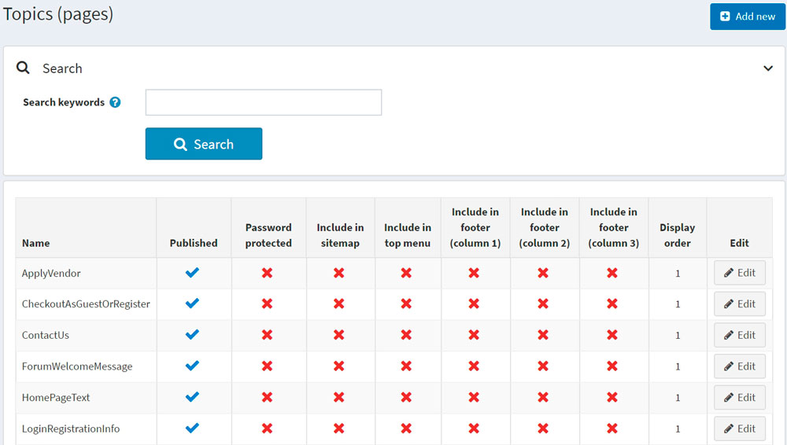
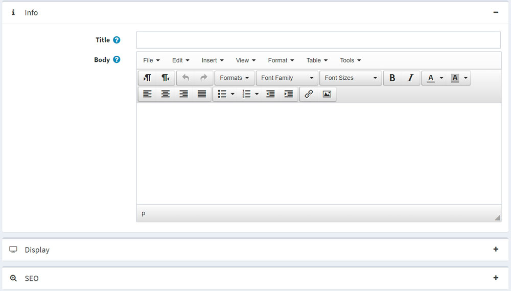

# Topics (pages)

Topics (pages) are free-form content blocks that can be displayed on your site, either embedded within other pages or on a page of their own. These are often used for FAQ pages, policy pages, special instructions, and so on. To create custom page, you should create a new topic and enter your custom page content on the topic details page. Content can be written for each language separately.

## Topic list

To see the topics go to **Content management → Topics (pages)**.
Search for topics in the topics list by entering topic text in the **Search keywords** field (or a part of the topic text), or among all the topics of a certain store.



## Adding topics

To add a new topic go to **Content management → Topics (pages)**.
Click **Add new** and fill the information about a new topic.



### Info panel
* Enter the **Title** for the topic.
* Add the topic content using the editor provided in the **Body** field.
* The **URL** field is here only for information purposes. It is the URL of the topic in the public store. You can edit this by editing the **Search engine friendly page name** field below.

### Diplay panel
* Tick **Published** checkbox to make this topic published.
* You can include this topic in the **top menu**, in **footer (column 1)**, in footer (column 2), in footer (column 3) and **sitemap**. Do this by ticking the corresponding checkbox.
* Select the **Password protected** checkbox, if this topic is password protected. The **Password** field is displayed on the topic page in the public store. A customer enters a password to access the content of this topic.
* From the **Customer roles** drop-down list select a customer role or roles that can access this topic.
* In the **Limited to stores** drop-down list select stores in which the topic will be displayed.
* Use the **Accessible when store closed** field to make this topic accessible when the store is closed.
* Select this topic **Display order**. For example, 1 would represent the item first in a list.
* Enter the **System name** of this topic. It is possible to use the same system name for different topics. For example, you can create two different topics with the same system name and make them accessible for different customer roles. For example, *Guest* and *Registered* customer roles. This means that guests and registered customers will see the different content on the site. 

> [!NOTE]
>
> While editing existing topic or after clicking **Save and continue edit** button for a new one, you can click on **Preview** button to see how the topic will appear on the site.

### SEO panel
* In the **Search engine friendly page name** field, enter the name of the page used by search engines. If you enter nothing then the web page URL is formed using the page name. If you enter *custom-seo-page-name*, then the following URL will be used: `http://www.yourStore.com/custom-seo-page-name`.
* In the **Meta title** field, enter the required title. The title tag specifies the title of your web page. It is code which is inserted into the header of your web page and is in the following format:

   ```html
   <head>
     <title>
        Creating Title Tags for Search Engine Optimization & Web Usability
      <title>
   </head>
   ```
* Enter the required category **Meta keywords**, which are a brief and concise list of the most important themes of your page. The meta keywords tag takes the following format:

   ```html
   <meta name="keywords" content="keywords, keyword, keyword phrase, etc.">
   ```

* In the **Meta description** field, enter a description of the category. The meta description tag is a brief and concise summary of your page's content. The meta description tag is in the following format:

   ```html
   <meta name="description" content="Brief description of the contents of your page.">
   ```

Click **Save**. The topic will be displayed in the public store.

## See also

- [SEO](xref:en/running-your-store/search-engine-optimization)

## Tutorials

- [Adding new topic template](https://www.youtube.com/watch?v=M-g4Ux2GCaY)
