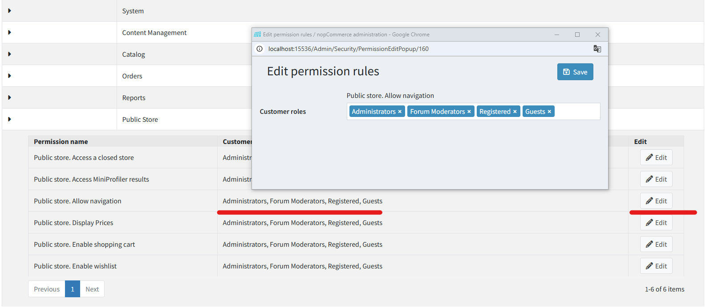

# Access control list

Access Control List (ACL) restricts or grants users access to certain areas of the site. This list is managed by administrators. Therefore, the user must have administrator rights to be able to access it. The access list has the following characteristics:

* Access control list is role-based, that is, manages roles, such as *Global administrators*, *Content managers*, and others. This list of roles can be managed on the **Customers → Customer roles** page. For further details, refer to [Customer roles](xref:en/running-your-store/customer-management/customer-roles).
* Access control list appears in the administration area. Make sure a user has to be an administrator in order to access the ACL.
* There are some predefined administrator actions. These include *Manage orders*, *Manage customers*, and much more.

To manage the access control list, go to **Configuration → Access control list**. The *Access control list* window will be displayed:

Click **Edit** and select the required roles beside the *Permission* items. The selected roles will have access to the selected actions accordingly.

Click **Save**.

> [!TIP]
>
> Example: We need a role called *Content manager*. The *Content manager* must have access to new products and manufacturers management, editing reviews on the site, blogs, campaigns, and no access to shopping carts.
> To do this:
>
> 1. Create a **Customer role** called *Content manager* on the **Customers → Customer roles** page.
> 1. In the access control list, add the desired customer roles for the following permissions: *Access Admin Area, Admin Area. Manage Blog, Admin Area. Manage Campaigns, Admin Area. Manage Forums, Admin Area. Manage News, Admin Area. Manage Newsletter Subscribers, Public Store. Allow Navigation, Public Store. Display Prices*.
> 1. Save the changes.
