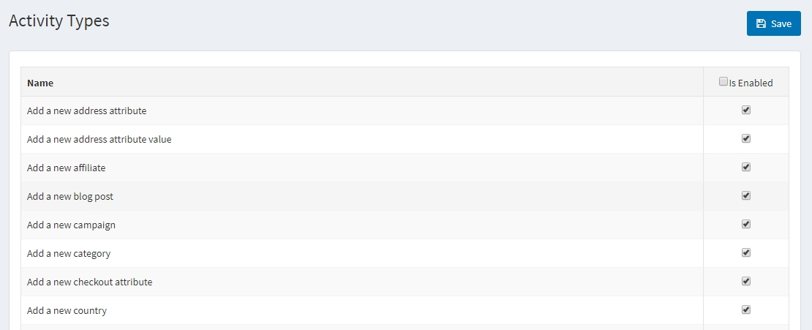
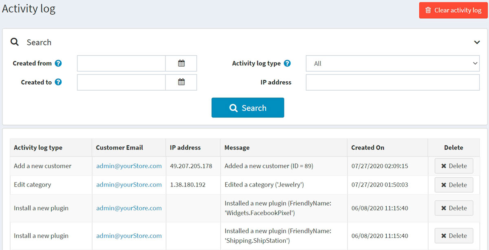

# Activity log

Activity log is used to track user activity in the system. By default, all *activity types* are enabled for tracking in nopCommerce. A store owner can disable them by clearing the relevant checkboxes. Most of the activity types listed are only for the administrator and record actions in the administration area. However, some are for the public store and track actions of shoppers (such as adding to cart/wishlist or placing an order).

## Customer activity types

To enable/disable activity types, go to **Customers → Activity types**.

Select the **Is enabled** checkbox beside the activity type you want to be enabled. Then click **Save** in the top right.

## Customer activity log

To search for activity logs, go to **Customers → Activity log**.

Define the search criteria using one or more of the following fields:

- To search by date range, enter the date range in the **Created from** and **Created to** fields. Alternatively, you can click the dropdown calendar and select the required date ranges.
- **Activity log type** for customer's activity.
- **IP address** to search for a customer by IP address.

You can clear a certain activity log item by clicking the **Delete** button beside it or clear the whole log of activities by clicking the **Clear activity log** button in the top right.
