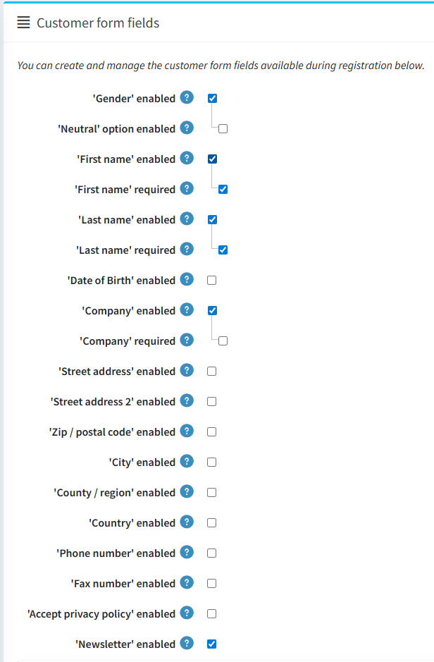

# Customer settings

Customer settings include enabling customers to upload avatar, showing customer location, changing name format, joining date and more.

To define customer settings, go to **Configuration → Settings → Customer settings**. The customer settings window is displayed. This window contains six panels: Common, Password and security, Account, Profile, Customer form fields and Address form fields.

1. **Common** panel contains general customer settings.

1. **Password and security** panel contains fields that can be used to configure security settings and password complexity.

1. **Account** panel contains fields for setting up a customer account.

1. **Profile** panel contains fields for configuring customer profile.

1. **Customer form fields** panel contains fields that are used on the customer registration page.

1. **Address form fields** panel contains fields for detailing the customer's address during checkout.

## Common

Define the common customer settings, as follows:
* Select the **Registration method**, as follows:
  * **Standard account creation**: users are enabled to register, no approval is required.
  * **Email validation is required after registration**: users are enabled to register, however, they must accept the confirmation email sent to them before their account is approved.
  * **A customer should be approved by administrator**: users are enabled to register, administrator approval is required.
  * **Registration is disabled**: select this option to disable registration.
* Tick the **Notify about new customer registration** checkbox, to enable a store owner to get an email notification each time when a new customer is registered.
* Tick the **Require registration for downloadable products** checkbox if customers have to complete registration in order to purchase downloadable products.
* Use the **Allow customers to check gift card balance** field to allow customers to check gift card balance.
  > [!NOTE]
  >
  > If the **Allow customers to check gift card balance** field is checked, then CAPTCHA setting must be enabled in the admin area (**Configuration → Settings → General settings → CAPTCHA panel**). This feature is potentially not safe and CAPTCHA is needed to prevent and complicate bruteforce. For more details refer to [CAPTCHA settings](xref:en/getting-started/advanced-configuration/security-settings#captcha).

* Choose whether to **Allow customers to select time zone** in the public store on the accounts page. Otherwise, the default time zone is used.
* Select the **Default store time zone** from a dropdown list.
   > [!NOTE]
   > 
   > The current time zone is displayed automatically.
 
 * Tick the **Allow customers to remove associations** to allow customers to remove external authentication associations.

## Password and security

* Set the **Password minimum length, Password must have at least one lowercase, Password must have at least one uppercase, Password must have at least one non alphanumeric character, Password must have at least one digit** to change password complexity.
* **Unduplicated passwords number** is a number of passwords that mustn't be the same as the previous one.
* Select the **Default password format**, as follows:
  * *Clear*
  * *Hashed*
  * *Encrypted*
  > [!NOTE]
  > 
  > This setting is for storing customers' passwords and will be applied only to newly registered customers.

* In the **Password lifetime** enter the number of days for password expiration.
  > [!NOTE]
  >
  > To use the **Password lifetime** feature don't forget to check **Enable password lifetime** property on the customer role edit page (**Customers → Customer roles**) for those roles, that need to change passwords. For more details refer to [Customer roles](xref:en/running-your-store/customer-management/customer-roles).

* In the **Password recovery link. Days valid** field, enter the number of days for password recovery link. Set it to 0 if you don't want the link to expire.
* Enter the **Maximum login failures** number. Set 0 to disable this feature.
* In the **Lockout time (login failures)** enter the number of minutes to lockout users.
* Tick the **Force entering email twice** checkbox if you want your customers to enter email twice during the registration.

## Account

* Tick the **'Usernames' enabled** checkbox, to enable using usernames for login and registration instead of emails. 
  > [!NOTE]
  >
  > It is not recommended to change this option in the production environment. 
  
  When the **'Usernames' enabled** checkbox is selected, the following options are displayed:
  * **Allow customers to change their usernames**: select this option if customers are allowed to change their usernames.
  * **Allow customers to check the availability of usernames**: select this option to allow customers to check the username availability before clicking *Save* button on the *My account - Customer info* page. The **Check availability** button is displayed in this case, see the example below.

* Tick the **Username validation is enabled** field if you want to enable username validation (when registering or changing on the "My account" page in the public store). When this checkbox is selected, the following options are displayed:
  * **Username validation rule**: set the validation rule for a username in this field. You can specify a list of allowed characters or a regular expression. If you use a regular expression check the **Use regex for username validation** field described below.
  * Check the **Use regex for username validation** field to use a regular expression for username validation (when registering or changing on the "My account" page in the public store).
* Select the **Customer name format**, as follows:
  * *Show emails*
  * *Show usernames*
  * *Show full names*
  * *Show first name*
  The customer name will be shown in the store next to the customer's news and blog comments, on the forum pages and others.
* Check the **Phone number validation is enabled** checkbox if you want to enable phone number validation (when registering or changing on the "My account" page in the public store). When this checkbox is selected, the following options are displayed:
  * **Phone number validation rule**: set the validation rule for a phone number in this field. You can specify a list of allowed characters or a regular expression. If you use a regular expression check the **Use regex for username validation** field described below.
  * Check the **Use regex for phone number validation** field to use a regular expression for phone number validation (when registering or changing on the "My account" page in the public store).
* **Allow customers to upload avatars**: the customers' avatars will be shown in the store next to their news and blog comments, on the forum pages and others. If this option is selected, the following checkbox is displayed:
  * Tick the **Default avatar enabled** checkbox, to display the default user avatars.
* Tick the **Hide 'Downloadable products' tab** checkbox, to hide this tab on the "My account" page.
* Tick the **Hide 'Back in stock subscriptions' tab** checkbox, to hide this tab on the "My account" page.
* Tick the **Hide newsletter box** checkbox if you do not want to display the newsletter subscription box.
* Tick the **Newsletter box. Allow to unsubscribe** checkbox to display "unsubscribe" option in the newsletter block. For example, it's required in Germany.
* Tick the **Store last visited page** checkbox, to store the customer's last visited page. You can then view the last visited pages by different customers on the **Customers → Online customers** page. You can untick this checkbox, to improve the site performance.
* Tick the **Store IP address** checkbox, to store the last IP address of customers. When disabled, it can improve performance.

## Profile

* **Allow viewing of customer profiles**: this setting enables to see the details of other customers in the public store.
* Tick the **Show customers location** checkbox if required.
* Tick the **Show customers join date** checkbox if required.

## Customer form fields
In the *Customer form fields* panel, define whether the following form fields are enabled in the system:

* **'Gender' enabled**
* **'First name' enabled**. When enabled, you can also decide whether this field should be required.
* **'Last name' enabled**. When enabled, you can also decide whether this field should be required.
* **'Date of Birth' enabled.** When enabled, you can also decide whether this field should be required and enter a minimum allowed age (for example, to ensure that a customer is above 18).
* **'Company' enabled.** When enabled, you can also decide whether this field should be required.
* **'Street address' enabled.** When enabled, you can also decide whether this field should be required.
* **'Street address 2' enabled**, if the second street address is enabled. When enabled, you can also decide whether this field should be required.
* **'Zip/postal code' enabled**. When enabled, you can also decide whether this field should be required.
* **'City' enabled.** When enabled, you can also decide whether this field should be required.
* **'County/region' enabled.** When enabled, you can also decide whether this field should be required.
* **'Country' enabled.** When enabled, you can also decide whether this field should be required.
* **'State/province' enabled.** When enabled, you can also decide whether this field should be required. Note: This field is visible only when the **Country** field is enabled.
* **'Phone number' enabled.** When enabled, you can also decide whether this field should be required.
* **'Fax number' enabled.** When enabled, you can also decide whether this field should be required.
* Tick the **'Accept privacy policy' enabled** checkbox, to request customers to accept the privacy policy during the registration.
* Tick the **'Newsletter' enabled** checkbox to offer customers a newsletter subscription during the registration. 
  * When the **'Newsletter' enabled** checkbox is selected, the **Newsletter ticked by default** checkbox is displayed. This automatically sets the 'Newsletter' checkbox on the registration page as ticked.

### Custom customer attributes 
If the default form fields are not enough for your requirements, you can manage additional customer attributes using this table. Customer attributes are created in the same manner as checkout attributes. For further details, refer to [Checkout attributes](xref:en/running-your-store/order-management/checkout-attributes).

## Address form fields
In the *Address form fields* panel, a store owner can manage the address form fields available during the registration. You can select which fields are enabled and required among the following:

* **'Company' enabled.** When enabled, you can also decide whether this field should be required.
* **'Street address' enabled.** When enabled, you can also decide whether this field should be required.
* **'Street address 2' enabled**, if the second street address is enabled. When enabled, you can also decide whether this field should be required.
* **'Zip/postal code' enabled**. When enabled, you can also decide whether this field should be required.
* **'City' enabled.** When enabled, you can also decide whether this field should be required.
* **'County/region' enabled.** When enabled, you can also decide whether this field should be required.
* **'Country' enabled.** When enabled, you can also decide whether this field should be required.
* **'State/province' enabled.** When enabled, you can also decide whether this field should be required. Note: This field is visible only when the **Country** field is enabled.
* **'Phone number' enabled.** When enabled, you can also decide whether this field should be required.
* **'Fax number' enabled.** When enabled, you can also decide whether this field should be required.

### Custom address attributes
> [!NOTE]
> 
> If the default address fields are not enough for your requirements, you can manage additional address attributes using this table. Address attributes are created in the same manner as checkout attributes. For further details, refer to [Checkout Attributes](xref:en/running-your-store/order-management/checkout-attributes).

Click **Save** in the top of the page.

## Tutorials

* [Configuring password settings](https://www.youtube.com/watch?v=TwWArXNi0CA)
