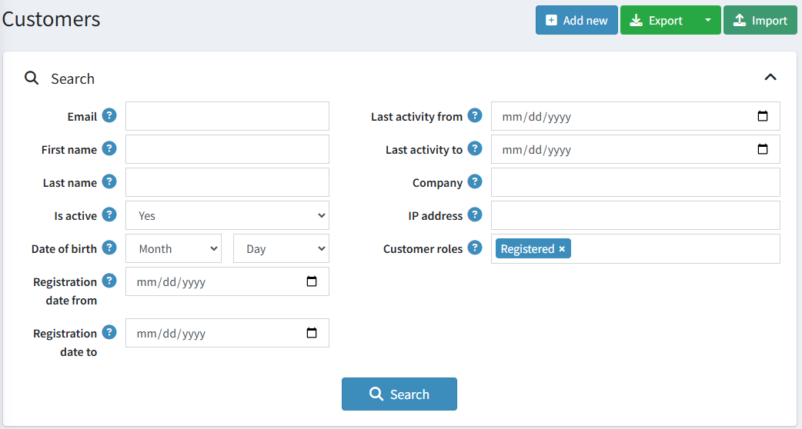
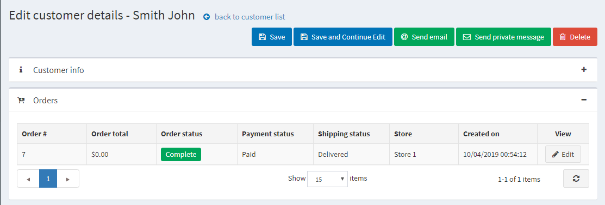
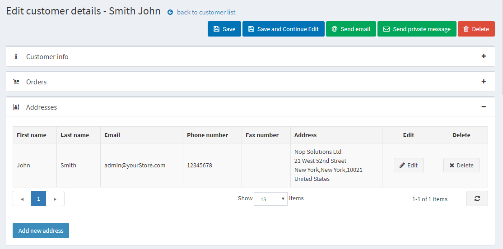

# Managing customers

The customer list contains details of all existing customers and allows adding new ones. The customer list contains details of all existing customers and allows adding new ones. This and other customer management configurations makes nopCommerce an eCommerce platform with built-in [omnichannel feature](https://www.nopCommerce.com/omnichannel-commerce). In nopCommerce, customers include all users, such as administrators, vendors, and buyers. In nopCommerce, customers include all users, such as administrators, vendors, and buyers. To manage customers, go to **Customers → Customers**. The following window will be displayed:

To search for customers, in the *Customers* window, enter one or more of the following search criteria:

- **Email**.
- **Username**, if enabled in the [customer settings](xref:en/running-your-store/customer-management/customer-settings).
- **First name**.
- **Last name**.
- **Date of birth**, if enabled in the [customer settings](xref:en/running-your-store/customer-management/customer-settings).
- **Company**, if enabled in the [customer settings](xref:en/running-your-store/customer-management/customer-settings).
- **Phone**, if enabled in the [customer settings](xref:en/running-your-store/customer-management/customer-settings).
- **Zip code**, if enabled in the [customer settings](xref:en/running-your-store/customer-management/customer-settings).
- **IP address**.
- **Customer roles** — you can select one or more customer roles to be displayed.
- **Registration date from** and **Registration date to**
- **Last activity from** and **Last activity to**

> [!NOTE]
>
> You can export the customer data to an external file by clicking **Export to XML (all)** or **Export to Excel (all)**. You can export selected customer data to an external file by clicking **Export to XML (selected)** or **Export to Excel (selected)**.

Then click the **Search** button.

## Add a new customer

To add a new customer, in the *Customers* window, click **Add new**.
The *Add a new customer* window will be displayed. Define the following customer details:

## Customer info

The *Customer info* panel allows to enter customers' personal and account information, for example, change a password, assign/remove customer roles.

You can edit the following fields:

- **Email** address.
- **Password**.
- **First name**.
- **Last name**.
- **Gender**.
- **Date of birth**.
- **Company name**.
- **Is tax exempt** indicates whether the customer is exempted from taxes.
- Choose appropriate stores in the **Newsletter** multiselect to subscribe the customer to a store newsletter.
- **Customer roles** — one or multiple customer roles. Note that any role that needs to log in to the system (for example, administrator, vendor) should have the "Registered" customer role among others. You can set up customer roles in the [Customer roles](xref:en/running-your-store/customer-management/customer-roles) section.
- From the **Manager of vendor** dropdown list, if required, select a vendor associated with this customer account. When associated, this customer will be able to log in to the selected vendor portal and manage its products and orders. Note that if you have a vendor associated with this customer, you should ensure this customer record is in the [Vendors](xref:en/running-your-store/vendor-management) list.
- Select the **Active** checkbox to activate the customer.
- **Admin comment** — administrator comments for internal use if required.

Click the **Save** button to save the changes or **Save and continue edit** button to proceed for more customer information. In this case, you will see the newly added panels on the customer details page.

You will also see the **Send email**, **Send private message** (if [forums](xref:en/running-your-store/content-management/forums) are enabled), and **Delete** buttons.

After clicking the **Send email** button, the *Send email* window will be displayed, enabling the store owner to send an email to the customer. After clicking the **Send private message** button, the *Send private message* window will be displayed, enabling to send a message to the customer. To use private messaging, allow private messages in [forum settings](xref:en/running-your-store/content-management/forums).

## Orders

In the *Orders* panel, you can view the customer's orders' details.

## Addresses

In the *Addresses* panel, you can view, edit, and create new addresses of the customer.

Click the **Add new address** button to add a new customer address. Fill in the appropriate fields and click **Save**. The new address will be added to the customer.

## Current shopping cart and wishlist

In the *Current shopping cart and wishlist* panel, you can view the customer's shopping cart and wishlist.

## Activity log

In the *Activity log* panel, you can view the customer's activity log. See how to manage activity types in the [Activity log - Customer activity types](xref:en/running-your-store/customer-management/activity-log#customer-activity-types) section.

## Place order (impersonate)

In the *Place order (impersonate)* panel, store owners can create orders for their customers without password information. This is useful for customers who do not want to register or for large sites using CSRs to place orders over the phone.

The panel contains the **Place order** button. After clicking this button, you will be redirected to the public store. Select the products the customer wants, add them to the cart exactly as the customer would do in the public store, then use the **Checkout** button to proceed through the usual checkout process, and then click the **Finish session** link at the top of the page to finish this session.

## Back in stock subscriptions

In the *Back in stock subscriptions* panel, see the products the customer is subscribed to.

## Reward points

In the *Reward points* panel, store owners can add reward points to the customer or view their reward points usage history. This panel is visible when the reward points program is enabled. Refer to the [Reward points](xref:en/running-your-store/promotional-tools/reward-points) section for more information.

### Add (reduce) points

In this panel:

- Enter the number of **Points**. To reduce points, enter a negative value.
- In the **Points validity** field, specify the number of days the awarded points will be valid (only for a positive number of points).
- Enter a **Message** or comment.
- Select the **Activate points immediately** checkbox if you want to enable customers to use reward points right after earning them. If you don't select this checkbox, one more option will appear:
- If the previous checkbox is clear, in the **Reward points activation** field, specify the period (number of days/hours) after which reward points will be activated.

## See also

- [Customer roles](xref:en/running-your-store/customer-management/customer-roles)
- [Vendors](xref:en/running-your-store/vendor-management)

## Tutorials

- [Customer management in nopCommerce](https://www.youtube.com/watch?v=DOl-g-NNFEM&list=PLnL_aDfmRHwsbhj621A-RFb1KnzeFxYz4&index=1)
- [Re-assigning a deleted email address](https://www.youtube.com/watch?v=lqmrWJdXZEE&t=1s)
- [Overview of impersonation mode](https://www.youtube.com/watch?v=KQi-CDVawJ4)
