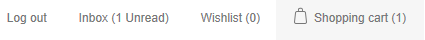

# Managing customers

Customer list contains details of all existing customers, as well as allows to add new ones. In nopCommerce, customers include all users, such as administrators, vendors, and buyers. To manage customers, go to **Customers → Customers**.

**To add a new customer**, in the Customers window click Add new, the Add a new customer window will be displayed. Define the following customer details:

- **Email address**
- **Password**
- **Customer roles** - one or multiple customer roles. Note that any role that needs to login into the system (e.g. administrator, vendor) should have "Registered" customer role among other. You can set up customer roles in [Customer roles](xref:en/running-your-store/customer-management/customer-roles) section.
- From the **Manager of vendor** **dropdown list**, if required, select a vendor associated with this customer account. When associated, this customer will be able to login to the selected vendor portal and manage its products and orders. Note that if you have a vendor associated with this customer, ensure this customer record is in the [Vendors](xref:en/running-your-store/vendor-management) list.

    

- **Gender**
- **FirstName**
- **LastName**
- **Date of birth**
- **Company name**
- **Admin comment** - administrator comments for internal use, if required
- Is **tax exempt** indicates whether the customer is exempted from taxes
- Choose appropriate stores in the **Newsletter** multiselect to subscribe the customer to a store newsletter
- Tick the **Active** checkbox, to activate the customer

**To search for customers**, in the Customers window enter one or more of the following search criteria:

- **Email**
- **First name**
- **Last name**
- **IP address**
- **Date of birth**, if enabled in the [Customer Settings](xref:en/running-your-store/customer-management/customer-settings)
- **Company**, if enabled in the Customer Settings
- **Phone**, if enabled in the Customer Settings
- **Zip code**, if enabled in the Customer Settings
- **Customer roles** - you can select one or more customer roles to be displayed.

> [!NOTE]
> 
> You can export the customer data to an external file by clicking **Export to XML (all)** or **Export to Excel (all)**. You can export selected customer data to an external file by clicking **Export to XML (selected)** or **Export to Excel (selected)**.
> 
> After clicking the Send email button, the Send email window is displayed enabling a store owner to send an email to the customer. After clicking the Send private message button the Send private message window is displayed enabling to send a message to the customer. To use private messaging, allow private messages in [Forum settings](xref:en/running-your-store/content-management/forums). 
> 
> 

**To edit customers**, in the Customers window enter the required search criteria and click Search. Click Edit beside the customer to edit. The Edit Customer Details window is displayed.

- On the **Customer info** tab you can edit customers' personal and account information, e.g. change a password, assign/remove customer roles
- On the **Orders** tab you can view the customer's order details

    
- On the **Addresses** tab you can view, edit and create new addresses of the customer

    
- On the **Current Shopping Cart** tab you can view the customer's shopping cart
- On the **Current Wishlist** tab you can view the customer's wish list
- On the **Activity Log** you can view the customer's activity log. You can manage activity types in the [Activity Log](xref:en/running-your-store/customer-management/activity-log) types section
- On the **Place Order (Impersonate)** tab store owners can create orders for their customers without having to have password information. This is useful for customers who do not want to register, or for large sites using CSRs to place orders over the phone. The tab contains the **Place order** button. The store owner can select the products the customer wants, add them to the cart exactly as the customer would do in the public store, then use the **Checkout** button to proceed through the usual checkout process and then click the **Finish session** link in the header to finish this session
- **Back in stock subscription** tab
- On the **Reward points** tab store owners can add reward points to the customer or to view his or her reward points usage history. This tab is enabled when the reward points program is enabled, in **Configuration → Settings → [Reward Points](xref:en/running-your-store/promotional-tools/reward-points)**.
- Tick the checkbox **Activate points immediately** if you want customers will be able to use reward points right after earn them. If you didn't check this checkbox one more option appears:
- In the **Reward points activation** specify the period (number of days/hours) after which reward points will be activated.

    

## See also

- [Customer roles](xref:en/running-your-store/customer-management/customer-roles)
- [Vendors](xref:en/running-your-store/vendor-management)

## Tutorials

- [Customer management in nopCommerce](https://www.youtube.com/watch?v=DOl-g-NNFEM&list=PLnL_aDfmRHwsbhj621A-RFb1KnzeFxYz4&index=1)
- [Re-assigning a deleted email address](https://www.youtube.com/watch?v=lqmrWJdXZEE&t=1s)
- [Overview of impersonation mode](https://www.youtube.com/watch?v=KQi-CDVawJ4)
