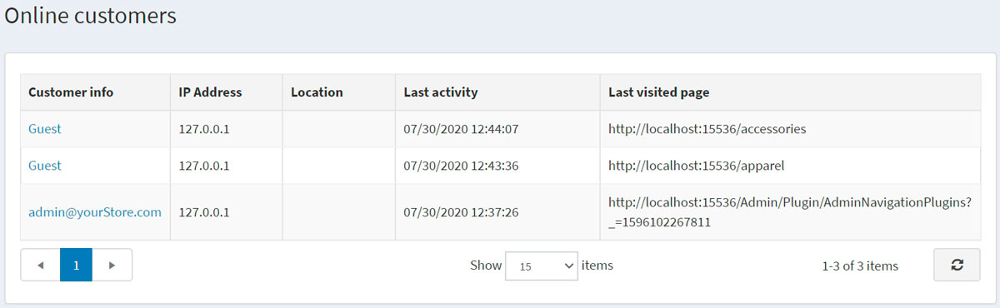

# Online customers

The Online customers section enables store owners to view customers that were online within the last 20 minutes. This information is useful for store owners as it shows the last visited page and helps to decide upon actions required to convert visitors into buyers.

To access this window, go to **Customers → Online customers**.

The *Online customers* window includes the following columns:

- **Customer info** — you can view and edit customer information by clicking the link.
- **IP Address** — current IP address of the customer
- **Location** — IP-address-wise location of the customer.
- **Last activity** — date and time the online customer last logged in.
- **Last visited page** — the page the customer visited last time.

> [!NOTE]
>
> To see the last visited page, you need to enable the **Store last visited page** setting on the **Configuration → Settings → Customer settings** page (*Account* panel).

This page includes GeoLite2 data created by MaxMind available from [http://www.maxmind.com](http://www.maxmind.com)
