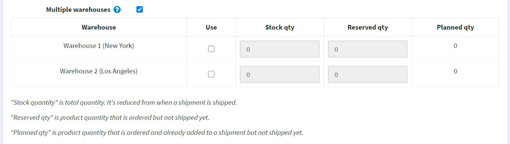
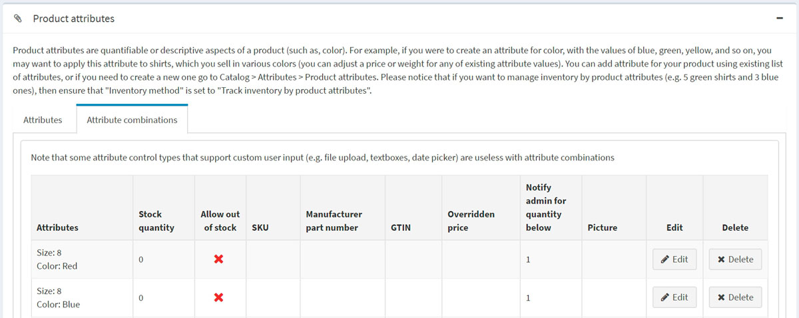

# Inventory management

Inventory management is a system of stock level controlling. In nopCommerce it consists of setting up the inventory and tracking low stocks.

To set up inventory, go to **Catalog → Products → Edit a product**. In the *Edit product details* window, go to the *Inventory* panel. In this panel you can choose one of three inventory methods:
1. [Don't track inventory](#dont-track-inventory)
1. [Track inventory](#track-inventory)
1. [Track inventory by product attributes](#track-inventory-by-product-attributes)

In the next sections we will see the difference between these methods.

## Don't track inventory
Some products may not require inventory tracking. For example, services, second hand or custom-made goods. In this case, a store owner can opt for no tracking, by choosing the *Don't track inventory* option in the **Inventory method** field. 

In this case, the store owner can define:
- **Warehouse** which will be used when calculating shipping rates. Read more in the [Warehouses](xref:en/getting-started/configure-shipping/advanced-configuration/warehouses) chapter.
- **Minimum cart qty** is a quantity allowed in a customer's shopping cart e.g. set to 3 to only allow customers to purchase 3 or more of this product.
- **Maximum cart qty** is a quantity allowed in a customer's shopping cart e.g. set to 5 to only allow customers to purchase 5 of this product.
- In the **Allowed quantities** field, enter a comma separated list of quantities you want this product to be restricted to. Instead of a quantity textbox that allows them to enter any quantity, they will receive a dropdown list of the values you enter here.
- Tick the **Not returnable** checkbox if this product is not returnable. In this case a customer won't be allowed to submit a return request.

## Track inventory
In case inventory tracking is required, the shop owner can select an **Inventory method** between two options: *Track inventory* (by product) or *Track inventory by product attributes*. The *Track inventory* option is for those who don't have product variants, and simply need to know how many items are left. In this section we will describe the *Track inventory* option.
Once this option is chosen, the section expands displaying new fields:

Set up inventory, as follows:
* **Stock quantity** is the total quantity. It is reduced every time when an order is shipped.
* Choose the **Warehouse** which will be used when calculating shipping rates. You can manage warehouses on the **Configuration → Shipping → Warehouses** page. For further details refer to the [Warehouses](xref:en/getting-started/configure-shipping/advanced-configuration/warehouses) page.
* Tick the **Multiple warehouses** checkbox if you want to support shipping and inventory management from multiple warehouses. This way you can manage inventory per warehouse:
  
    Click **Use** in the appropriate row if you want to use this warehouse for the product.
    * Enter the **Stock qty** what is the total quantity. It is reduced every time when an order is shipped.
    * Enter the **Reserved qty** what is the product quantity that is ordered but not shipped or added to a shipment yet.
    * The **Planned qty** is the product quantity that is ordered and already added to a shipment but not shipped yet.

* To prevent customers from placing orders and finding out that the product is out of stock, you can take certain actions. Tick the **Display availability** checkbox, to display stock availability in the public store.
  * If required, tick the **Display stock quantity** checkbox, to enable customers to see a product stock quantity on the product details page (this checkbox is displayed only when the **Display availability** checkbox is ticked). The following screenshot demonstrates what a customer will see in the public store:
      
      

* In the **Minimum stock qty** field, enter a minimum value, under which further actions will be taken.
* From the **Low stock activity** dropdown list, select the action to be taken when the stock quantity falls below the minimum stock quantity value, as follows:
  * **Nothing**: store owners can still choose to not take any action. It means that customers can continue to order products.
  * **Disable buy button**: the buy button becomes disabled when stock is low. Therefore, customers cannot buy this product but can still see it existing in the store.
  * **Unpublish**: the product is not visible in the store anymore. Used when the product is going to be stopped entirely.

* In the **Notify for qty below** field, enter a value under which a notification email will be sent to the administrator.
* Store owners can set up **Backorders**, i.e. orders that can not be fulfilled at the moment of purchase. From the backorders dropdown list, select the required backorder mode, as follows:
  * **No backorders**: customers can't purchase this product when there is no stock available.
  * **Allow qty below 0**: customers can purchase this product even when there is no stock available.
  * **Allow qty below 0 and notify customer**: customers can purchase this product even when there is no stock available. In addition, they get a notification with the following message: *Out of stock - on backorder and will be dispatched once in stock (**Display availability** option should be also enabled in this case)*.

* Tick **Allow back in stock subscriptions**, to enable customers to subscribe for a notification about product availability, as on the screenshot below:
  
  

* Choose the **Product availability range** which will be displayed for customers when the product is not available for the moment. You can set up availability ranges in the *Product availability ranges* panel of the **Configuration → Shipping → Dates and ranges** page. For further details refer to the [Dates and ranges](xref:en/getting-started/configure-shipping/advanced-configuration/dates-and-ranges) page.
- **Minimum cart qty** is a quantity allowed in a customer's shopping cart e.g. set to 3 to only allow customers to purchase 3 or more of this product.
- **Maximum cart qty** is a quantity allowed in a customer's shopping cart e.g. set to 5 to only allow customers to purchase 5 of this product.
- In the **Allowed quantities** field, enter a comma separated list of quantities you want this product to be restricted to. Instead of a quantity textbox that allows them to enter any quantity, they will receive a dropdown list of the values you enter here.
- Tick the **Not returnable** checkbox if this product is not returnable. In this case a customer won't be allowed to submit a return request.

## Track inventory by product attributes
In case you have different product attributes combinations and need to track their stock quantity, select the *Track inventory by product attributes* inventory method.
Once this option is chosen, the section expands displaying new fields:

* Choose the **Warehouse** which will be used when calculating shipping rates. You can manage warehouses on the **Configuration → Shipping → Warehouses** page. For further details refer to the [Warehouses](xref:en/getting-started/configure-shipping/advanced-configuration/warehouses) page.
* To prevent customers from placing orders and finding out that the product is out of stock, you can take certain actions. Tick the **Display availability** checkbox, to display stock availability in the public store.
  * If required, tick the **Display stock quantity** checkbox, to enable customers to see a product stock quantity on the product details page (this checkbox is displayed only when the **Display availability** checkbox is ticked). The following screenshot demonstrates what a customer will see in the public store:
    
    

* Choose the **Product availability range** which will be displayed for customers when the product is not available for the moment. You can set up availability ranges in the *Product availability ranges* panel of the **Configuration → Shipping → Dates and ranges** page. For further details refer to the [Dates and ranges](xref:en/getting-started/configure-shipping/advanced-configuration/dates-and-ranges) page.
- **Minimum cart qty** is a quantity allowed in a customer's shopping cart e.g. set to 3 to only allow customers to purchase 3 or more of this product.
- **Maximum cart qty** is a quantity allowed in a customer's shopping cart e.g. set to 5 to only allow customers to purchase 5 of this product.
- In the **Allowed quantities** field, enter a comma separated list of quantities you want this product to be restricted to. Instead of a quantity textbox that allows them to enter any quantity, they will receive a dropdown list of the values you enter here.
- Tick **Allow only existing attribute combinations** to allow adding to the cart/wishlist only existing attribute combinations with stock quantity greater than 0. In this case you have to create all product attributes combinations that you have in stock.
- Tick the **Not returnable** checkbox if this product is not returnable. In this case a customer won't be allowed to submit a return request.

> [!NOTE]
>
> To set **Stock quantity** for different attribute combinations go to the **Attribute combinations** tab of the *Product attributes* panel on the edit product details page. On this tab you can define whether to **Allow out of stock** for a certain attribute combination to enable orders to be approved even when the product is out of stock.
  

> [!TIP]
>
> To track products that are currently under stock, go to **Reports → Low stock**.
> The low stock report contains a list of products that are currently under stock, i.e. the stock quantity is equal or less than the minimum stock quantity set in the *Inventory* section on the product details page.
  
  Click **Vew** to view the product details page, where these stock settings can be changed.
  For more details about reports in nopCommerce visit the [Reports](xref:en/running-your-store/reports) page.

## See also

* [Product attributes](xref:en/running-your-store/catalog/products/product-attributes)
* [Warehouses](xref:en/getting-started/configure-shipping/advanced-configuration/warehouses)

## Tutorials

* [Managing backorders in nopCommerce](https://www.youtube.com/watch?v=CMhQ39clCKM)
