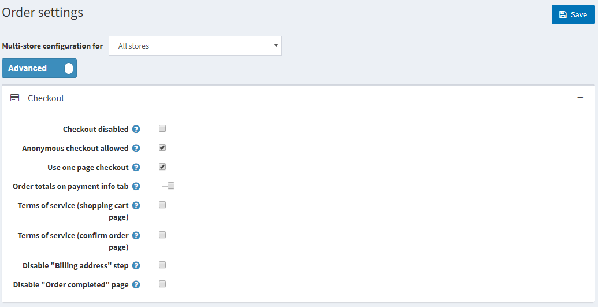
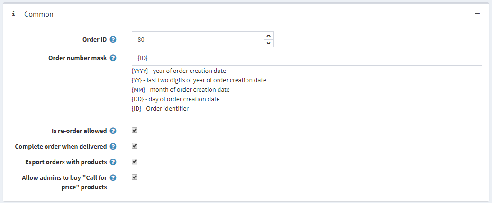
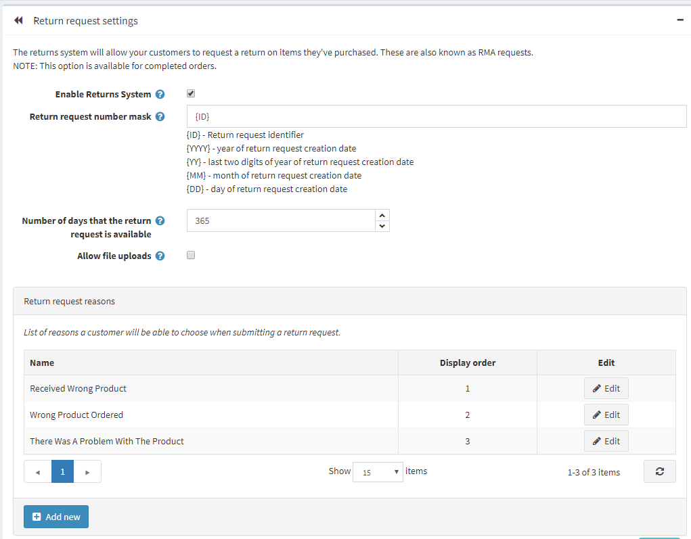

# Order Settings

To define order settings, go to **Configuration → Settings → Order Settings**. The Order Settings window will be displayed:

In order settings you can define:

* **Checkout disabled**, to disable the checkout process.
* **Anonymous checkout allowed**, to enable customers to purchase products without registration/logging in.
* To **Use one page checkout**, which is a single web page your customers would use to buy a product or a service from you.
* **Order totals on payment info tab** to display a product list and order totals on the payment info tab (one-page checkout).
* To require customers to accept the **Terms of service** before processing the order (**on the shopping cart page**).
* To require customers to accept the **Terms of service** before processing the order (**on the confirm order page**).
* To **Disable “Billing address” step** to disable the billing address step during checkout. The billing address will be pre-filled and saved using the default registration data (cannot be used with guest checkout selected). Ensure the appropriate address fields that cannot be pre-filled are not required (or disabled).
* To **Disable “Order completed” page**, to automatically redirect a customer to the order details page when he places an order.
* **Min order sub-total amount**. Orders under this amount will not be issued.
* To **Calculate “Min order sub-total amount” including tax**. In this case, an order sub-total will be calculated including tax when validating Min order sub-total amount field (specified in the previous step).
* **Min order total amount**. Orders under this amount will not be issued.
* To **Auto update order totals** to have the order totals automatically updated on editing an order in admin area (currently in BETA testing).
* The **Order ID** counter. This is useful if you want your orders to start at a certain number. This affects only orders created after; the value must be greater than the current maximum order ID.
* In the **Order number mask** you can create custom order number. For example, start with {YYYY} - year of order creation date
* **“Is re-Order” allowed** to enable customers to re-order. The re-order mechanism automatically adds to the shopping cart all items that were in a previous order.
* **Complete order when delivered**, to set order status to "Complete" only when its shipping status is "Delivered". Otherwise, "Shipped" status will be enough.
* To **Export orders with products**.
* **Allow admins to buy "Call for price" products**, to allow administrators (in impersonation mode) to buy products marked as "Call for price".
* **To Attach PDF invoice ("order placed" email)**.
* **To Attach PDF invoice ("order paid" email)**.
* **To Attach PDF invoice ("order completed" email)**.
* **Activate gift cards after completing of an order**, to activate related gift cards when an order is completed.
* **Deactivate gift cards after cancelling of an order**, to deactivate related gift cards when an order is cancelled.
* **Deactivate gift cards after deleting of an order**, to deactivate related gift cards when an order is deleted.
* **Delete gift card usage history after order cancellation**, to to delete gift card usage history after order cancellation

This page enables **multi-store configuration**, it means that the same settings can be defined for all stores, or differ from store to store. If you want to manage settings for a certain store, choose its name from Multi-store configuration drop-down list and tick all needed checkboxes at the left side to set custom value for them.

## See also

* [Return request settings](xref:en/user-guide/running/order-management/return-requests/index)
* [Orders](xref:en/user-guide/running/order-management/orders/index)
* [PDF settings](xref:en/user-guide/configuring/setting-up/main-store/pdf-settings)
