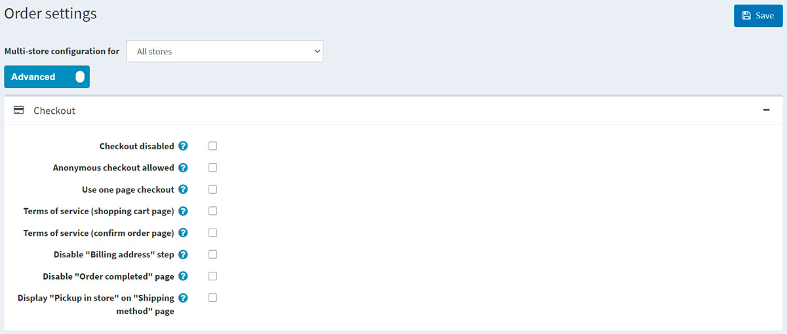
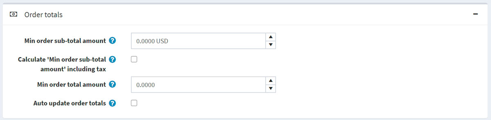
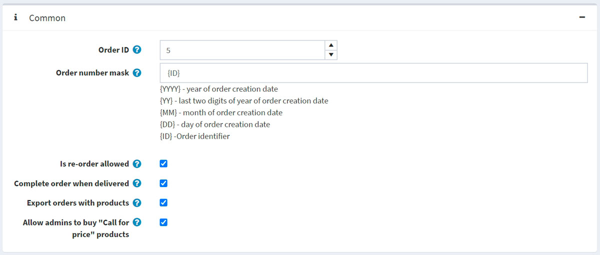
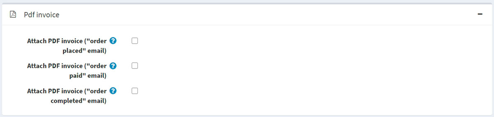

# Order settings

To define order settings, go to **Configuration → Settings → Order settings**. The *Order settings* window will be displayed.

This page enables multi-store configuration; it means that the same settings can be defined for all stores or differ from store to store. If you want to manage settings for a certain store, choose its name from the multi-store configuration dropdown list and select all the checkboxes needed on the left to set custom values for them. For further details, refer to [Multi-store](xref:en/getting-started/advanced-configuration/multi-store).

In this window, you can define the following order settings:

## Checkout

Define the following settings in the *Checkout* panel:

* **Checkout disabled** to disable the checkout process.
* **Anonymous checkout allowed** to enable customers to purchase products without registration/logging in.
* **Use one page checkout**, which is a single webpage your customers would use to buy a product or a service from you.
* **Order totals on payment info tab** to display a product list and order totals in the payment info tab (one-page checkout).
* Whether to require customers to accept the **Terms of service** before processing the order (**on the shopping cart page**).
* Whether to require customers to accept the **Terms of service** before processing the order (**on the confirm order page**).
* **Disable "Billing address" step** during checkout. The billing address will be pre-filled and saved using the default registration data (cannot be used with guest checkout selected). In **Configuration → Settings → Customer settings**, ensure the appropriate address fields that cannot be prefilled are not required (or disabled).
* **Disable "Order completed" page** to automatically redirect a customer to the order details page after an order is placed.
* **Display "Pickup in store" on "Shipping method" page** or on the shipping address page.

## Order totals

Define the following settings in the *Order totals* panel:

* **Min order sub-total amount**. Orders below this amount will not be issued.
* **Calculate "Min order sub-total amount" including tax**. In this case, an order subtotal will be calculated including tax when validating **Min order sub-total amount field** specified in the previous step.
* **Min order total amount**. Orders below this amount will not be issued.
* **Auto update order totals** to have the order totals automatically updated on editing an order in the admin area (currently in BETA testing).

## Common

Define the following settings in the *Common* panel:

* The **Order ID** counter. This is useful if you want your orders to start with a certain number. This only affects orders created after defining. The value must be greater than the current maximum order ID.
* In **Order number mask**, you can create a custom order number. For example, starting with {YYYY} — the year of the order creation date.
* **Is re-order allowed** to enable customers to re-order. The re-order mechanism automatically adds all items that were in a previous order to the shopping cart.
* **Complete order when delivered** to set order status to "Complete" only when its shipping status is "Delivered." Otherwise, the "Shipped" status will be enough.
* **Export orders with products**.
* **Allow admins to buy "Call for price" products** to allow administrators (in impersonation mode) to buy products marked as "Call for price."
* **Show product thumbnail in order details page** to show product thumbnail in order details page.

## PDF invoice

Define the following settings in the *PDF invoice* panel:

* **To Attach PDF invoice ("order placed" email)**.
* **To Attach PDF invoice ("order paid" email)**.
* **Attach PDF invoice ("order processing" email)**.
* **To Attach PDF invoice ("order completed" email)**.

> [!TIP]
>
> Learn how to set up PDF in the [PDF settings](xref:en/getting-started/advanced-configuration/pdf-settings) chapter.

## Gift cards

Define the following settings in the *Gift cards* panel:

* **Activate gift cards after completing of an order** to activate related gift cards when an order is completed.
* **Deactivate gift cards after cancelling of an order** to deactivate related gift cards when an order is canceled.
* **Deactivate gift cards after deleting of an order** to deactivate related gift cards when an order is deleted.
* **Delete gift card usage history after order cancellation** to delete gift card usage history after an order is canceled.

## Return request settings

In the *Return request settings* panel, you can set up return requests. For more details, see the [Return request settings](xref:en/running-your-store/order-management/return-requests#return-request-settings) section.

## See also

* [Orders](xref:en/running-your-store/order-management/orders)
* [Return requests](xref:en/running-your-store/order-management/return-requests)
* [PDF settings](xref:en/getting-started/advanced-configuration/pdf-settings)
