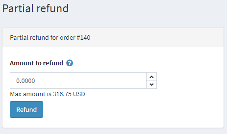
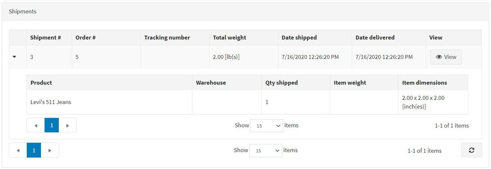
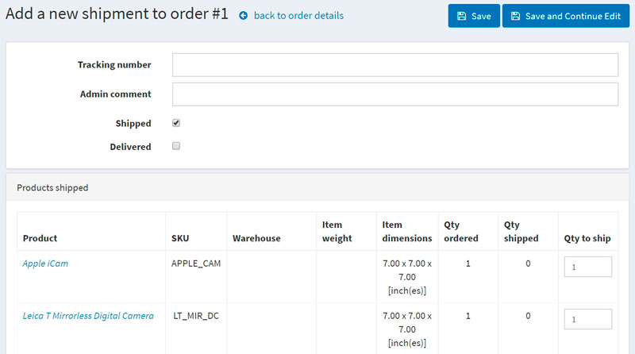
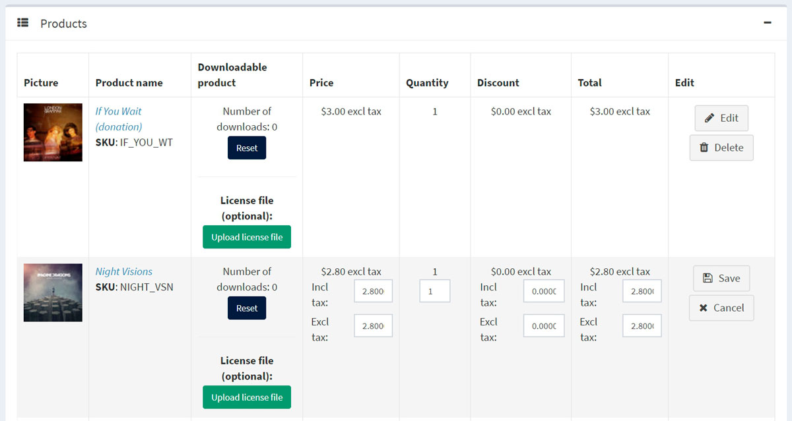
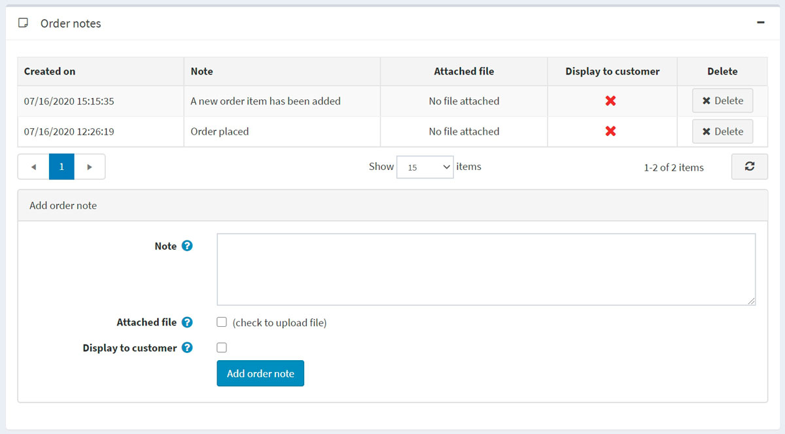

# Orders

To view and manage orders, go to **Sales → Orders**. The orders page lists all current orders. After a customer completes a transaction, a new order appears on the orders page.

The top area of the page enables a store owner to search for orders. Enter specific search criteria and use a variety of filters to find any order placed in the store. Whenever a search is completed, the results of the search will be displayed in the lower half of the screen. You can click **View** to view the order details.

## Search for orders

To search for orders, enter one or more of the following search criteria:

* **Start date** and **End date** to define a period of orders' creation.
* **Warehouse** to load orders with products from a specified warehouse.
* **Product** — enter a product name
* **Order statuses** – select one of the following: *All*, *Pending*, *Processing*, *Complete*, *Cancelled*.
* **Payment statuses** — select a specific payment status to search by: *All*, *Pending*, *Authorized*, *Paid*, *Partially refunded*, *Refunded*, *Voided*.
* **Shipping statuses** — select a specific shipping status to search by: *All*, *Shipping not required*, *Not yet shipped*, *Partially shipped*, *Shipped*, *Delivered*.
* **Store** — set a specific store in which orders were placed.
* **Vendor** — search by a specific vendor. You'll see orders with products by a specified vendor.
* **Billing phone number** — customer's phone number.
* **Billing email address** — customer's email address.
* **Billing last name** — customer's last name.
* **Billing country** — customer's country.
* **Payment method**  — set a specific payment method that was used during checkout.
* **Order notes** — search in order notes. Leave empty to load all orders.
* **Go directly to order #** — enter the order number and click **Go** to display the required order.

### Export orders

You can export orders to an external file by clicking the **Export** button at the top of the page. After clicking the **Export** button, you will see the dropdown menu enabling you to **Export to XML (all found)** or **Export to XML (selected)** and **Export to Excel (all found)** or **Export to Excel (selected)**.

### Import orders

You can import orders from Excel by clicking the **Import**, choose the file, and click the **Import from Excel** button. Imported orders are distinguished by order GUID. If the order GUID already exists, then its details will be updated.

> [!WARNING]
>
> Import requires a lot of memory resources. That's why it's not recommended to import more than 500 - 1,000 records at once. If you have more records, it's better to split them to multiple Excel files and import separately.

## Order details

To view the full order information, click **View** beside the order in the list.

Click the **Invoice (PDF)** button in the top right corner to generate an invoice for the order in PDF. Click **Delete** if you want to delete the order.

### Info

In the **Info** panel, a store owner can perform the following:

* View the **Order #**, which is a unique order number.
* View the **Created on** — the date/time the order was placed/created.
* View the **Customer** who placed the order.
* View the **Order status**. The order status will only be *Completed* when the payment status is set to *Paid* and the shipping status is set to *Delivered*. The order status can be changed manually by clicking the **Change status** button. However, this option is only recommended for advanced users because all appropriate actions (such as inventory adjustment, sending notification emails, reward points, gift card activation/deactivation) must be performed manually in this case.
* **Cancel order**. A confirmation message will be displayed; click **Yes** to remove the order from the system.

> [!NOTE]
>
> When a customer uses the Manual Credit Card payment method, which enables storing credit card information in the database, the **Edit credit card** button becomes visible. If a different payment method is used, this button will not be visible.

* View the **Order subtotal**, **Order shipping**, **Order tax**, **Order total**, **Profit**. If you click the **Edit order totals** button, you will be able to edit the order totals as on the screenshot below:
 

* View the **Payment method** used for this order.
* View the **Payment status**. Can be one of the following: *Pending*, *Authorized*, *Paid (captured)*, *Refunded*, *Partially refunded*, or *Voided*.

 > [!NOTE]
 >
 > Not all of the payment gateways support all of these statuses. Read more about payment methods in the [Payment methods](xref:en/getting-started/configure-payments/payment-methods/index) chapter.

 If the payment status is *Authorized*, the relevant buttons will be available to **Void** and **Capture** the order. **Capture** is used to collect the funds from the customer. **Void** cancels an order that has not been captured.

 If the payment status is *Pending*, the owner can click **Mark as paid** to indicate the payment has been issued for the order.

 If the payment status is *Paid*, the **Refund** and **Partial refund** buttons will be available. After clicking **Refund**, a confirmation window will be displayed. After clicking the **Partial refund** button, the *Partial refund* window will be displayed. This window enables the owner to refund part of the total order as follows:

 

* View the **Store** in which this order was placed.
* View the **Order GUID** displayed for internal usage.
* View the **Customer IP address**, which a customer used when placing the order.

### Billing & shipping

In the **Billing & shipping panel**, view and edit the billing and shipping information if needed.

* View the **Billing address** and **Shipping address**. Optionally, you can click the **View address on Google maps** link to locate the required shipping address. Click the **Edit** button in order to edit the billing or shipping address.
* View and edit the **Shipping method** if needed.
* View the **Shipping status**.

> [!NOTE]
>
> Store owners can create several shipments per order. If you create a shipment but do not ship all products, then the shipping status of the order will be **Partially shipped**. Once all the products are shipped, the status changes to **Shipped**. Once all the shipments are delivered, the status changes to **Delivered**.

* View the list of **Shipments**.
 
 Click **View** beside the shipment to view its details. The shipment information window will be displayed:
 

 **Add shipment** button enables creating several shipments per order and is visible when there is at least one unshipped product in the order. Click **Add shipment** button to add a new shipment to the order, and you will see the **Add a new shipment to order** window:
  
  
* In the **Tracking number** field, enter the tracking number of the shipment. A tracking number enables your customers and you to check up on the progress of a shipment via telephone or online system operated by your shipping agent (post office or a private courier service, such as FedEx or UPS). Whenever a shipment passes certain points along its route, it will be identified by the shipping agent's system, and the tracking database will be updated with the new location and time information.
* Fill the **Admin comment** field if needed.
* Select the **Shipped** checkbox to mark the shipment as shipped using the current date.
* If the previous checkbox is selected, the **Delivered** checkbox will be available. Select this checkbox to mark the shipment as delivered using the current date.
* In the **Products shipped** panel: in the **Qty to ship** column, enter the required quantity of the specific order item to ship.

### Products

In the **Products** panel, a store owner can:

* **View the product information**, including price, quantity, and total price.
* Click the **Product name** link to view a product details page. If the product is downloadable, click **Reset** to reset the number of downloads or **Upload license file**. In addition, when the *Download activation type* of a product is set to *Manually*, the administrator has the option to click **Activate** to enable downloading the product from the site or **Deactivate** to disable downloading the product from the site.
* **Edit** the product's **Price**, **Quantity**, **Discount**, and **Total**.
* **Delete** a product from the system.
 
* Click **Add product**. Select the product from the list. Then, in the *Add a new product to order* window, find the required product. Then proceed to fill the required values and click **Add product**. Do not forget to update order totals after adding a new product to the order.
 

### Order notes

In the **Order notes** panel, a store owner can view the notes that were added to the order for information purposes, delete notes, and add new ones. A note may contain an **Attached file** and can be **Displayed to a customer** in the public store.

## See also

* [Adding products](xref:en/running-your-store/catalog/products/add-products)
* [Shipments](xref:en/running-your-store/order-management/shipping-management)
* [YouTube tutorial on managing orders](https://www.youtube.com/watch?v=z6TUJOO3gVg&index=5&list=PLnL_aDfmRHwsbhj621A-RFb1KnzeFxYz4)
