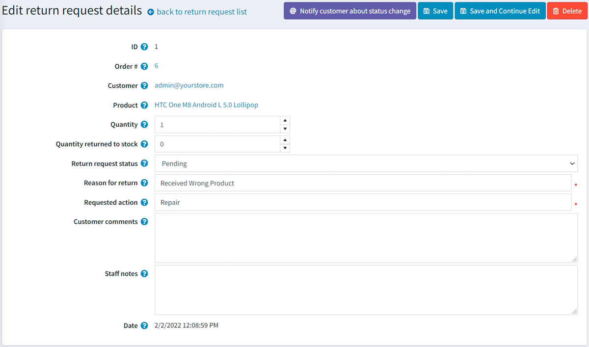

# Return requests

The return request feature enables customers to request a return on items previously purchased. These are also known as RMA requests. This option is only available for completed orders. Return requests settings are managed in **Configuration → Settings → Order settings** in the *Return request settings* panel.

To enable return requests, select the **Enable returns system** checkbox.
When this option is enabled, a **Return item(s)** button is displayed for completed orders on the order details page in the public store.

To proceed to the return request settings section, click [here](#return-request-settings).

In the next sections, we will describe how the return request functionality can be used by your customers and how to manage return requests in the admin area.

## Submit a return request

To submit a return request, a customer should take the following steps:

1. In the public store, go to the *My account* window and click **Orders**. The following page will be displayed:

1. Click the **Return Item(s)** button beside the completed order to be returned. The *Return item(s) from order #* window will be displayed as shown in the following example:
  
    * The **Qty to return** dropdown list allows selecting the number of items to be returned.
    * The **Return reason** dropdown list allows selecting the reason for requesting a return. For example, the wrong product ordered, wrong product received, and more. Read [below](#return-request-settings) about how to manage return reasons.
    * The **Return action** dropdown list allows selecting the required return action to take. For example, repair a product, replace a product, issue credit, and more. Read [below](#return-request-settings) about how to manage return actions.
    * Use the **Upload a file** option if you want to attach some additional documents or pictures to your request.
     > [!NOTE]
     >
     > This option is only available when the **Allow file uploads** checkbox is selected. Read [below](#return-request-settings) about how to set this up.

    * In the **Comments** field, a customer can enter an optional comment for information purposes.
1. After using the return request feature, the customer can see the created return requests and their statuses on the *My Account* page in the public store by clicking **Return requests**:
  

## Manage return requests

The store owner can now manage this return request in the administration area.

To view and edit return requests, go to **Sales → Return requests**. All return requests will be displayed as follows:

Click **Edit** beside the return request; the *Edit return request details* window will be displayed:

The store administrator is allowed to:

* View the return request **ID**.
* View the **Order #**. Clicking the order number redirects to the associated order details page.
* View the **Customer**. Clicking the customer email redirects to the associated customer details page.
* View the **Product**. Clicking the product name redirects to the associated product details page.
* Enter the **Quantity** of the returned product.
* Fill the **Quantity returned to stock** field. It represents the number of items that should be returned to stock.
* Select the **Return request status**:  
  * *Pending*
  * *Received*
  * *Return authorized*
  * *Item(s) repaired*
  * *Item(s) refunded*
  * *Request rejected*
  * *Cancelled*

* In the **Reason for return** field, edit the reason for return if necessary.
* In the **Requested action** field, edit the requested action if necessary.
* In the **Customer comments** field, edit the comment entered by the customer if necessary.
* In the **Staff notes** field, enter an optional note for information purposes. These notes will not be displayed to a customer.
* View the **Date** when the return request was submitted.

> [!NOTE]
>
> Click the **Notify customer about status change** button to send an email to the customer informing them on the return request status change. 

## Return request settings

To define the return request settings, go to **Configuration → Settings → Order settings**.

This page enables multi-store configuration; it means that the same settings can be defined for all stores or differ from store to store. If you want to manage settings for a certain store, choose its name from the multi-store configuration dropdown list and select all the checkboxes needed on the left to set custom values for them. For further details, refer to [Multi-store](xref:en/getting-started/advanced-configuration/multi-store).

Go to the *Return request settings* panel:

In this panel, you can define:

* **Enable returns system** to enable your customers to submit return requests for purchased items.
* In the **Return request number mask** field, specify a custom return request number if needed.
* **Number of days that the return request is available** to set the number of days that the return request link will be available in the customer area.
  > [!TIP]
  >
  > For example, if the store owner allows returns within 30 days after the purchase, this field will be set to 30. When the customer logs into the website and looks at "My account," orders completed earlier than 30 days ago will have no **Return item(s)** button.

* Select the **Allow file uploads** checkbox if you want to allow uploading files (pictures, for example) when submitting a return request. This option is especially useful for customers who face some problems with their orders, such as receiving damaged items or wrong products.

### Return request reasons

This panel represents a list of reasons a customer can choose from when submitting a return request.

Click **Add new** to add a new request reason. The *Add new return request reason* window will be displayed as follows:

Enter the return request reason **Name** and **Display order** number (1 represents the first item in the list). Click **Save** to save the changes.

### Return request actions

This panel represents a list of actions a customer can choose from when submitting a return request.

Click **Add new** to add a new request action. The *Add new return request action* window will be displayed as follows:

Enter the return request action **Name** and **Display order** number (1 represents the first item in the list). Click **Save** to save the changes.

## See also

* [YouTube tutorial: managing return requests](https://www.youtube.com/watch?v=VqF2GZ2ip_0&list=PLnL_aDfmRHwsbhj621A-RFb1KnzeFxYz4&index=17)
* [Order settings](xref:en/running-your-store/order-management/order-settings)
* [Orders](xref:en/running-your-store/order-management/orders)
