# Request for Quote (RFQ) & Quote Support

## Overview

This functionality is implemented as a standalone plugin that allows customers to submit a **Request for Quote (RFQ)** for products in their shopping cart. It is particularly useful for negotiating bulk discounts or special pricing that is not otherwise available on the site.

In response, site administrators can create and send a formal **Quote** to the customer, outlining a special offer.

## Setup & Configuration

The plugin's configuration is straightforward:

- **Activation**: The entire feature can be enabled or disabled with a single setting.
    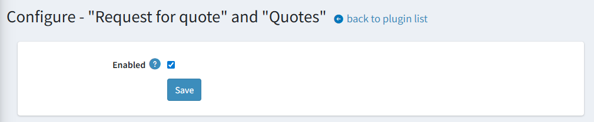
- **Access Control**: Access Control List (ACL) permissions can be configured separately for the public-facing storefront and the admin panel to control who can use the feature.
    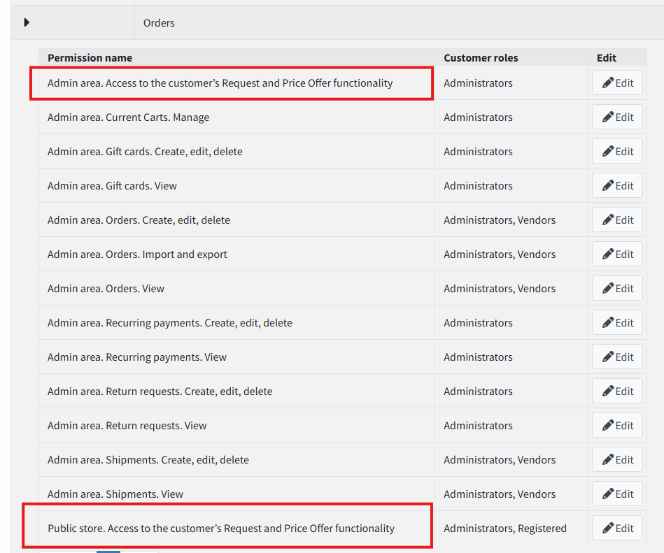

## Usage

### Customer Workflow

1. **Initiating an RFQ**: If the plugin is active and permitted by ACLs, a new button appears on the shopping cart page.
    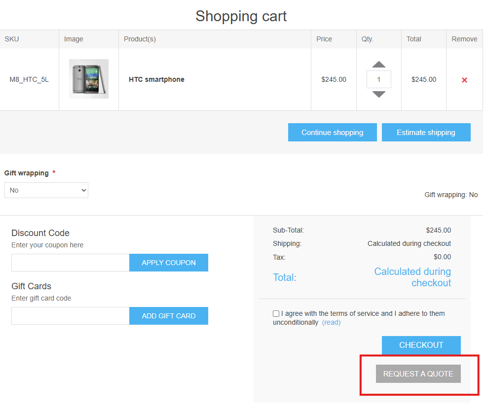
Clicking it takes the user to the RFQ creation form.
    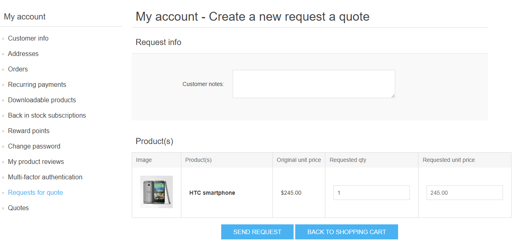
1. **Editing the RFQ**: On this form, the user can adjust the request before submitting it. The RFQ is not saved to the database until it is sent.
    - Add comments to the request.
    - Propose a custom quantity and price per unit for each item.
    - The user can return to the cart by clicking **"Back to shopping cart"**.
1. **Submitting the RFQ**: Once the user clicks **"Send request"**, the RFQ is submitted and can no longer be edited by the user. The only available actions are to cancel or delete it.
    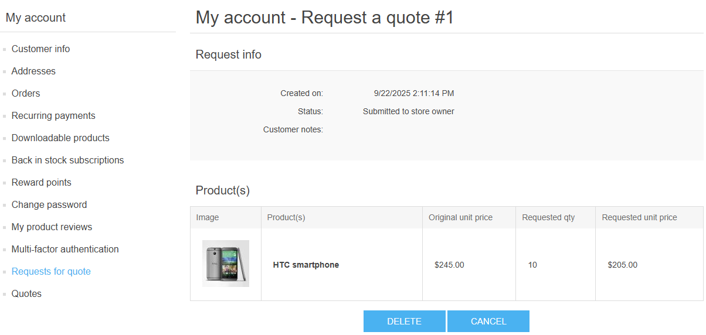
1. **Managing RFQs and Quotes**: After submitting a request, two new menu items appear in the user's account section:
    - **"Requests for quote"**: A list of all submitted RFQs.
        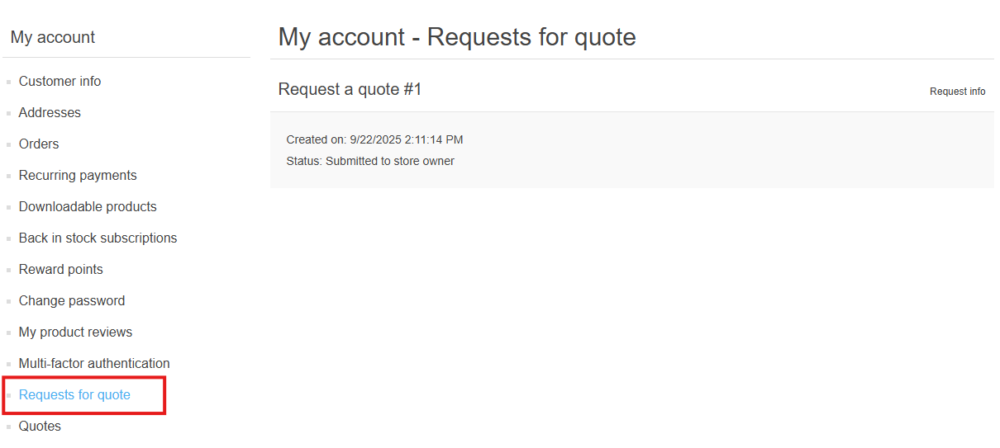
    - **"Quotes"**: A list of all offers received from the store administrator. The user receives an email notification when a new quote is sent.
    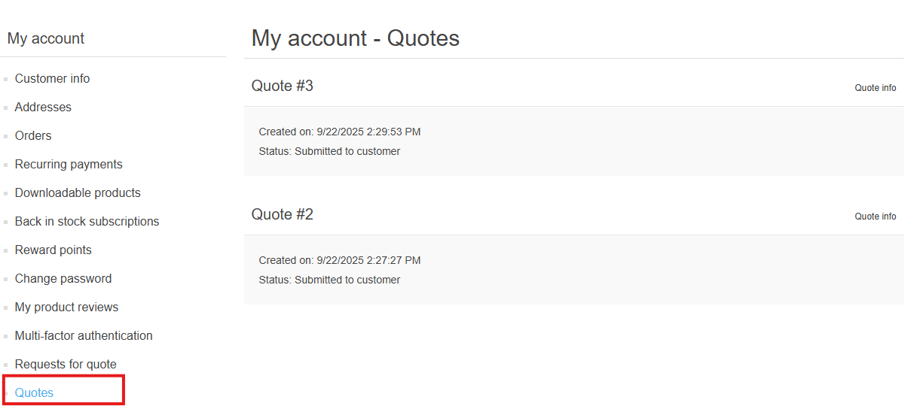
1. **Creating an Order from a Quote**: If a received quote is acceptable and not expired, the user can click **"Create the order"**.
    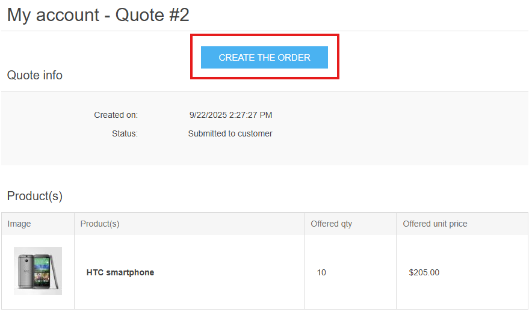
This action performs the following:
    - The user's current shopping cart is cleared.
    - A new cart is created containing the exact items and prices from the quote.
    - The user proceeds to the standard checkout process.
1. **Quote Mode Limitations**:
    - Once a cart has been generated from a quote, it is considered in "quote mode".
    - The user cannot add any other items to the cart or modify the items from the quote. Attempting to do so will cancel the quote mode and empty the cart.
    - The user can click **"Exit quote mode"** to clear the cart and return to the main store page.
    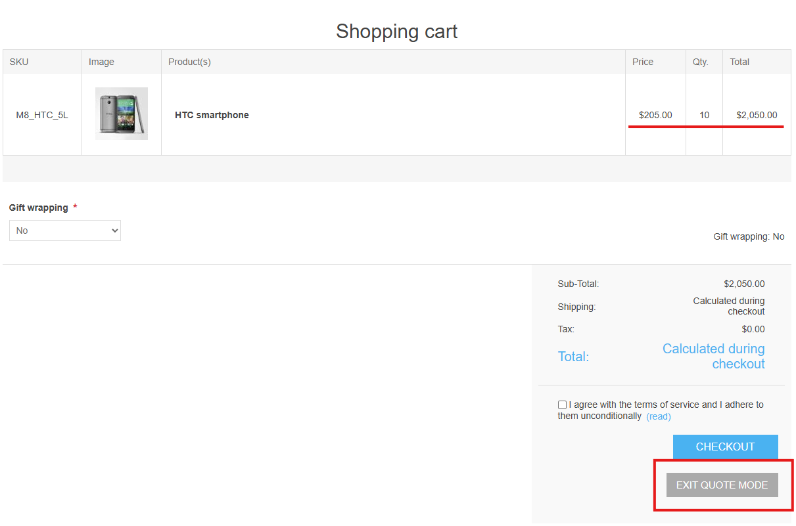

### Administrator Workflow

1. **Notification and Management**: When a user submits an RFQ, the store owner receives an email notification. Two new menu items appear in the admin panel for managing RFQs and Quotes, leading to their respective lists.
    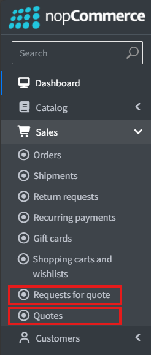
1. **Reviewing an RFQ**: From the RFQ list, an admin can view the details of a user's request. On the edit page, the admin can:
    - Modify any product line item.
    - Delete an item from the request.
    - Cancel or delete the entire RFQ.
    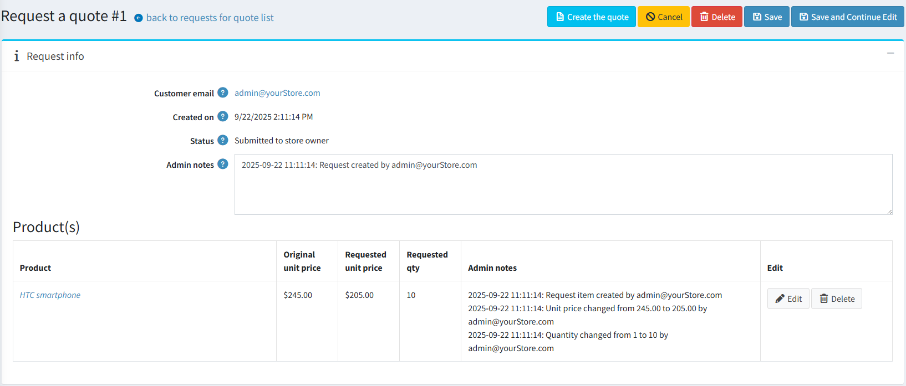
1. **Creating a Quote**:
    - **From an RFQ**: The admin can directly convert an RFQ into a quote by clicking the **"Create the quote"** button on the RFQ detail page.
    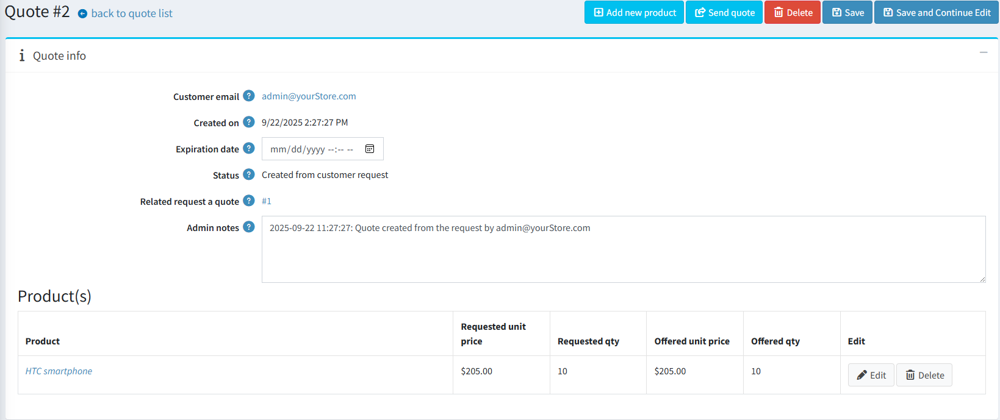
    - **From Scratch**: A new quote can also be created independently from the main quotes list page.
1. **Editing a Quote**: On the quote editing page, the admin can:
    - Modify existing product data.
    - Add new products via a two-step process:
        - first search for the product;
        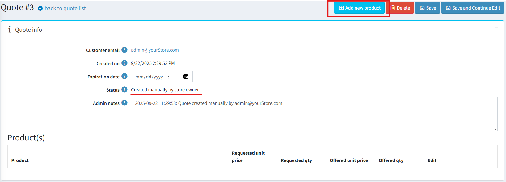
        - then set the desired quantity and price;
        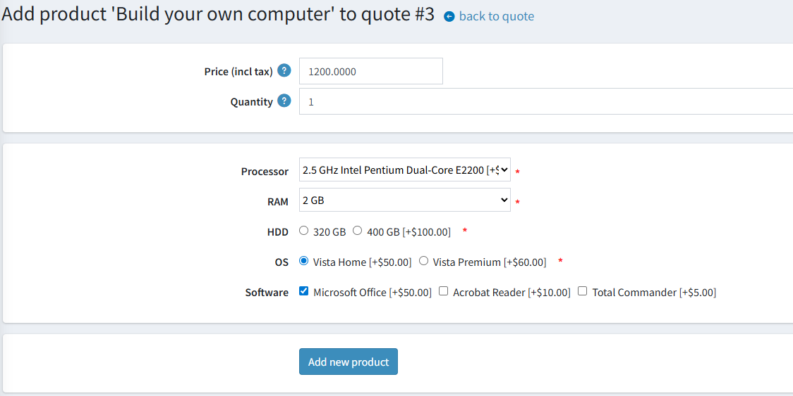
    - Set an expiration date for the offer. After this date, the user can no longer create an order from it.
1. **Sending a Quote**: The quote is saved in the database but remains hidden from the user until the admin clicks **"Send quote"**. Upon sending, the user receives an email notification.
1. **Post-Submission Rules**:
    - Once a quote has been sent to the user, it can no longer be edited by the administrator.
    - A sent quote can only be deleted if the user has not yet created an order from it.
