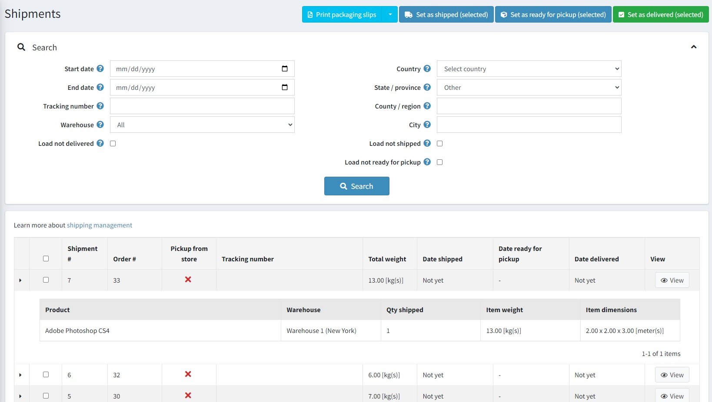
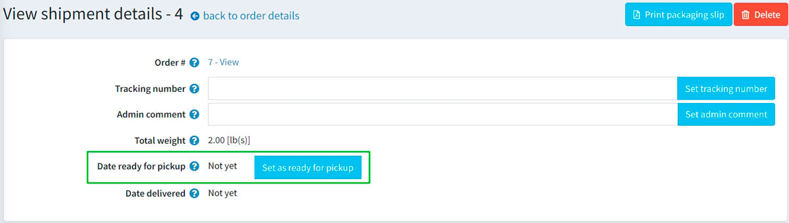

# Shipping management

To search for shipments and view them, go to **Sales → Shipments**.

## Shipment list

The top area of the page enables you to search for a shipment by various search criteria:

* **Start date** and **End date** for shipments created between these dates.
* Enter the **Tracking number** if you want to find shipment with a certain tracking number.
* Select the **Warehouse** for shipments sent from a specific warehouse.
* Click the **Load not delivered** checkbox if you do not want to load already delivered items.
* Use **Country, State/province, County/region, City** to search by a shipment destination.
* Click the **Load not shipped** checkbox if you do not want to load already shipped items.

Select certain shipments to **Set as shipped (selected)** or **Set as delivered (selected)**. You can also **Print packaging slips (selected)** or **Print Packaging slips (all)** to print packaging receipts.

In the list of shipments, a store owner can view all items of a shipment by clicking  in the first column of the shipment.

## Shipment details

If you click **View**, the *View shipment details* window will be opened as follows:

In this window, you can:

* Proceed to the order.
* Set a **Tracking number** for the shipment.
* Add an **Admin comment** for internal use.
* See the **Shipment total weight**.
* Mark the shipment as **Shipped**.
* Edit the **Date shipped**.
* Mark the shipment as **Delivered**.
* Edit the **Date delivered**.
* **Print packaging slip**.
* **Delete** the shipment.

If a customer chose the "Pick up in store" shipping method during the checkout process, you will be able to mark the shipment as "ready for pickup". On the *View shipment details* page, this button looks as follows:

## Shipping settings

To set up shipping, visit the [Configure shipping](xref:en/getting-started/configure-shipping/index) section.

## See also

* [Orders](xref:en/running-your-store/order-management/orders)
* [Adding products](xref:en/running-your-store/catalog/products/add-products)
