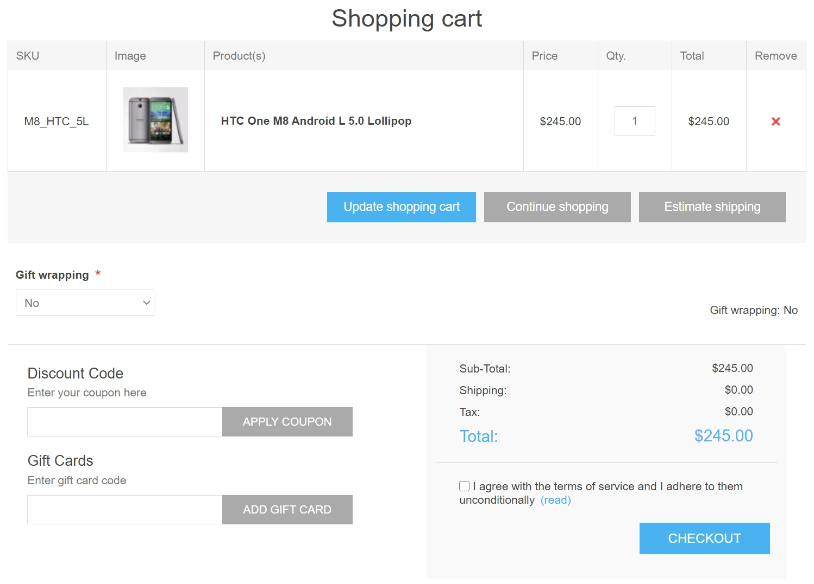

# Shopping carts and wishlists

The "Shopping carts and wishlists" section enables store owners to view all the existing shopping carts and wishlists of all the customers in all stores on one page. To access this page, go to **Sales → Shopping carts and wishlists**.

In the *Search* area at the top of the page, select the desired **Shopping cart type**: *Shopping cart* or *Wishlist*.

You can expand the products by clicking the following icon in the first column: .

From the list, you can proceed to the customer details page by clicking the customer link. You can also visit the edit product details page by clicking the name of the product or delete the product from the cart by clicking the **Delete** button.

## Shopping cart

Select the *Shopping cart* from the **Shopping cart type** dropdown list on the **Sales → Shopping carts and wishlists** and click **Search** to view the shopping cart list. This list contains all products that were placed in carts but not purchased.

The following screenshot shows how a customer sees a shopping cart page in the public store:

There are a few elements on the shopping cart page. Some of them can be disabled if needed:

1. The button in the **Remove** column allows removing an item from the shopping cart.
1. The **Update shopping cart** button allows a customer to change a product's quantity by entering the appropriate number in the **Qty** field.
1. The **Continue shopping** button allows a customer to proceed to the catalog.
1. The **Estimate shipping** button allows a customer to estimate shipping. After clicking this button, the following pop-up window will be displayed:
  
  In this window, the customer can enter the shipping address and see the appropriate shipping options.
  You can disable shipping estimation on the shopping cart page by clearing the **Estimate shipping enabled (cart page)** checkbox on the **Configuration → Settings → Shipping settings** page.
1. You can see the **Gift wrapping** dropdown on the shopping cart screenshot provided above. This is a checkout attribute. Read more about how to manage checkout attributes in the [Checkout attributes](xref:en/running-your-store/order-management/checkout-attributes) chapter.
1. The **Discount code** section allows a customer to enter a discount code. You can disable this by clearing the **Show discount box** checkbox on the **Configuration → Settings → Shopping cart settings** page. Read more about discounts in the [Discounts](xref:en/running-your-store/promotional-tools/discounts) chapter.
1. The **Gift cards** section allows a customer to use a gift card. You can disable this by clearing the **Show gift card box** checkbox on the **Configuration → Settings → Shopping cart settings** page. Read more about gift cards in the [Gift cards](xref:en/running-your-store/promotional-tools/gift-cards) chapter.
1. In the shopping cart totals section, a customer sees the shipping fee. Read about how to set up shipping in the [Configure shipping](xref:en/getting-started/configure-shipping/index) section.
1. In the same section, a customer sees the tax info. Read about how to set up taxes in the [Configure taxes](xref:en/getting-started/configure-taxes/index) section.
1. In the same section, a customer sees how many reward points will be earned. Read about how to set up reward points in the [Reward points](xref:en/running-your-store/promotional-tools/reward-points) section.
1. In the same section, a customer sees terms of service. You can disable this by clearing the **Terms of service (shopping cart page)** checkbox on the **Configuration → Settings → Order settings** page.

> [!NOTE]
>
> In case you don't want to allow customers to add a certain product to shopping cart, select the **Disable buy button** checkbox in the *Prices* panel of the product edit page. Read more about adding a product in the [Add products](xref:en/running-your-store/catalog/products/add-products) chapter.
>
> [!NOTE]
>
> Check out our [marketplace](http://www.nopcommerce.com/marketplace) for plugins that help you manage abandoned carts and recover lost sales.

## Wishlist

Select the *Wishlist* option from the **Shopping cart type** dropdown list on the **Sales → Shopping carts and wishlists** page and click **Search** to view the wishlists.

A wishlist is a list of products that a customer can share with friends or save to transfer to the cart later. If adding to wishlist is enabled for a product, the **Add to wishlist** button appears on the product details page in the public store. When a product of different variants is added to a wishlist, all variants chosen by the customer will be included in the wishlist.

> [!TIP]
>
> For example, if a customer adds the same shirt in 2 different colors, each shirt will appear as a separate item in the wishlist. In the case a customer adds the same product to the wishlist multiple times, the product only appears once but with an updated quantity that reflects the number of times it was added.

The following screenshot illustrates how a customer sees the wishlist page in the public store:

There are a few elements on the wishlist page:

1. The button in the **Remove** column allows removing an item from the wishlist.
1. The **Update wishlist** button allows a customer to change a product's quantity by entering the appropriate number in the **Qty** field.
1. The **Add to cart** button allows a customer to add the selected products to the cart.
1. The **Email a friend** button allows a customer to send the wishlist to a friend via email. You can disable this by clearing the **Allow customers to email their wishlists** checkbox on the **Configuration → Settings → Shopping cart settings** page.
1. **Your wishlist URL for sharing** allows a customer to share the wishlist.

> [!NOTE]
>
> In case you don't want to allow a customer to add a certain product to wishlist, select the **Disable wishlist button** checkbox in the *Prices* panel of the product edit page. Read more about adding a product in the [Add products](xref:en/running-your-store/catalog/products/add-products) chapter.

## Shopping cart and wishlist settings

To change the shopping cart and wishlist settings, go to the **Configuration → Settings → Shopping cart settings** page.

This page enables multi-store configuration; it means that the same settings can be defined for all stores or differ from store to store. If you want to manage settings for a certain store, choose its name from the multi-store configuration dropdown list and select all the checkboxes needed on the left to set custom values for them. For further details, refer to [Multi-store](xref:en/getting-started/advanced-configuration/multi-store).

### Common settings

In the *Common* panel, you can define:

* **Show discount box** displaying the discount coupon box on the shopping cart page.
* **Show gift card box** displaying the gift card box on the shopping cart page.
* **Allow cart item editing** to enable customers to edit items in the cart. This feature is useful when products have values entered by customers.
* **Maximum shopping cart items** — the maximum number of products allowed to be added to the shopping cart.
* Select the **Carts shared between stores** checkbox to share shopping carts (and wishlists) between stores.
* **Show product images on cart** to display product images in the store shopping carts.
* **Display cart after adding a product** to the display the shopping cart page immediately after a product is added to the cart. When this checkbox is clear, the customer will remain on the page where the product was added to the cart.
* **Number of cross-sells** that you want to display on the checkout page of the shopping cart in the public store. Enter 0 if you do not want to display cross-sells.

### Mini shopping cart settings

In the *Mini shopping cart* panel, you can define:

* **Show mini-shopping cart** – a dropdown menu that appears at the top right corner of the main window, when hovering over the "Shopping cart" link as shown below:
  
  When this field is selected, the following fields will be displayed:
  * **Number of products in mini-shopping cart** — the maximum number of products displayed in the mini shopping cart dropdown menu in the public store.
  * **Show product images in mini shopping cart** to determine whether images are displayed in the mini shopping cart dropdown menu.

### Wishlist settings

In the *Wishlist* panel, you can define:

* **Maximum wishlist items** — the maximum number of different products allowed to be added to the wishlist.
* **Show product images on wishlist** to display product images in customers' wishlists.
* **Allow customers to email their wishlist** to friends. When this field is enabled, the following field will be displayed:
  * **Allow guests to email their wishlist** to friends.
* **Allow 'out of stock' items to be added to the wishlist**.
* Select the **Move items from wishlist to cart** checkbox to move products from wishlist to the cart when clicking the "Add to cart" button. Otherwise, they are copied.
* **Display wishlist after adding a product** to display the wishlist page immediately after a product is added to the wishlist. When this checkbox is clear, the customer will remain on the page, where the product was added to the wishlist.

## See also

* [Orders](xref:en/running-your-store/order-management/orders)
* [Promotional tools](xref:en/running-your-store/promotional-tools/index)

## Tutorials

* [Overview of wishlists in nopCommerce](https://www.youtube.com/watch?v=9EN7oZSwIVE)
