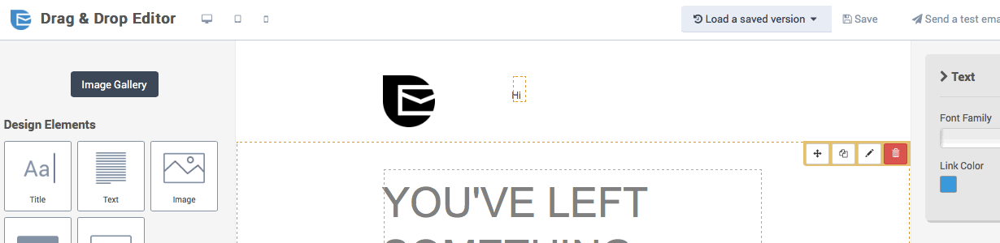
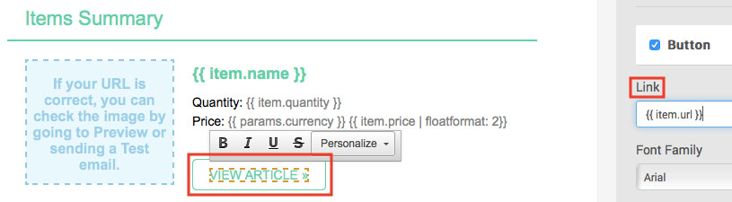
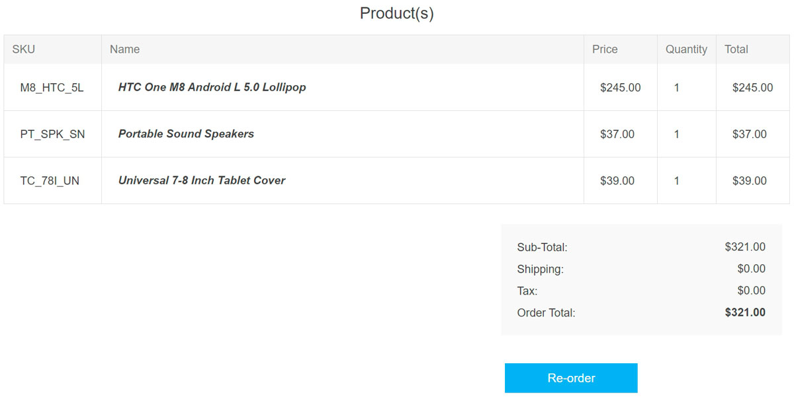

# Send an order confirmation email

In this tutorial, you will learn how to create an order confirmation email template and set up a workflow to keep buyers engaged. You will also learn which nopCommerce order data are compatible with the Brevo platform.

## Before getting started

You will need the following:

* Brevo account credentials. If you don't have one, [sign up for free](https://app.brevo.com/account/register/?tap_a=30591-fb13f0&tap_s=840216-5153c7).
* Make sure that Brevo [*New Template Language*](https://help.brevo.com/hc/en-us/articles/360000659260?tap_a=30591-fb13f0&tap_s=840216-5153c7) for emails is enabled in your account.
* Follow [these steps](xref:en/running-your-store/promotional-tools/brevo-integration/set-up-brevo-plugin) to set up the brevo plugin.

## Create the order confirmation email template

First, log in to your Brevo account, then go to the Automation platform > [Email Templates](https://my.brevo.com/camp/lists/template?tap_a=30591-fb13f0&tap_s=840216-5153c7). Click the **New Template** button in the top right.

The email template can be personalized with several types of data:

* [contact attributes saved in your Brevo list](#personalize-your-email-with-contact-attributes)
* [order details](#personalize-your-email-with-the-order-details)
* [ordered item details](#personalize-your-email-with-the-ordered-items-details)

### Personalize your email with contact attributes

Let's start by personalizing with [contact attributes](https://help.brevo.com/hc/en-us/articles/360001008200?tap_a=30591-fb13f0&tap_s=840216-5153c7).

In the example below, we have included personalization of:

* the recipient's first name using `{{ contact.FIRSTNAME }}`
* the recipient's last name using `{{ contact.LASTNAME }}`

> [!NOTE]
> FIRSTNAME and LASTNAME should be existing attributes in your Brevo account.

### Personalize your email with the order details

The following variables can be included directly within your Brevo template content:

| Order data | Shipping address data | Billing address data |
| ------------- | ------------- | ------------- |
| {{ params.url }} | {{ params.shipping_address.firstname }} | {{ params.billing_address.firstname }} |
| {{ params.currency }} | {{ params.shipping_address.lastname }} | {{ params.billing_address.lastname }} |
| {{ params.date }} | {{ params.shipping_address.company }} | {{ params.billing_address.company }} |
| {{ params.discount }} | {{ params.shipping_address.phone }} | {{ params.billing_address.phone }} |
| {{ params.id }} | {{ params.shipping_address.address1 }} | {{ params.billing_address.address1 }} |
| {{ params.revenue }} | {{ params.shipping_address.address2 }} | {{ params.billing_address.address2 }} |
| {{ params.shipping }} | {{ params.shipping_address.city }} | {{ params.billing_address.city }} |
| {{ params.subtotal }} | {{ params.shipping_address.country }} | {{ params.billing_address.country }} |
| {{ params.tax }} | {{ params.shipping_address.state }} | {{ params.billing_address.state }} |
| {{ params.total_before_tax }} | {{ params.shipping_address.zipcode }} | {{ params.billing_address.zipcode }} |

In the *Drag & Drop Editor*, select your desired block that will display the order information, then add your variables.

We recommend formatting numbers using [floatformat](https://help.brevo.com/hc/en-us/articles/360000268730?tap_a=30591-fb13f0&tap_s=840216-5153c7). In the example below, we have added:

* `{{ params.currency | floatformat: 2 }}` - the currency of the order
* `{{ params.subtotal | floatformat: 2 }}` - the subtotal of the order
* `{{ params.discount | floatformat: 2 }}` - the discount of the order
* `{{ params.total | floatformat: 2 }}` - the total of the order

Now let's personalize the email template with ordered items. To do so, we're using the *New Template Language* to insert a dynamic list.

### Personalize your email with the ordered items details

The following variables can be included directly from a dynamic list within your Brevo template content:

| Items data | Insert this placeholder in your template |
| ------------- | ------------- |
| Name | {{ item.name }} |
| SKU | {{ item.sku }} |
| Category | {{ item.category }} |
| ID | {{ item.id }} |
| ID of the item variation | {{ item.variant_id }} |
| Name of the item variation | {{ item.variant_name }} |
| Price | {{ item.price }} |
| Quantity | {{ item.quantity }} |
| Storefront link to the purchased item | {{ item.url }} |
| Image | {{ item.image }} |

In the *Drag & Drop Editor*, select your desired block that will display the ordered items.

1. Click the **pencil icon** to edit the settings for the design block.
1. Enable the **dynamic list** option.
1. In the **parameter** field, type `items`.
1. In the **variable** field, type `item`.
1. Set the limit for the number of items that will be displayed. For example, if there are 5 items, and you set 3 as the limit, only 3 items will be shown in the email.

Now add the variables to your email template. In the example above, we have added:

* `{{ item.name }}` - the name of the item
* `{{ item.quantity }}` - the quantity of the item
* `{{ item.price | floatformat: 2 }}` - the price of the item

To add the link to the item, select the **Call-To-Action (CTA)** button. On the right sidebar, under *Link*, type `{{ item.url }}`.

To add the image of the item, select the image. On the right sidebar, under *Image source*, choose *From URL*, then type `{{ item.image }}`.

Once your design is complete, click the green **Save & Quit** button. Then click the **Save & Activate** button.

## Creating the order confirmation workflow

> [!NOTE]
>
> A customer has to be identified by their email address to trigger the workflow, that is, a customer should be logged in to their account on your nopCommerce store or enter their email address during checkout.

Navigate to the [Automation](https://automation.brevo.com/?tap_a=30591-fb13f0&tap_s=840216-5153c7) tab of your Brevo account.

Click **+ CREATE A NEW WORKFLOW**, then select **Product Purchase** and follow the steps.

1. **Step 1/3** — An event happens

   * Select *Custom Event (Track Event)*.
   * Type `order_completed`.
   * Click **NEXT**.

1. **Step 2/3** — Add a delay

   * Choose a delay. For example, 5 seconds.
   * Click **NEXT**.

1. **Step 3/3** — Send an email

   * From the dropdown list, select the email template you have just created and    activated.
   * Select **Use my event data to customize the email**.
   * Select **The event data which triggered the workflow**.
   * Click **FINISH**.

When your workflow is complete, click **DONE** to save and activate it.

## Example

Let's say that customer Jean Blue jean.blue@brevo.com has purchased the following 3 items from your store.

Your template will look like this:

The email received by Jean Blue at jean.blue@brevo.com will look like this:

## Learn more

* [Recover abandoned carts](xref:en/running-your-store/promotional-tools/brevo-integration/recover-abandoned-carts)
