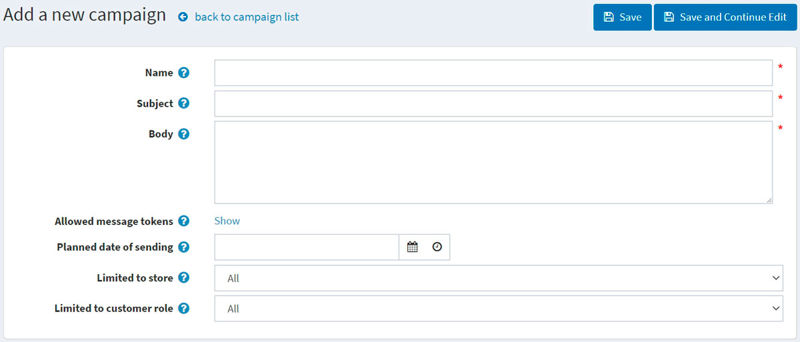
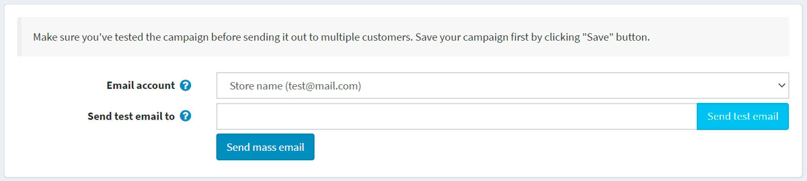
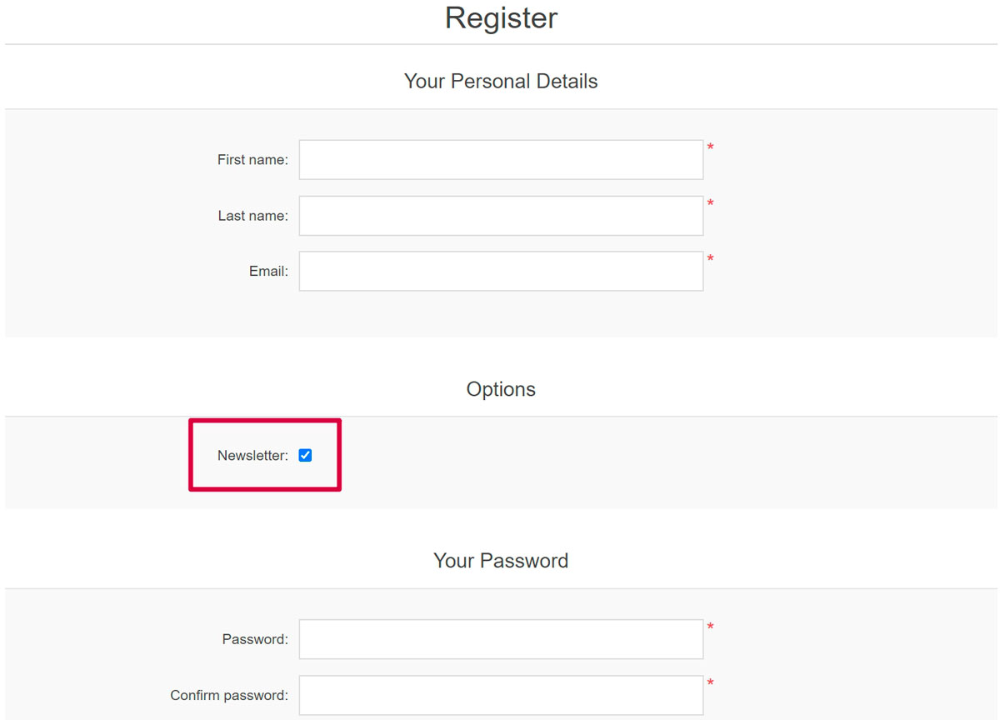
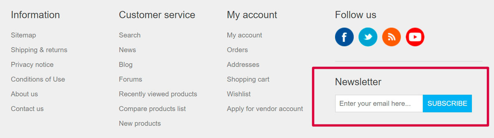
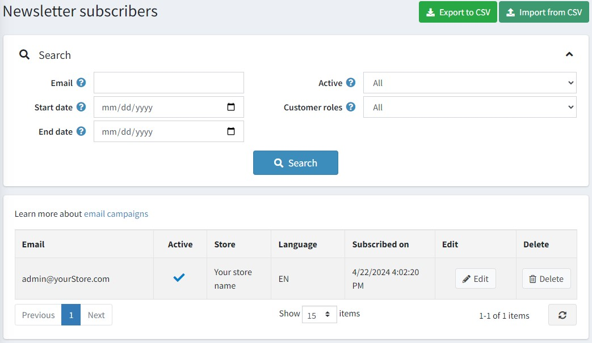

---
title: Email campaigns
uid: en/running-your-store/promotional-tools/email-campaigns
author: git.AndreiMaz
contributors: git.DmitriyKulagin, git.exileDev, git.IvanIvanIvanov, git.mariannk
---

# Email campaigns

During registration, a customer can select the *Newsletter* option to receive newsletters from your store. Or it's possible to subscribe to a newsletter later using the form in the footer (in the Default Clean nopCommerce theme). The other way of filling in email subscribers is to import a list of subscribers from an external CSV file to nopCommerce. You can also export the list of subscribers to an external CSV file from nopCommerce.

See how to manage newsletter subscribers in the [Newsletter subscribers](#newsletter-subscribers) section below.

Use your subscribers list to create email campaigns to easily and quickly reach the target audience with no additional marketing activities. Campaigns help to promote trust and loyalty to a company while also increasing sales.

There are several examples of email marketing campaigns you can use for your store: start with a welcome email that thanks for the subscription, regularly send out announcements, news regarding your company, coupons for future purchasing, and much more.

> [!NOTE]
>
> There are no campaigns available by default, so you can create them from scratch in order to follow your own marketing strategy.

To manage campaigns, go to **Promotions → Campaigns**.

## Add a new email campaign

To create a new campaign, click **Add new**.

Define the following campaign details:

- Campaign **Name**.
- **Subject** of the campaign.
- Enter the **Body** text of the email you want to send out.
- In **Allowed message tokens**, you can see the list of allowed message tokens you can use in your email campaign. You can see all of them if you click **Show**.
- Enter the **Planned date of sending** and time.
- From the **Limited to store** dropdown list, select which store's subscribers will get this email.
- From the **Limited to customer role** dropdown list, select the roles of subscribers that will receive this email.

Click **Save** or **Save and continue editing** to proceed to send your campaign.

## Send the campaign

After the campaign is saved, you can send it to customers. You will see the new panel at the top of the page:

> [!NOTE]
>
> Make sure you've tested the campaign before sending it out to multiple customers.

First of all, send a test email to check if everything is done properly. To do this, choose the **Email account** that will be used to send the campaign. See how to create an email account in the [Email accounts](xref:en/getting-started/email-accounts) section.

Then enter your email address in the **Send test email to** field and click **Send test email**.

After you make sure that everything is OK, send your campaign to customers using the **Send mass email** button.

## Newsletter subscribers

During registration, a customer can select the *Newsletter* option to receive a newsletter from your store:

Or it's possible to subscribe to a newsletter later using the form in the footer (in the Default Clean nopCommerce theme):

The other way of filling in email subscribers is to import a list of subscribers from an external CSV file to nopCommerce. You can also export the list of subscribers to an external CSV file from nopCommerce.

To export/import newsletter subscribers, go to **Promotions → Newsletter subscribers**.

You can click **Import from CSV** to import subscriber lists in CSV format. Ensure that each line of the CSV file has the appropriate format: email_address, is_active, store_id (store_id parameter is optional). For example, `test@test.com, true`. You can click **Export to CSV** to export the existing subscriber list.

## Searching for the subscribers

On the *Newsletter subscribers* page, you can find certain subscribers using the following fields for search:

- Enter the **Email** of the subscriber to find or leave this field empty to load all the newsletter subscribers registered in the system.
- Specify **Start date** and **End date** when a customer subscribed.
- From the **Active** dropdown list, choose between *Active* and *Not active* subscribers or load *All*.
- From the **Store** dropdown list, choose the store.
- From the **Customer roles** dropdown list, select the customer role.

Click **Search**.

## Tutorials

- [Managing campaigns in nopCommerce](https://youtu.be/iW2m8LQyyWM)
