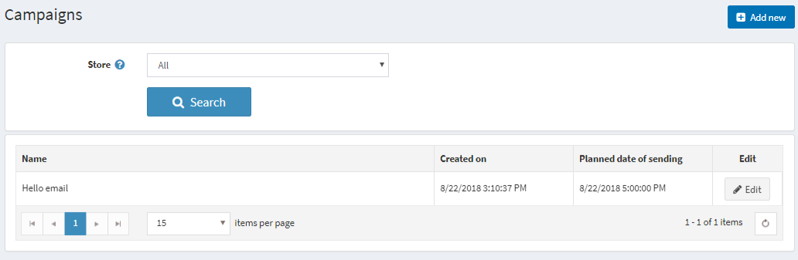
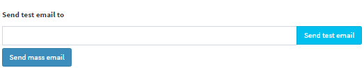
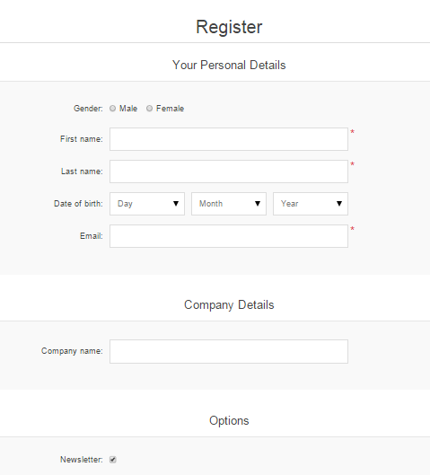

---
title: Email campaigns
uid: en/running-your-store/promotional-tools/email-campaigns
author: git.AndreiMaz
contributors: git.DmitriyKulagin, git.exileDev, git.IvanIvanIvanov
---

# Email campaigns

During customer registration, a customer can select the **Newsletters option** to receive nopCommerce newsletters.

# All campaigns

During customer registration, a customer can select the **Newsletters option** to receive nopCommerce newsletters. The other way of filling in email subscribers is to **export the list of subscribers** to an external CSV file as well **import list of subscribers from an external CSV** file into nopCommerce.

> [!TIP]
> 
> You can manage newsletter subscribers on Promotions → Newsletter subscribers.

Use your subscribers list to create email campaigns to easily and quickly reach the target audience without any additional marketing activities. Campaigns help to promote trust and loyalty to a company while also increasing sales.

There are several examples of email marketing campaigns you can use for your store: start with a welcome email that thanks for the subscription, regularly send out announcements,  news regarding your company, coupons for future purchasing and much more.

There are **no campaigns available by default**, so you can create them from scratch in order to follow your own marketing strategy.

To manage campaigns go to **Promotions → Campaigns**

## Adding new email campaign

To create a new campaign go to **Promotions → Campaigns → Add new.**

## Define the campaign details

- In the **Allowed message tokens field**, enter the allowed list of message tokens you can use in your campaign email. You can see all of them if choose Show

- Campaign **Name**
- **Subject** of the campaign
- Enter the **Body text** of the email you want to send out
- Choose **Planned date and time** of sending
- From the **Limited to store** dropdown list, select the store which subscribers will get this email
- From the **Limited to customer roles** dropdown list, select the roles of subscribers which will get this email
- Click **Save**. The Campaigns window is displayed, as follows: 

After the campaign is saved you can send a test email to check if everything is done properly. Click Edit campaign and you will see one more field on the top if the screen **Send test email to** and fill in the email address. 

## Tutorials

- [Managing campaigns in nopCommerce](https://youtu.be/iW2m8LQyyWM)

# Newsletter subscribers

During customer registration, a customer can select the **Newsletters option** to receive nopCommerce newsletters.

The other way of filling in email subscribers is to **export the list of subscribers** to an external CSV file as well **import list of subscribers from an external CSV** file into nopCommerce.

To Export/Import Newsletter subscribers go to **Promotions  → Newsletter Subscribers.**

> [!NOTE]
> 
> You can click **Import from CSV** to import subscriber lists in CSV format. Ensure that each line of the CSV file is in the following format: email_address,is_active,store_id (store_id parameter is optional). For example, `test@test.com, true`. You can click **Export to CSV**  to export subscriber lists.

## Searching for the subscribers

On the **Newsletter subscribers page** you can find certain subscribers using following fields for **search:**

- Specify **Start date** and **End date** for the search
- Enter the **email** of the subscriber to find, or leave this field empty and click Search to load all the newsletter subscribers registered in the system
- From the **Active** dropdown list, choose between active and inactive subscribers
- From the **Customer roles** dropdown list, select the customer role in which a user subscribed to newsletters
