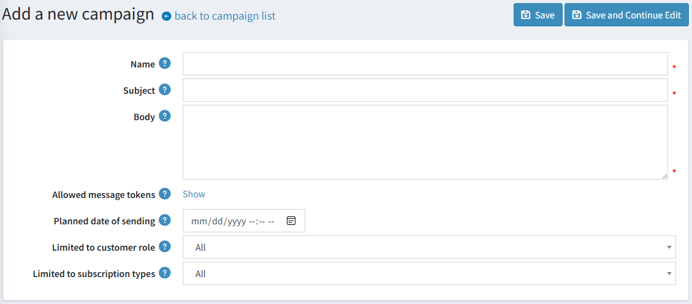
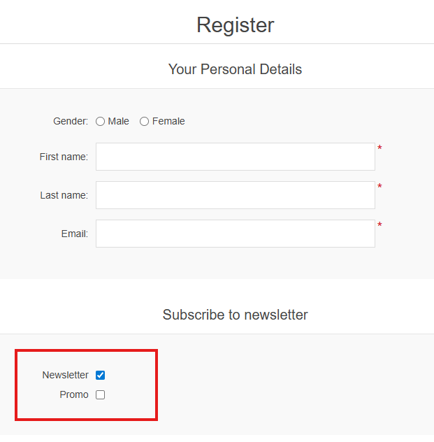
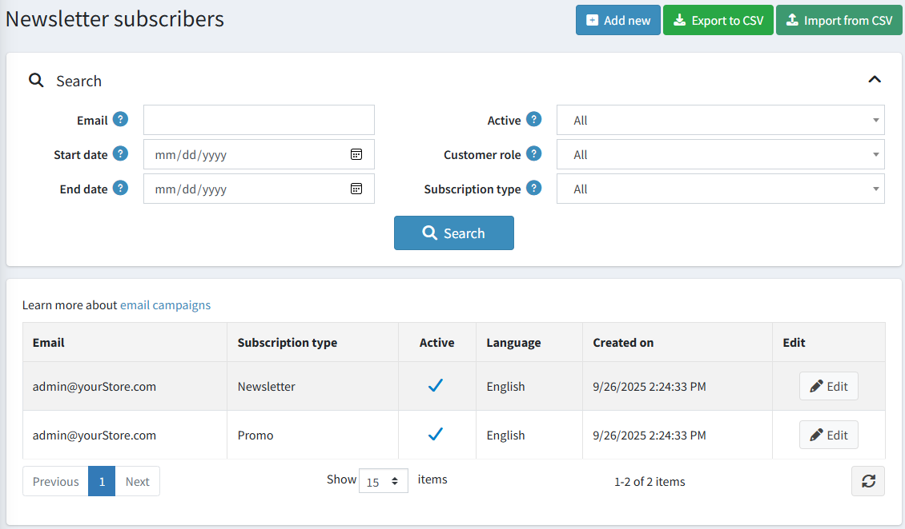
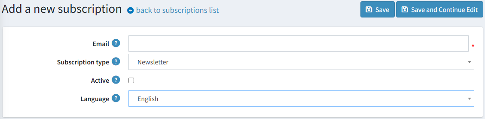
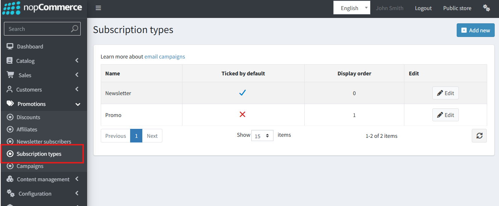
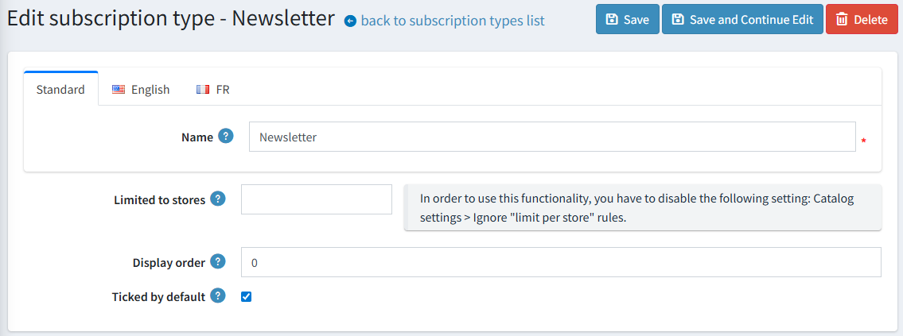

---
title: Email campaigns
uid: en/running-your-store/promotional-tools/email-campaigns
author: git.AndreiMaz
contributors: git.DmitriyKulagin, git.exileDev, git.IvanIvanIvanov, git.mariannk
---

# Email campaigns

During registration, a customer can select the *Newsletter* option to receive newsletters from your store. Or it's possible to subscribe to a newsletter later using the form in the footer (in the Default Clean nopCommerce theme). The other way of filling in email subscribers is to import a list of subscribers from an external CSV file to nopCommerce. You can also export the list of subscribers to an external CSV file from nopCommerce.

See how to manage newsletter subscribers in the [Newsletter subscribers](#multiple-newsletter-lists) section below.

Use your subscribers list to create email campaigns to easily and quickly reach the target audience with no additional marketing activities. Campaigns help to promote trust and loyalty to a company while also increasing sales.

There are several examples of email marketing campaigns you can use for your store: start with a welcome email that thanks for the subscription, regularly send out announcements, news regarding your company, coupons for future purchasing, and much more.

> [!NOTE]
>
> There are no campaigns available by default, so you can create them from scratch in order to follow your own marketing strategy.

To manage campaigns, go to **Promotions → Campaigns**.

## Add a new email campaign

To create a new campaign, click **Add new**.

Define the following campaign details:

- Campaign **Name**.
- **Subject** of the campaign.
- Enter the **Body** text of the email you want to send out.
- In **Allowed message tokens**, you can see the list of allowed message tokens you can use in your email campaign. You can see all of them if you click **Show**.
- Enter the **Planned date of sending** and time.
- From the **Limited to store** dropdown list, select which store's subscribers will get this email.
- From the **Limited to customer role** dropdown list, select the roles of subscribers that will receive this email.
- From the **Limited to subscription types** dropdown list, choose a subscription type to which this email will be sent.

Click **Save** or **Save and continue editing** to proceed to send your campaign.

## Send the campaign

After the campaign is saved, you can send it to customers. You will see the new panel at the top of the page:

> [!NOTE]
>
> Make sure you've tested the campaign before sending it out to multiple customers.

First of all, send a test email to check if everything is done properly. To do this, choose the **Email account** that will be used to send the campaign. See how to create an email account in the [Email accounts](xref:en/getting-started/email-accounts) section.

Then enter your email address in the **Send test email to** field and click **Send test email**.

After you make sure that everything is OK, send your campaign to customers using the **Send mass email** button.

## Multiple Newsletter Lists

The **Multiple Newsletter Lists** feature allows store owners to create and manage multiple newsletter subscription options for their customers. Previously, only a single default newsletter was available. With this feature, customers can now choose which newsletters they want to subscribe to, giving them more control over the communications they receive.

By default, one newsletter list named **"Newsletter"** is provided. Store owners can create additional lists, such as **"Partner Newsletter"**, **"Special Offers"**, or **"Promo Newsletter"**, and manage them from the admin panel.

### Customer Experience

When multiple newsletter lists are configured, customers will see all available lists on:

- The **registration page**
- The **customer information page**

Customers can select the newsletters they wish to subscribe to using checkboxes.

Alternatively, customers can subscribe later using the form in the footer (in the Default Clean nopCommerce theme):  

### Managing subscribers

On the **Promotions → Newsletter subscribers** page you can search for subscribers using the following fields:

- **Email** – Enter a subscriber’s email to find them, or leave empty to load all subscribers.
- **Start date / End date** – Filter by the subscription date.
- **Active** – Choose between *Active*, *Not active*, or *All* subscribers.
- **Store** – Select the store.
- **Customer roles** – Select a customer role.
- **Subscription type** – Select the type of subscription.

Click **Search** to apply filters.

The function of creating and editing subscriptions is available through the administration panel.

You can also manage newsletter subscribers by importing a list from an external CSV file into nopCommerce or exporting subscribers to a CSV file.

To export or import newsletter subscribers:  

- Click **Import from CSV** to import subscriber lists in CSV format.
- Click **Export to CSV** to export the existing subscriber list.

### Managing Subscription Types

In addition to managing subscribers, store owners can view and edit **subscription types**.  
This allows full control over what kinds of newsletters are available for customers.

- From the admin panel, navigate to **Promotions → Subscription types**.
- You can add, edit, or delete subscription types.  
- These types will be displayed as options to customers when subscribing.

**Examples:**

Manage existing subscription types:  

Edit or create subscription type details:  

### Campaign Management

When creating an email campaign, store owners can:

- Select a **specific newsletter list** to target
- Choose **"all newsletter lists"** to send the campaign to all customers subscribed to at least one newsletter

This functionality is fully integrated with email plugins, such as **Brevo**, ensuring seamless campaign delivery.

## Tutorials

- [Managing campaigns in nopCommerce](https://youtu.be/iW2m8LQyyWM)
