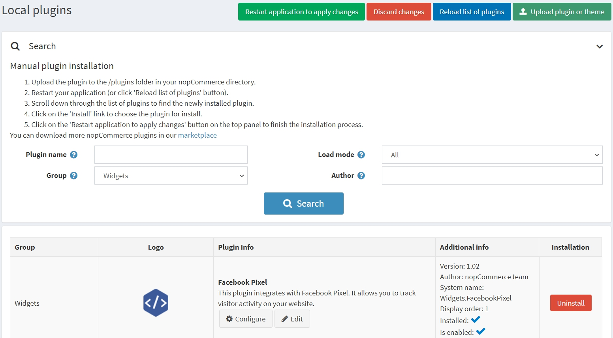

# Facebook pixel plugin

This section describes how to integrate Facebook pixel in your store.

## What the Facebook pixel is

Facebook pixel allows you to receive information about the actions taken on your store to make your Facebook ads more relevant to your audience. Facebook pixel can help you understand the behaviour of people who visit your store and which advertising strategy works best to reach your business goals.

Tracked conversions appear in the [Facebook Ads Manager](https://www.facebook.com/adsmanager) and in the [Facebook Analytics](https://business.facebook.com/analytics) dashboard, where they can be used to measure the effectiveness of your ads, to define custom audiences for ad targeting, for dynamic ads campaigns, and to analyze the effectiveness of your website's conversion funnels.

## What the Facebook pixel plugin does

The Facebook pixel plugin for nopCommerce pasts a snippet of JavaScript code that allows you to track visitor activity on your website. It works by loading a small library of functions which are used whenever a customer takes an action.

## Install and enable the plugin

The Facebook pixel plugin is an out-of-the-box nopCommerce plugin. You can find it here: **Configuration → Local plugins**. To find the plugin faster use the **Group** field in the search panel to filter the plugins by *Widgets* type:

Install the plugin using the **Install** button if it is uninstalled. Then enable it by clicking the **Edit** button. You will see the *Edit plugin details* window in this case. Mark the plugin as enabled using the **Is enabled** checkbox and click the **Save** button.

## How to configure the plugin

1. Click the **Configure** button. You will see the *Configure - Facebook Pixel* page window:

1. Click the **Add new configuration** button.
1. Fill the following form to set up the plugin:

* Tick the **Enabled** checkbox to enable this Facebook pixel configuration.
* Enter your **Pixel ID** which you can find in the [Ads Manager → Events Manager](https://business.facebook.com/events_manager). If you have not created a pixel, [follow these instructions](https://www.facebook.com/business/help/952192354843755) to create one - all you need is the pixel's ID.
* **Advanced Matching**: if ticked some of the visitor's data (in the hashed format) will be collected by the Facebook Pixel. If you automatically implement advanced matching using the Events Manager, uncheck this setting.
* **Include User properties**: check to include *User properties*, data about the User, in a pixel. Then you can view User properties in the Facebook Analytics dashboard under People → User Properties.

Next you see the list of events. Standard events are predefined visitor actions that correspond to common, conversion-related activities, such as searching for a product, viewing a product, or purchasing a product.

* **Track "PageView" event**: check to enable tracking standard event, when a person lands on the website pages.
* **Track "AddToCart" event**: check to enable tracking standard event, when a product is added to the shopping cart.
* **Track "Purchase" event**: check to enable tracking standard event, when an order is placed.
* **Track "ViewContent" event**: check to enable tracking standard event, when a person lands on a product details page.
* **Track "AddToWishlist" event**: check to enable tracking standard event, when a product is added to the wishlist.
* **Track "InitiateCheckout" event**: check to enable tracking standard event, when a person enters the checkout flow prior to completing the checkout flow.
* **Track "Search" event**: check to enable tracking standard event, when a search is made.
* **Track "Contact" event**: check to enable tracking standard event, when a person person submits a question via contact us form.
* **Track "CompleteRegistration" event**: check to enable tracking standard event, when a registration form is completed.

> [!NOTE]
>
> As an additional parameter, some events include product SKU or product combination SKU; make sure that they are filled out correctly in your catalog.

* **Disable for users not accepting Cookie Consent**: check to disable the Facebook pixel for users not accepting Cookie Consent. You may want this if you conduct business in countries that are subject to General Data Protection Regulation (GDPR). You also need to activate the **DisplayEuCookieLawWarning** setting on the **Configuration → Settings → General settings** page in order to display Cookie Consent for users.

> [!NOTE]
>
> The General Data Protection Regulation (GDPR) took effect on May 25, 2018, and creates consistent data protection rules across Europe. Businesses who advertise with the Facebook companies can continue to use Facebook platforms and solutions in the same way they do today.

## Configure custom events

> [!NOTE]
>
> You can see this panel only after you already created and saved current configuration!

If the predefined standard events aren't suitable for your needs, you can track your own custom events, which also can be used to define custom audiences for ad optimization.
You can configure them below. Specify the name and choose widget zones in which the custom event will be tracked. If you don't know which zone to use for your custom event, you can ask about it in our [forums](https://www.nopcommerce.com/boards).

## See also

[What data does the Facebook pixel collect?](https://developers.facebook.com/docs/facebook-pixel/support#pixelcollect)
