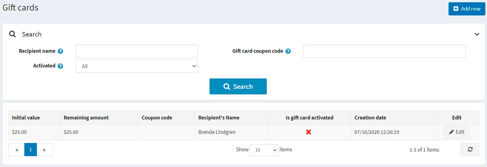

# Gift cards

In nopCommerce, you have an opportunity to sell gift cards among other types of products.

Gift cards are a good marketing tool, enabling you to reach more customers and stimulate additional purchases. Gift cards are a highly targeted instrument as the receivers are certainly motivated to use them because it is like a personal proposal to them.

## Add a new gift card

You can create gift card products, defining a product as a gift card by selecting the **Is gift card** checkbox when creating the product in the **Catalog → Products → Add new → Gift card** panel.

In this panel, you also need to specify the **Gift card type**: *Virtual* or *Physical*.

> [!WARNING]
>
> It is not recommended to change the gift card type in a "live" store.

## Activating a gift card

After your customers complete purchases with the gift card products, you can then search and view the list of all the purchased gift cards in **Sales → Gift cards**.

To see the gift card details, click the **Edit** button beside it. The *Edit gift card details* window will be displayed:

You should select the **Is gift card activated** checkbox to activate the gift card. Then generate the **Coupon code**.

> [!NOTE]
>
> In order to activate a gift card automatically after completing an order, go to the **Configuration → Settings → Order settings** page. Find the *Gift cards* panel and select the **Activate gift cards after completing of an order** checkbox. In this case, the **Coupon code** will be generated automatically as well.
> Note that this page has other settings related to gift card activation as well.

You can also define the following gift card information:

- In **Gift card type**, select whether it's *Virtual* or *Physical*.
- Beside the **Order** field, click **View** to view the order in which the gift card was purchased.
- In the **Initial value** field, edit the initial value of the card if needed.
- The **Remaining amount** field allows to see the remaining amount of this gift card.
- The **Is gift card activated** field determines whether this gift card is activated and can be used.
- The **Coupon code** field represents the gift card coupon code (used during checkout).
- If required, edit the **Recipients name**, **Recipient's email** (if the gift card type is *Virtual*), **Sender's name**, and **Sender's email** (if the gift card type is *Virtual*) in the relevant fields.
- Enter an optional message in the **Message** area.
- Click **Notify recipient**. An email containing the gift card details will be sent to the recipient. This button is only relevant for virtual gift cards and not physical ones.

## Usage history

In the *Usage history* panel, you can see the list of orders for which this gift card coupon was used. After the gift card is activated and the sender receives a coupon code, they can use it during checkout.

## Using gift cards

A gift card is used in the public store by entering the serial number in the box on the shopping cart page.

> [!NOTE]
>
> You can disable the gift card box on the shopping cart page by clearing the **Show gift card box** checkbox on the **Configuration → Settings → Shopping cart settings** page (*Common* panel).

You can also allow your customers to check the gift card balance. To do this, select the **Allow customers to check gift card balance** checkbox on the **Configuration → Settings → Shopping cart settings** page (*Common* panel).

> [!NOTE]
>
> This feature requires CAPTCHA to be enabled because it is potentially not safe, and CAPTCHA is needed to prevent and complicate brute force. To activate CAPTCHA, go to the **Configuration → Settings → General settings** page and select the **CAPTCHA enabled** checkbox in the *CAPTCHA* panel. To learn how to set up CAPTCHA, refer to the [Security settings - CAPTCHA](xref:en/getting-started/advanced-configuration/security-settings#captcha) section.

## See also

- [Adding products](xref:en/running-your-store/catalog/products/add-products)
- [YouTube tutorial on managing gift cards](https://www.youtube.com/watch?v=4SJ7uBZGas0&index=4&list=PLnL_aDfmRHwsbhj621A-RFb1KnzeFxYz4)
