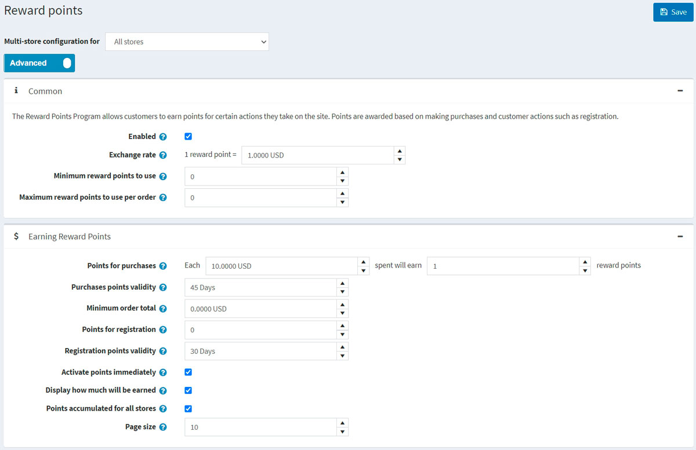

---
title: Reward points
uid: en/running-your-store/promotional-tools/reward-points
author: git.AndreiMaz
contributors: git.exileDev, git.DmitriyKulagin, git.IvanIvanIvanov, git.mariannk
---

# Reward points

The "Reward points" functionality enables you to create and implement loyalty program for improving customer experience and increase customer loyalty. The "Reward points" program allows customers to earn points for certain actions they take on the site like registering and making purchases.

Reward points can be used as one of the payment methods. This option is displayed in the payment method area of the checkout. Exchangeable reward points can be used together with other payment options such as credit cards, gift cards and more.

The points can also be canceled if a customer canceled an order or sent a return request.

## Managing reward points

To manage the reward points program go **Configuration → Settings → Reward points**. This page is available in two modes: *basic* and *advanced*.

This page enables multi-store configuration, it means that the same settings can be defined for all stores, or differ from store to store. If you want to manage settings for a certain store, choose its name from multi-store configuration drop-down list and tick all needed checkboxes at the left side to set custom value for them. For further details refer to [Multi-store](xref:en/getting-started/advanced-configuration/multi-store).



To set up your reward point program, define these settings:

## Common
- Tick the **Enabled** checkbox, to make the reward points program active.
- In the **Exchange rate** field, specify the reward points exchange rate. (1 point - $1 etc).
- In the **Minimum reward points to use** field, enter the minimum amount of rewards points required, before customers can use their reward points. Enter 0, if you do not need to define this setting.
- If you specify the **Maximum reward points to use per order** field customers won't be able to use more than X reward points per one order. Set to 0 if you do not want to use this setting. 

## Earning reward points
- In the **Points for purchases** field, specify the number of points granted for purchases.
- In the **Purchases points validity** field, specify the number of days when the points awarded for purchases will be valid.
- In the **Minimum order total** field, specify the minimum order total (exclude shipping cost) to award points for purchases.
- In the **Points for registration** field, specify the number of points granted for customer registration.
- In the **Registration points validity** field, specify number of days when the points awarded for registration will be valid.
- Tick the **Activate points immediately** checkbox if you want customers will be able to use reward points right after earn them. If you don't check this checkbox one more option appears:
- In the **Reward points activation** checkbox specify the period (number of days/hours) after which reward points will be activated.
- Tick the **Display how much will be earned** checkbox to show your customers how many points will be earned. It will be visible on the checkout page.
- Tick the **Points accumulated for all stores** checkbox to accumulate all the reward points in one balance for all stores so they can be used in any store.
- In the **Page size** field set the page size for history of reward points on the *My account* page

Click **Save**.

> [!NOTE]
> 
> Reward points are applied to only registered users.

When a customer uses reward points when checkout it looks like that:





## See also

- [Managing reward points tutorial](https://www.youtube.com/watch?v=lE4-xDUKkd0&index=14&list=PLnL_aDfmRHwsbhj621A-RFb1KnzeFxYz4)
