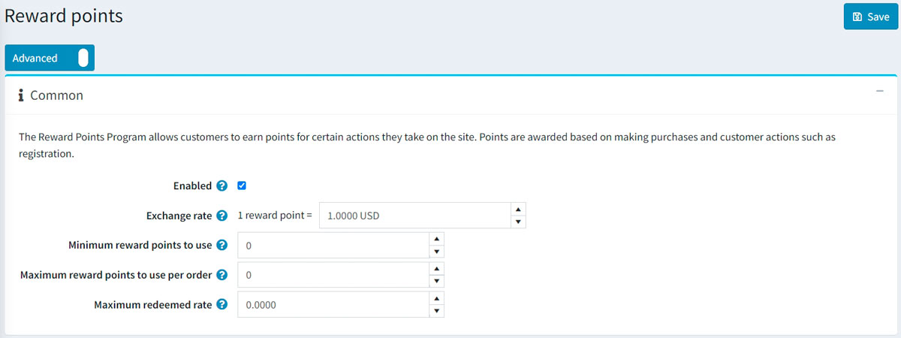

# Reward points

The "Reward points" functionality enables you to create and implement a loyalty program for improving customer experience and increasing customer loyalty. A "Reward points" program allows customers to earn points for certain actions they take on the site, like registering and making purchases.

Reward points can be used as one of the payment methods. This option is displayed in the payment method area of the checkout. Exchangeable reward points can be used together with other payment options, such as credit cards, gift cards, and more.

The points can also be canceled if a customer cancels an order or sends a return request.

## Managing reward points

To manage the reward points program, go to **Configuration → Settings → Reward points**. This page is available in two modes: *basic* and *advanced*.

This page enables multi-store configuration; it means that the same settings can be defined for all stores or differ from store to store. If you want to manage settings for a certain store, choose its name from the multi-store configuration dropdown list and select all the checkboxes needed on the left to set custom values for them. For further details, refer to [Multi-store](xref:en/getting-started/advanced-configuration/multi-store).

To set up your reward point program, define these settings:

## Common

- Select the **Enabled** checkbox to make the reward points program active.
- In the **Exchange rate** field, specify the reward points exchange rate (for example, 1 point = $1).
- In the **Minimum reward points to use** field, enter the minimum number of reward points required before customers can use them. Enter 0 if you do not need to define this setting.
- If you specify the **Maximum reward points to use per order** field, customers won't be able to use more than X reward points per order. Set to 0 if you do not want to use this setting.
- The **Maximum redeemed rate** setting limits the maximum order total that can be paid by reward points (percentage). For example, if set to 0.6, then only 60% of order total can be paid using reward points but not more than the **Maximum reward points to use per order**. Set to 0 if you do not want to use this setting.

## Earning reward points

- In the **Points for purchases** field, specify the number of points granted for purchases.
- In the **Purchases points validity** field, specify the number of days the points awarded for purchases will be valid. The default value is `45` days. If you specify a value of `0`, then the reward points will expire indefinitely.
- In the **Minimum order total** field, specify the minimum order total (excluding shipping cost) to award points for purchases.
- In the **Points for registration** field, specify the number of points granted for customer registration.
- In the **Registration points validity** field, specify the number of days the points awarded for registration will be valid.
- Select the **Activate points immediately** checkbox if you want to enable customers to use reward points right after earning them. If you clear this checkbox, one more option will appear:
- In the **Reward points activation** checkbox, specify the period (number of days/hours) after which reward points will be activated.
- Select the **Display how much will be earned** checkbox to show your customers how many points will be earned. It will be visible on the checkout page.
- Select the **Points accumulated for all stores** checkbox to accumulate all the reward points in one balance for all stores so that they can be used in any store.
- In the **Page size** field, set the page size for the history of reward points on the *My account* page

Click **Save**.

> [!NOTE]
>
> Reward points are applied to registered users only.

When a customer uses reward points during checkout, it looks like this:

## See also

- [Managing reward points tutorial](https://www.youtube.com/watch?v=lE4-xDUKkd0&index=14&list=PLnL_aDfmRHwsbhj621A-RFb1KnzeFxYz4)
