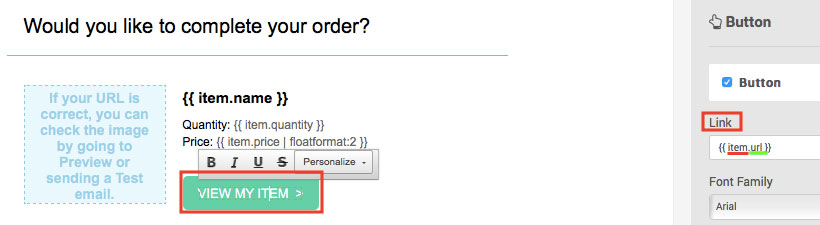
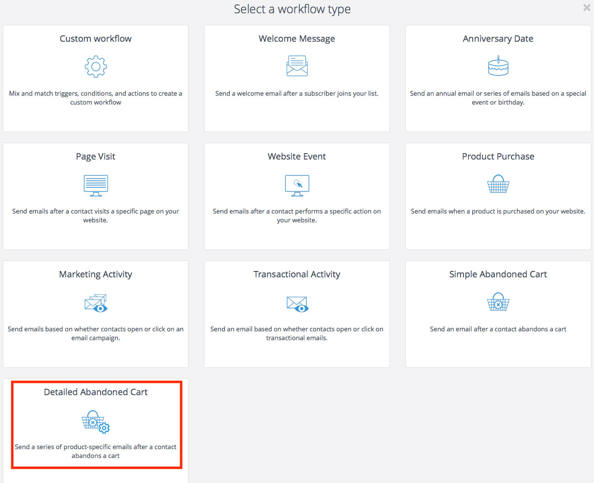
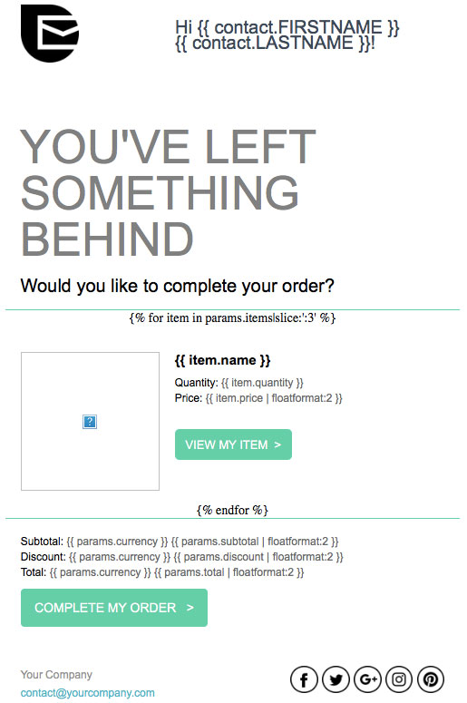
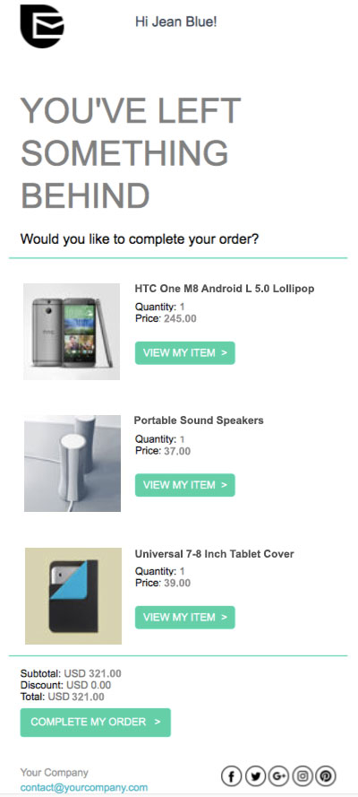

# Recover abandoned carts

In this tutorial, you will learn how to create abandoned cart email and how to set up the workflow to recover lost sales. You will also learn which nopCommerce order data is compatible with the Sendinblue platform.

## Before getting started

You will need the following:

* Sendinblue account credentials. If you don't have one, [sign up for free](https://app.sendinblue.com/account/register/?tap_a=30591-fb13f0&tap_s=840216-5153c7).
* Make sure that Sendinblue's [*New Template Language*](https://help.sendinblue.com/hc/en-us/articles/360000659260?tap_a=30591-fb13f0&tap_s=840216-5153c7) for emails is enabled on your account.
* Follow [these steps](xref:en/running-your-store/promotional-tools/sendinblue-integration/set-up-sendinblue-plugin) to set up the Sendinblue plugin.

## Create an abandoned cart email template

First, log into your Sendinblue account then go to the Automation platform > [Email Templates](https://my.sendinblue.com/camp/lists/template?tap_a=30591-fb13f0&tap_s=840216-5153c7). Click on the **New Template** button at the top right.

The email template can be personalized with several types of data:

* [contact attributes saved in your Sendinblue list](#personalize-your-email-with-contact-attributes)
* [abandoned item details](#personalize-your-email-with-the-abandoned-items-details)
* [abandoned cart details](#personalize-your-email-with-the-abandoned-cart-details)

### Personalize your email with contact attributes

Let's start by [personalizing with contact attributes](https://help.sendinblue.com/hc/en-us/articles/360001008200?tap_a=30591-fb13f0&tap_s=840216-5153c7).

In the example below, we have included a personalization of:

* the recipient's first name using {{ contact.FIRSTNAME }}
* the recipient's last name using {{ contact.LASTNAME }}

> [!NOTE]
> FIRSTNAME and LASTNAME should be existing attributes in your Sendinblue account.

Now let's personalize the email template with order variables such as the name of the items left behind, their images, price etc. To do so, we will use the *New Template Language* to insert a dynamic list.

### Personalize your email with the abandoned items details

The following variables may be included directly from a dynamic list within your Sendinblue template content:

| Items data | Insert this placeholder in your template |
| ------------- | ------------- |
| Name | {{ item.name }} |
| SKU | {{ item.sku }} |
| Category | {{ item.category }} |
| ID | {{ item.id }} |
| ID of the item variation | {{ item.variant_id }} |
| Name of the item variation | {{ item.variant_name }} |
| Price | {{ item.price }} |
| Quantity | {{ item.quantity }} |
| Storefront link of the purchased item | {{ item.url }} |
| Image | {{ item.image }} |

In the *Drag & Drop Editor*, select your desired block that will display the abandoned items.

1. Click the **pencil icon** to edit the settings for the design block.
1. Enable the **dynamic list** option.
1. In the **parameter** field, write `items`.
1. In the **variable** field, write `item`.
1. Set the limit for the number of items that will be displayed. For example, if there are 5 items left in the cart, and you set 3 as the limit, only 3 items will be shown in the email.

Now add the variables to your email template. In the example above, we have added:

* `{{ item.name }}` - the name of the item
* `{{ item.quantity }}` - the quantity of the item
* `{{ item.price | floatformat: 2 }}` - the price of the item

To add the link of the item, select the **Call-To-Action (CTA)** button. On the right sidebar, under *Link*, type `{{ item.url }}`.

To add the image of the item, select the image. On the right sidebar, under *Image source*, choose *From URL* then type `{{ item.image }}`.

Once your design is complete, click the green **Save & Quit** button. Then click the **Save & Activate** button.

### Personalize your email with the abandoned cart details

The following variables may be included directly within your Sendinblue template content:

| Cart details | Insert this placeholder |
| ------------- | ------------- |
| Affiliation | {{ params.affiliation }} |
| Currency | {{ params.currency }} |
| Discount | {{ params.discount }} |
| Shipping | {{ params.shipping }} |
| Subtotal | {{ params.subtotal }} |
| Tax | {{ params.tax }} |
| Total before tax | {{ params.tax }} |
| Total | {{ params.total_before_tax }} |
| Link to cart | {{ params.url }} |

> [!NOTE]
> Items shown in the link to cart page will be different based on where the session is opened from. For example, let's say a customer is browsing from their laptop. If they click on the abandoned cart email from their phone, it will not show their abandoned cart.

In the *Drag & Drop Editor*, select your desired block that will display the abandoned cart information then add the order variables you want.

We recommend formatting numbers by using [floatformat](https://help.sendinblue.com/hc/en-us/articles/360000268730?tap_a=30591-fb13f0&tap_s=840216-5153c7). In the example below, we have added:

* `{{ params.currency }}` - the currency of the abandoned cart
* `{{ params.subtotal | floatformat: 2 }}` - the subtotal of the abandoned cart
* `{{ params.discount | floatformat: 2 }}` - the discount of the abandoned cart
* `{{ params.total | floatformat: 2 }}` - the total of the abandoned cart

To add the link of the abandoned cart, select the **Call-To-Action (CTA)** button. On the right sidebar, under *Link*, type `{{ params.url }}`.

Once your design is complete, click the green **Save & Quit** button. Then click the **Save & Activate** button.

## Creating the abandoned cart workflow

> [!NOTE]
> A customer has to be identified by their email address to trigger the workflow, i.e. a customer should be logged into their account on your nopCommerce store or input their email address during checkout.

Navigate to the [Automation](https://automation.sendinblue.com/?tap_a=30591-fb13f0&tap_s=840216-5153c7) tab of your Sendinblue account.

Click on **+ CREATE A NEW WORKFLOW**, then select **Detailed Abandoned Cart** and follow the steps.

At the *Send an email* step, select the email template you have just created and activated from the dropdown list.

When your workflow is complete, click on **DONE** to save and activate it.

Feel free to read this tutorials to help you creating the workflow:

* [Recovering abandoned carts: automatically send the emails (step 3)](https://help.sendinblue.com/hc/en-us/articles/360002761299?tap_a=30591-fb13f0&tap_s=840216-5153c7)

## Example

Let's say that customer Jean Blue jean.blue@sendinblue.com has visited your store but the following 3 items have been left in the cart.

Your template will look like this:

The email received by Jean Blue will look like this:

## Learn more

* [Send an order confirmation email](xref:en/running-your-store/promotional-tools/sendinblue-integration/send-an-order-confirmation-email)
