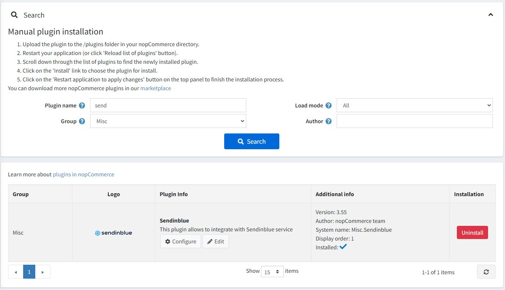
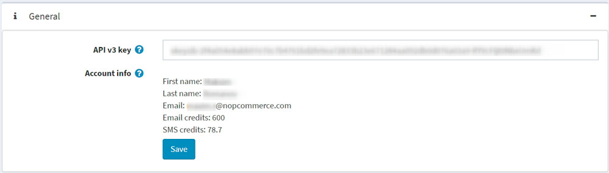
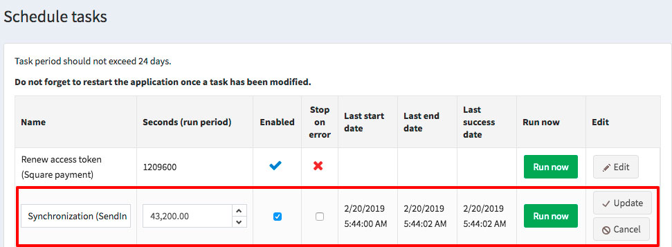
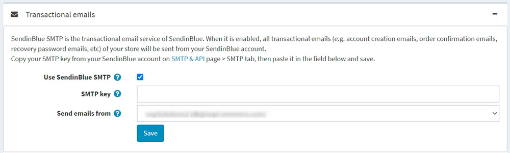
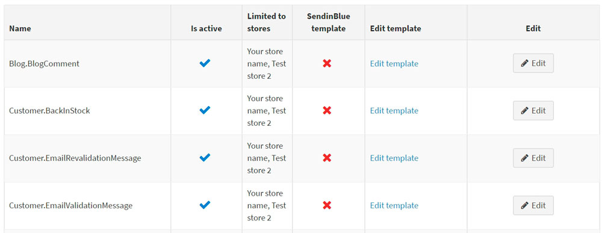

# Set up Sendinblue plugin

This section describes how to integrate Sendinblue into your store.

## Install and enable the plugin

The Sendinblue plugin is an out-of-the-box nopCommerce plugin. You can find it here: **Configuration → Local plugins**. To find the plugin faster, use the **Group** field in the search panel to filter the plugins by *Misc* type:

Install the plugin using the **Install** button if it is uninstalled. Then enable it by clicking the **Edit** button. You will see the *Edit plugin details* window in this case. Mark the plugin as enabled using the **Is enabled** checkbox and click the **Save** button.

## How to configure the plugin

1. Click the **Configure** button. You will see the *Configure - Sendinblue* window:

1. You will need to create a free Sendinblue account using [this link](https://app.sendinblue.com/account/login/?tap_a=30591-fb13f0&tap_s=840216-5153c7).

1. Enter your **API v3 key** from your Sendinblue account on the [SMTP & API](https://account.sendinblue.com/advanced/api/?tap_a=30591-fb13f0&tap_s=840216-5153c7) page.

1. Click the **Save** button.

1. Once you have done this, you should be able to see your account details.

1. Go to the **Contacts** panel to synchronize your nopCommerce customers with your Sendinblue account.

* To create a new Sendinblue list, click the **Create a list** button to be redirected to your Sendinblue account.
* From the dropdown list, select the list where your nopCommerce subscribers and their contact data will be added. Click the **Save** button.

### What data is synced?

The following form fields are synced as contact attributes:

* EMAIL
* FIRSTNAME
* LASTNAME
* SMS
* STORE_ID
* USERNAME
* PHONE
* COUNTRY
* GENDER
* DATE_OF_BIRTH
* COMPANY
* ADDRESS_1
* ADDRESS_2
* ZIP_CODE
* CITY
* COUNTY
* STATE
* FAX

> [!NOTE]
>
> For the sync, note that these form fields need to be enabled for customers. Go to **Configuration → Settings → Customer settings → Customer form fields**.

Order data is synced as transactional attributes:

* ORDER_ID: ID of the order
* ORDER_PRICE: amount of the order
* ORDER_DATE: date of the order

> [!NOTE]
>
> Orders are synced when their payment status is "Paid."

### How often are contacts synced?

After the initial sync, a task is scheduled to run every 6000 seconds to automatically add your new subscribers to your Sendinblue list.

Click the **Sync now** button to sync right away.

To change the sync frequency, go to **System → Schedule tasks**.

## Sending transactional emails

Go to the **Transactional emails** panel to send your transactional emails via Sendinblue SMTP.

1. Select the **Use Sendinblue SMTP** checkbox.
1. Paste your SMTP password, which can be found [here](https://account.sendinblue.com/advanced/api?tap_a=30591-fb13f0&tap_s=840216-5153c7).
1. From the dropdown list, select the sender you wish to send your emails from.
1. Click the **Save** button.

You should then be able to see the email notification list. This lists all the transactional emails (like order confirmation ones) that you send.

For each template, you can:

* Choose if it is active or inactive.
* Choose between the default nopCommerce template and a Sendinblue template. To do this:

 1. Click the **Edit** button
 1. From the dropdown, choose your template
 1. Click **Update**

* Edit its content.

> [!NOTE]
>
> If you *have selected* the **Sendinblue email template**, then click **Edit template** to edit the content of your template on your Sendinblue account.
If you *haven't selected* the **Sendinblue email template**, then clicking **Edit template** will redirect you to the message template edit page in the nopCommerce admin area. Read more about the message template editing process [here](xref:en/running-your-store/content-management/message-templates). You can also send a test email from that page to check the content. Note that an email credit will be used for each test email.

## Sending SMS

Go to the **SMS** panel to send SMS notifications to your customers in addition to emails.

1. Select the **Use SMS notifications** checkbox.
1. Enter an alphanumerical sender (maximum of 11 characters).
1. Type your telephone number.
1. Click the **Save** button.

To send an SMS campaign to a Sendinblue list:

1. Go to the **SMS campaigns** block.
1. Choose a **List** of contacts to send the SMS campaign.
1. Enter the name of the sender to the **Send SMS campaign from** field. The number of characters is limited to 11 (alphanumeric format).
1. Specify the SMS campaign content using the **Text** field. The number of characters is limited to 160 for one message.
1. Click **Save campaign**.

The plugin is now configured. You can access all your transactional email stats directly from Sendinblue.

## Setting up Marketing Automation workflows

> [!NOTE]
>
> A customer has to be identified by their email address to trigger a workflow, that is, a customer should be logged in to their account on the nopCommerce store or enter their email address during checkout.

Go to the **Marketing Automation** panel to install the marketing automation tracking script to track the activity of shoppers in your store. You will be able to automate your marketing by sending a series of emails or SMS once a visitor has signed up, a prospect has abandoned their cart, a customer has made a purchase or in case of other event.

1. Select the **Use Marketing Automation** checkbox.
1. If the *Marketing Automation platform* is enabled on your Sendinblue account, then the plugin will automatically fill your **Tracker ID**.
1. Paste the tracking script generated by Sendinblue to the **Tracking script** field. {TRACKING_ID} and {CUSTOMER_EMAIL} will be dynamically replaced.
1. Make sure that the Sendinblue widget is activated on the **Configuration → Widgets** page.
1. Click the **Save** button.

Once Marketing Automation is enabled and functioning properly, you will find the following logs in your Sendinblue account under *Automation → Logs → Event logs*:

* Page
* Identify
* Track events

The plugin will automatically track the activity of shoppers for you to set up workflows to recover lost sales and order confirmation workflows. 3 track events are passed:

* cart_updated is passed when an item is added to a cart.
* cart_deleted is passed when a cart is emptied.
* order_completed is passed when an order has been made. This means that the payment status is "Paid."

## Learn more

* Learn how to [create an abandoned cart email](xref:en/running-your-store/promotional-tools/sendinblue-integration/recover-abandoned-carts).
* Learn how to [create an order confirmation email](xref:en/running-your-store/promotional-tools/sendinblue-integration/send-an-order-confirmation-email).
