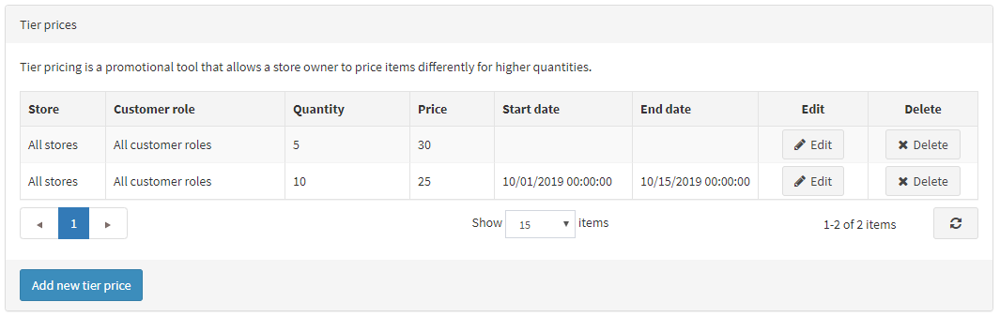

# Tier prices

Tier prices is a promotional tool that allows a store owner **to offer special prices when customers buy bigger amounts of a particular product**. This tool is typically used in wholesales, but retailers can apply it as well to incentivize buyers and drive more sales.

> [!NOTE]
> 
> **You need to save the product before you can add tier prices for the product page.**

## Adding tier prices

To add tier prices, go to **Catalog → Products**, select a product you want to add a tier price to and click **Edit**. On the Edit product details page, find the Tier Prices section at the bottom left and click **Add new record** and fill out the details:

- In case you run **several stores**, from the Store drop-down list, select the one in which you plan to apply the tier prices
- From the **Customer role** drop-down list, select the customer role based on which the tier price will be defined, ex. all customers, registered, guests.
- In the **Quantity and Price** fields, define the price applicable to a certain quantity of the product.
- In fields **start date** and the **end date** enter the period of tier prices availability. Leave these fields empty if not applicable.
- Click **Update**. The Tier Prices tab is updated with the new data.
- Click **Save** on the Edit product details page.

You can now view the **updated product details page in the public store**

> [!NOTE]
> 
> When a customer adds a certain quantity of a product to their cart, the price is being automatically changed to reflect the discount. 

## Tutorials

- [Managing tier pricing](https://www.youtube.com/watch?v=ERE08UEDU58&t=10s)
