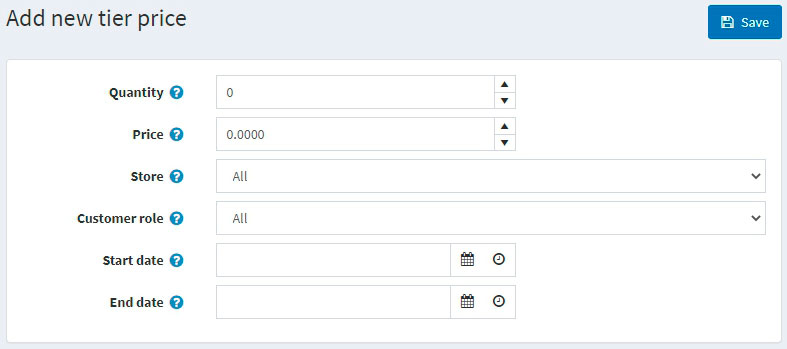

# Tier prices

Tier prices are a promotional tool that allows a store owner to offer special prices when customers buy larger amounts of a particular product. This tool is typically used in wholesales, but retailers can apply it as well to incentivize buyers and drive more sales.

Tier prices can be applied to a product on the product edit page. Go to **Catalog → Products**, select a product to which you want to add a tier price, and click **Edit**. Find the *Tier prices* panel to add a new tier price:

> [!NOTE]
>
> You need to save the product before you can add tier prices for the product page.

## Adding tier prices

Click the **Add new tier price** button to add a new tier price. The *Add new tier price* window will be displayed:

- In the **Quantity** and **Price** fields, define the price applicable to a certain quantity of the product.
- In the case you run several stores, from the **Store** dropdown list, select the one in which you plan to apply the tier prices.
- From the **Customer role** dropdown list, select the customer role based on which the tier price will be defined, for example, *All* customers, *Registered*, *Guests*.
- In the **Start date** and **End date** fields, enter the period of tier prices availability. Leave these fields empty if not applicable.

Click **Save**. The *Tier prices* table will be updated with the new data.

You can now view the updated product details page in the public store:

When a customer adds a certain quantity of a product to their cart, the price will automatically change to reflect the discount.

## Tutorials

- [Managing tier pricing](https://www.youtube.com/watch?v=ERE08UEDU58&t=10s)
