# Microsoft Power BI

Please get the official integration with Power BI [here](https://www.nopcommerce.com/microsoft-power-bi).

## Introduction

Power BI is a collection of software services, apps, and connectors that work together to turn your unrelated sources of data into coherent, visually immersive, and interactive insights. Power BI lets you easily connect to your data sources, visualize and discover what's important, and share that with anyone or everyone you want.
The content isn't static, so you can dig in and look for trends, insights, and other business intelligence. Slice and dice the content, and even ask it questions in your own words. Or, sit back and let your data discover interesting insights, send you alerts when data changes, or email reports to you on a schedule that you set. All your content is available to you anytime, in the cloud or on-premises, from any device. That's just the beginning of what Power BI can do.

Learn more about [Power BI](https://learn.microsoft.com/en-us/power-bi/fundamentals/power-bi-overview).

## Available reports

A Power BI report is a multi-perspective view into a dataset, with visuals that represent different findings and insights from that dataset. A report can have a single visual or pages full of visuals.

> [!TIP]
> Since the plugin comes with the source code, you can add new reports or change the data model, customizing the integration for your specific requirements. You can find out more about how reports are created [here](https://learn.microsoft.com/en-us/power-bi/consumer/end-user-experience).

The basic plugin package includes 13 reports covering different analytical aspects of the available information. A detailed description of each of them is presented below.

### Sales Summary

The Sales Summary is a commonly used report that shows detailed sales data for your chosen date range.

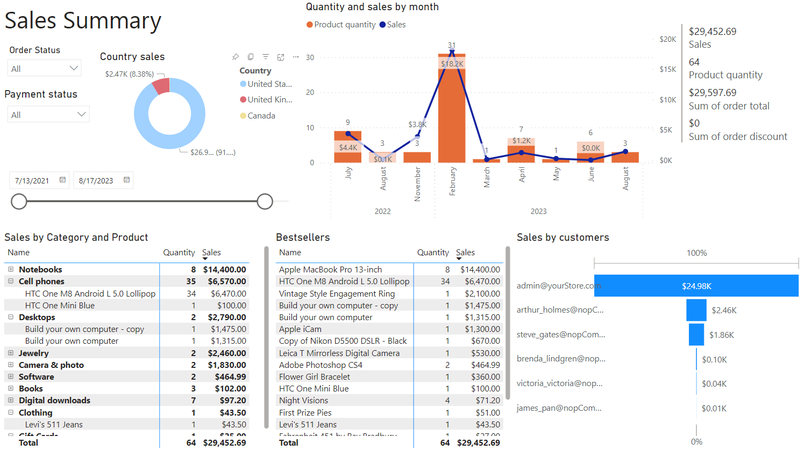

For all cards in the report, several filtering fields are available - here and henceforth we will call them general filters.

> [!TIP]
> Each element of the report, be it a table, graph, or chart, is interactive and can act as an additional filter for the overall summary of information.

The Sales Summary report has few sections, or “cards”, that display different sales information for your selected date range.

- **Sales by Category and Product** - This table displays information about how many products were sold by category. The report gives an overall picture of sales.
- **Bestsellers** - The table shows the products that had the highest sales amount. You can also change the sort order and display the best selling products by number of sales.
- **Sales by customers** - The report provides an understanding of which customers make the most purchases.
- **Quantity and sales by month** - This graph shows how sales were distributed over time. Records are kept not only of the amount of revenue, but also of the units of goods sold.

Sales by Day of Week

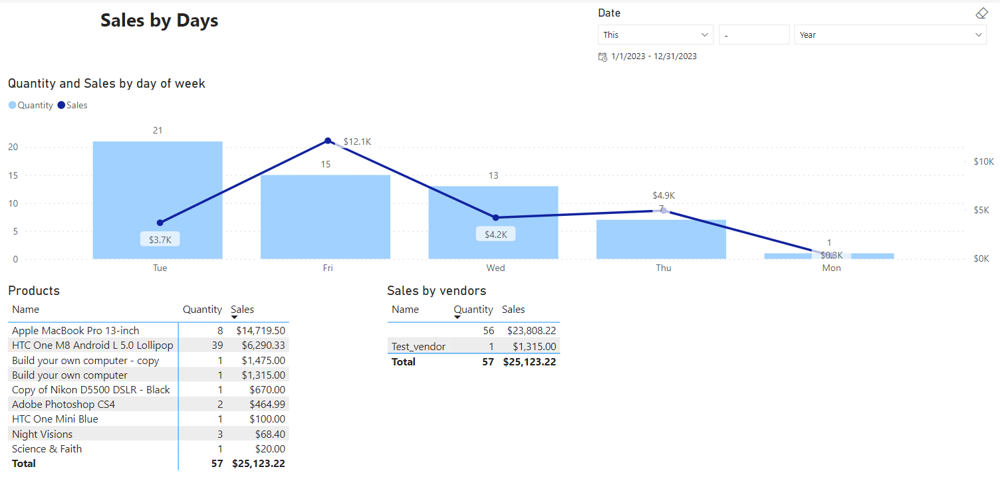

The report shows the distribution of sales by day of the week. This can be useful when planning sales or some one-time discounts.

### Sales History

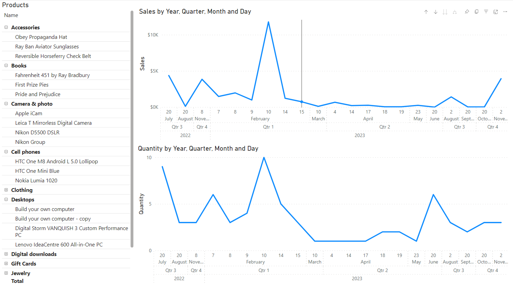

This report allows to analyze the sales history of both an individual product and an entire category throughout the history of the store. This information is useful for studying the demand for certain goods and signals whether the chosen product shows  a tendency toward obsolescence or going out of fashion.

### Sales by Shipping Address

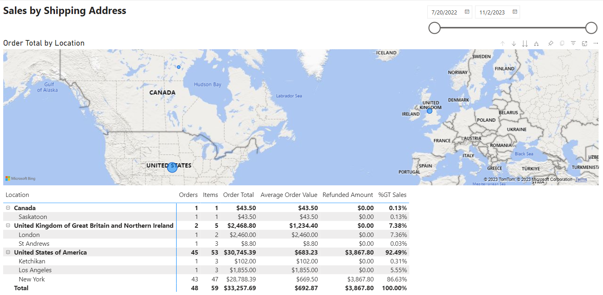

If you are interested in the geography of shipment of your goods, then this report provides a fairly detailed description of how many products were sent to specific locations  for the selected period of time.

### Average Order Value

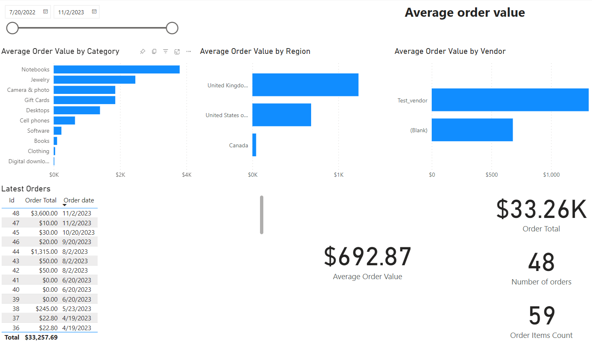

The report helps to estimate the average order price by category, region and vendor. This information can be useful in assessing the purchasing power of customers from different regions and understanding which vendors influence this indicator.

### Order Overview

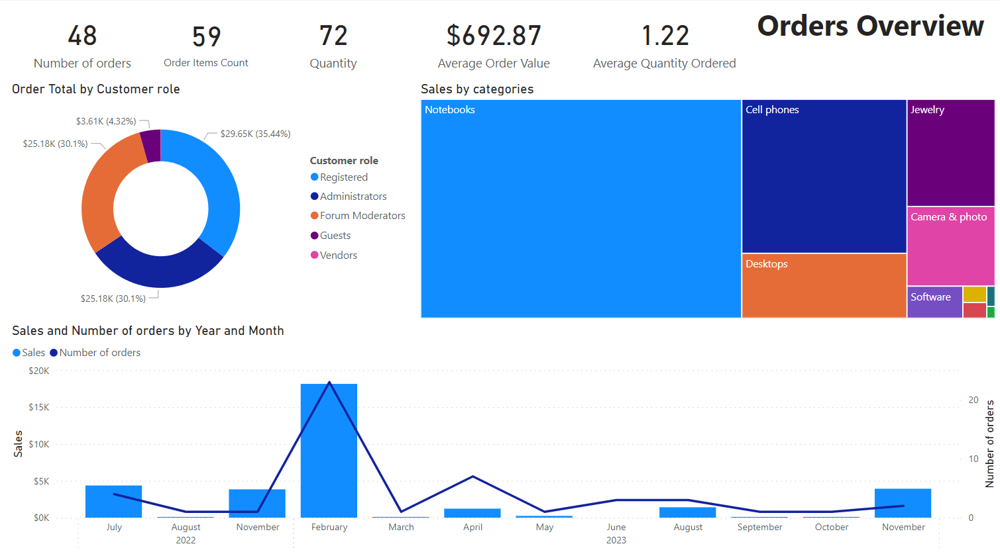

The report consists of several sections, let's look at each of them:

- **Order Total by Customer role** - The graph displays the distribution of orders by user roles. Keep in mind, though,  that a user can have several roles, therefore information about orders will be displayed for each role of this user, respectively. In the example above, administrators are also registered users, so their orders are displayed for both summaries.
- **Sales by Categories** - This report allows you to evaluate the sales share of product categories.
- **Sales and Number of orders by Year and Month** - This chart is auxiliary and helps to understand the dynamics of sales growth over several time periods. This information can be used to analyze seasonal sales of a particular product category.

Orders by Status

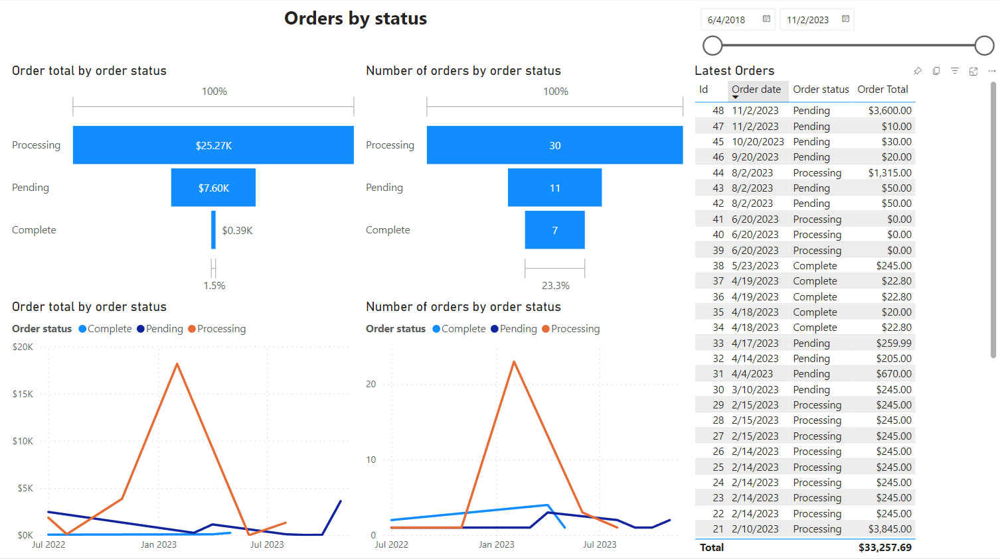

This report is intended to show the distribution of orders according to their statuses. This is important for understanding how many orders are being processed for the selected time period, how many of them have already been paid and how many have been completed.

### Monthly Performance

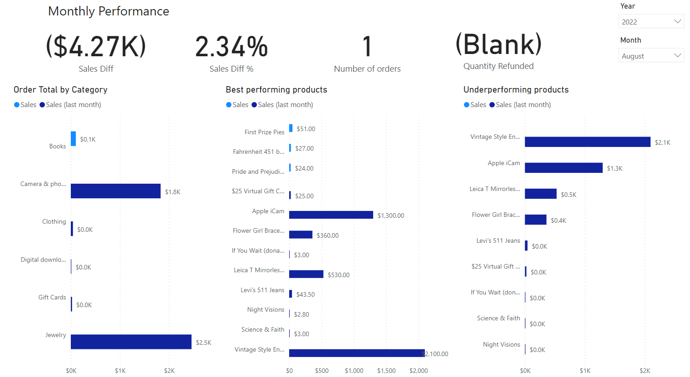

The report collects information about sales for a specified month in comparison with the previous month. This allows merchants to track best performing and underperforming products compared to the previous month.

- **Order Total by Category** - The report collects all product sales by category for a specified month and compares them with the previous one.
- **Best performing products** - The report includes only those products whose sales in the current month exceeded the sales in  the previous one.
- **Underperforming products** - The report includes only those products whose sales in the current month were lower than those in the previous month.

### Year to year comparison

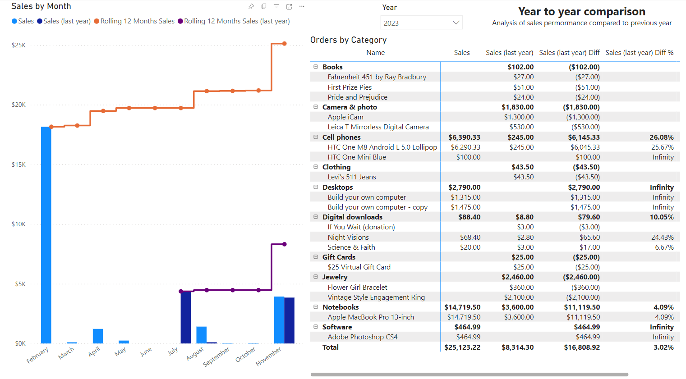

The report asks you to compare sales for a given year with sales in the previous year. An interesting feature is the implementation of a cumulative sales schedule. This will allow you to analyze the dynamics of profit generation and predict an increase in sales for the future.

### Top Products

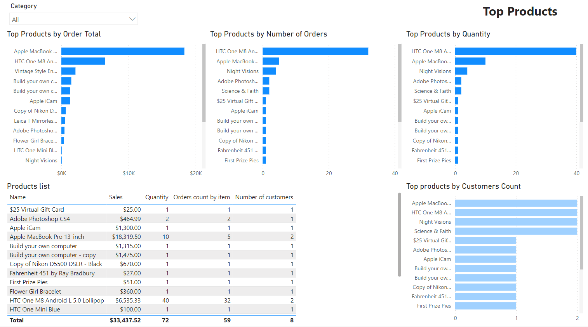

The report allows you to identify sales leaders in a specified category. Data is analyzed over the entire sales history.
The report consists of several sections, let's look at each of them:

- **Top Products by Order Total** - This chart displays the product rating based on the total order amount.
- **Top Products by Number of Orders** - The chart ranks  products, whose number of orders is presented in descending order. It helps you track your most frequently ordered products.
- **Top Products by Quantity** - This chart shows the rating of products that were purchased in large numbers.
- **Top Products by Customers Count** - The chart visualizes how many people purchased a particular product. The product rating is compiled regardless of repeat purchases from the same buyer. This way you can reach the audience that is interested in the product.
- **Product list** - This general report represents all previous graphs in a table.

### Latest 20 Orders

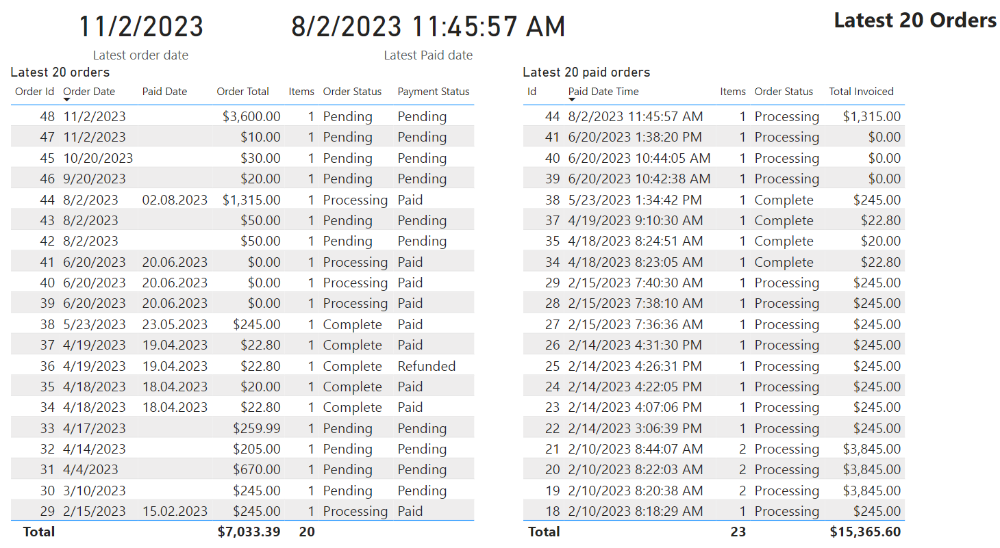

The report allows you to track information on the latest 20 orders. This can be a convenient tool for the administrator to monitor the current store’s workload.

### Customers

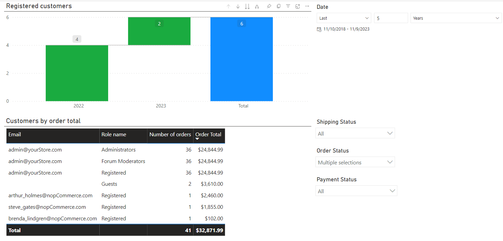

Information about the number of registered users, the amount and number of their orders. The report can be built depending on the status of the order, shipment or payments, and all this can be seen for a selected period of time.

### Advanced Product Search

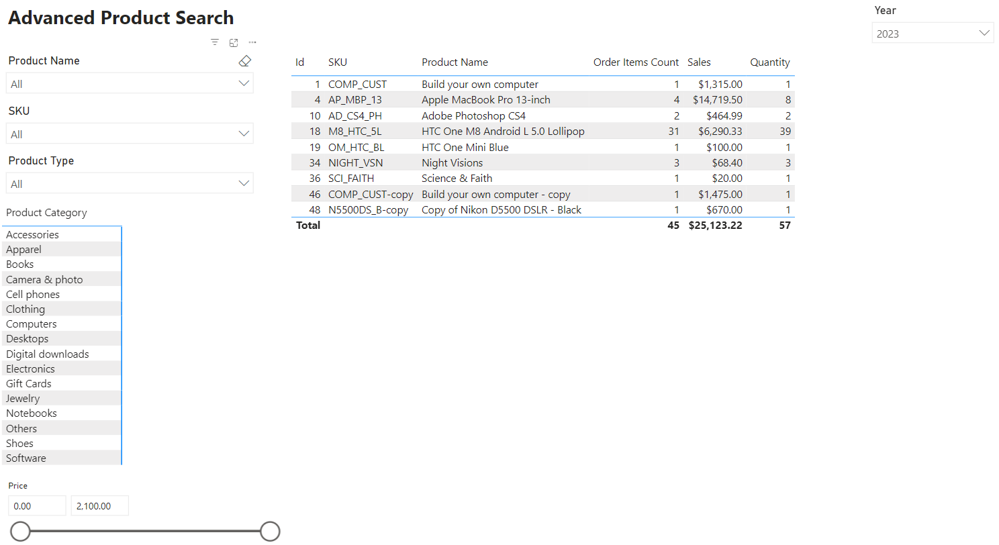

A report that provides an advanced product search option.

## Plugin installation

This section describes how to integrate the Power BI service into your store.

1. Purchase the integration at [here](https://www.nopcommerce.com/microsoft-power-bi).
1. Download the plugin archive.
1. Go to admin area > configuration > local plugins.
1. Upload the plugin archive using the "Upload plugin or theme" plugin.
1. Scroll down through the list of plugins to find the newly installed plugin. And click on the "Install" button to install the plugin.

## Pre-configuration

The following will describe the necessary and sufficient steps to set up the Power BI integration with nopCommerce.

1. [Register](https://app.powerbi.com/singleSignOn) or [log in](https://app.powerbi.com/home) to the Power BI service. The account must be your company’s account.
1. [Install](https://powerbi.microsoft.com/en-us/gateway/) a standard gateway **Power BI Gateway**.

   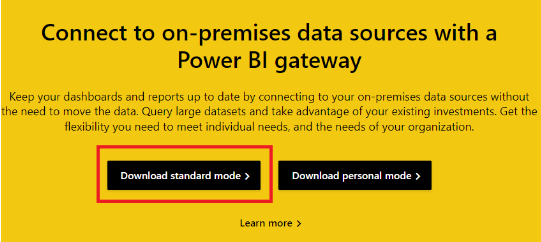

1. Launch the **Gateway**, to do this, launch the **On-premises data gateway** application.
1. Enter the email address for your account that you used when you signed up for the Power BI service.

   > [NOTE]
   > Your account is stored in the **Azure AD** tenant.

   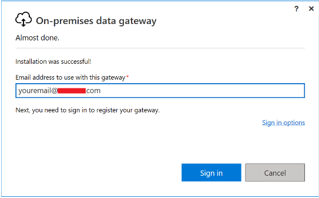

1. Select the **Register a new gateway on this computer**

   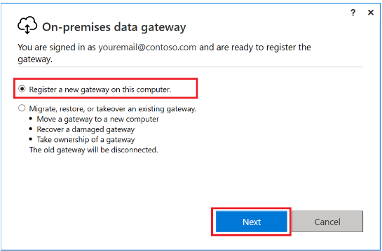

1. Enter the gateway name. The name must be unique within the client. Also enter your recovery key. You will need this key to restore or move the gateway.

   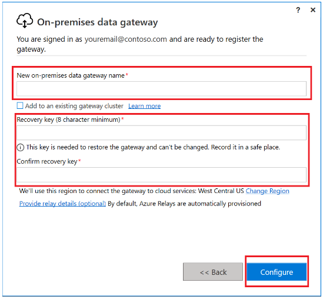

1. Check that your gateway is ready for use.

   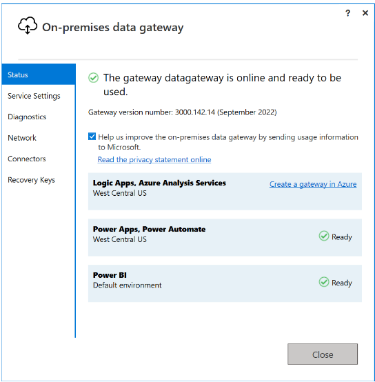

1. Next, you need to register your new application in **Azure Active Directory** to [access Power BI apps](https://app.powerbi.com/apps).

1. Sign in to Power BI. You will be prompted to select an account, sign in with the user that belongs to your Power BI tenant. The Azure AD application is registered under this user.

   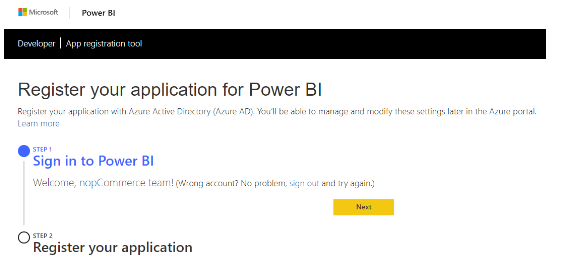

1. Register your Azure AD application with Azure. The Azure AD app sets permissions on Power BI REST resources and allows access to the [Power BI REST API](https://learn.microsoft.com/en-us/rest/api/power-bi/). You can always change these settings later.

   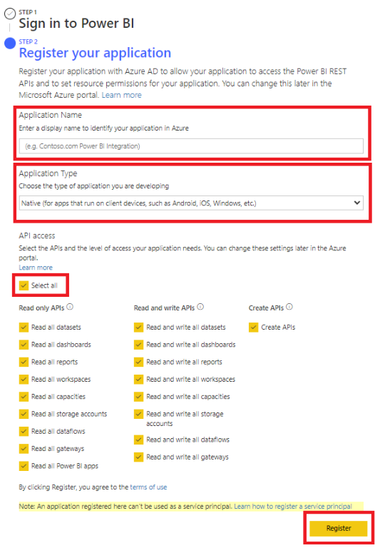

1. Your Azure AD app **Application ID** is displayed in the **Summary** box. Copy this value for later use.

1. Review your application in the Azure portal. The application with the **Application ID** that was just given to you should be displayed.

   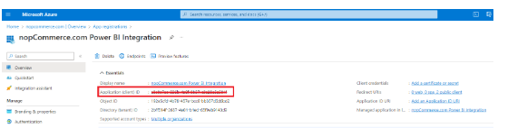

1. Go to the plugin configuration page and paste the resulting **Application ID**.
   > [WARNING]
   > Publishing a report is only possible if you use an MSSQL database. Connection configurations with other types of databases are not currently supported.

## Publish reports

In this section, we'll look at the process of publishing a report to Power BI. If you do not plan to change the content of the report or modify its data model, then this procedure should be performed only once. After this, the integration of your store with the Power BI service will be permanent. All you need to do is to update the data either on a schedule or manually from your Power BI account.
After this, all the reports described in this article will be available to you.

1. You must specify the name under which the report will be uploaded to the Power BI service. The Dataset will be named similarly.

   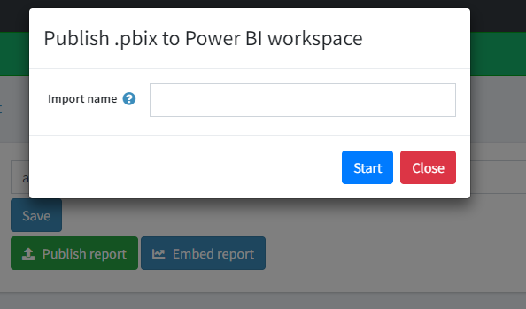

1. Next, a verification code will be generated to pass user verification. By default, it is copied to the clipboard for later pasting. Click the **Verify user** button.

   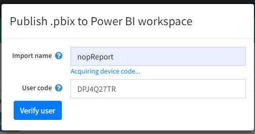

1. Paste the received code in the pop-up window.

   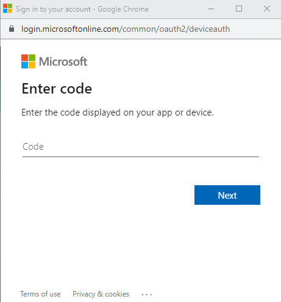

1. Next, select your account in PowerBI.

   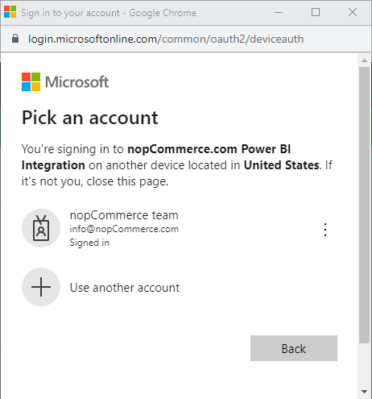

1. Next, confirm that you are connecting to your application in Power BI. Click **Continue**.

   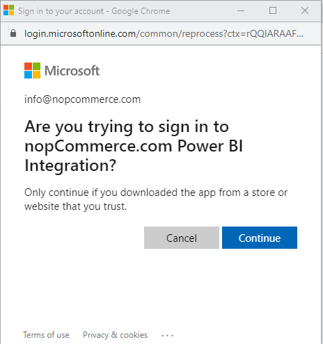

1. If you have successfully logged into your application, the following window will appear. Just wait until it closes on its own.

   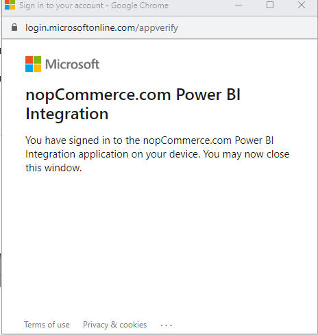

1. At this step, you have an option to overwrite an existing report in Power BI under an already existing name. In this case, the following message appears:

   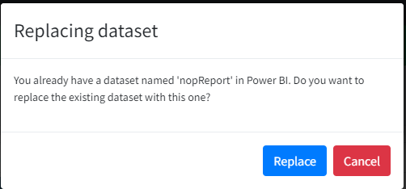

1. Next, you will need to choose which gateway to use to communicate with the data. Select the one you created earlier.

   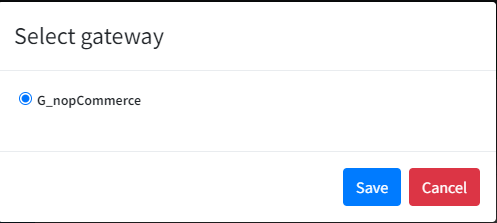

1. Next, the report file will be published.

   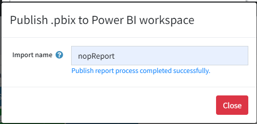

1. You can now set up a data refresh schedule for your report in the dataset settings panel.

   

## Troubleshooting

### Checking the correct connection and settings (in case of problems)

- To verify that the gateway is correctly connected to your data source, you can check the connection status in the **Manage connections and gateways** section.

   

- Connecting to the gateway

   

- Connecting to the database

   

- (Optional) To verify that your data binding to the gateway settings are correct, log into your Power BI account and open your dataset settings.

   

- Check the connection to gateway from the drop-down list:

   

## View reports

Published reports can be viewed in several ways:

1. Directly in your Power BI account under the **My Workspace** [tab](https://app.powerbi.com/groups/me/list?experience=power-bi).
1. Directly on the Power BI plugin configuration page in the **View reports** panel using Power BI embedded analytics.

Let's take a closer look at the second scenario, since it is part of the integration.

[TIP]> More information about Power BI embedded analytics can be found [here](https://learn.microsoft.com/en-us/power-bi/developer/embedded/embedded-analytics-power-bi).

The process for viewing reports is similar to the publishing process. After successful user verification, all reports in your Workspace will be available in the **View reports** panel of the plugin.

> [!WARNING]
> Each time you view reports, you must go through a user authorization process, this is due to the fact that the Power BI service issues an access token for a limited time.
> 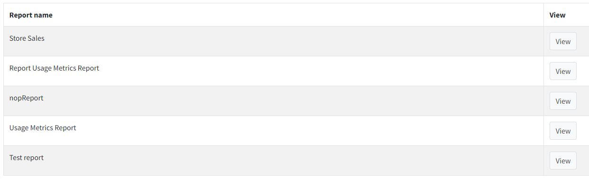

The default currency is the *US dollar*. For technical reasons, the integration does not use the main currency of the store and if it is necessary to change it in reports, then this must be done manually. To change the currency, you need to edit the format of all numeric indicators in the measures.

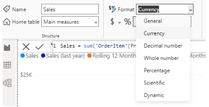

By default, the currency format is set to "*Currency General*", which should cause the currencies to be reformatted when the regional settings for the report are changed.

## License

The Power BI plugin is licensed under the following [terms](https://www.nopcommerce.com/microsoft-power-bi-license-terms).
