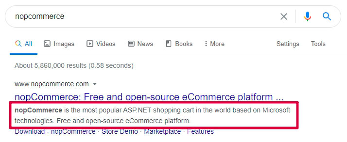
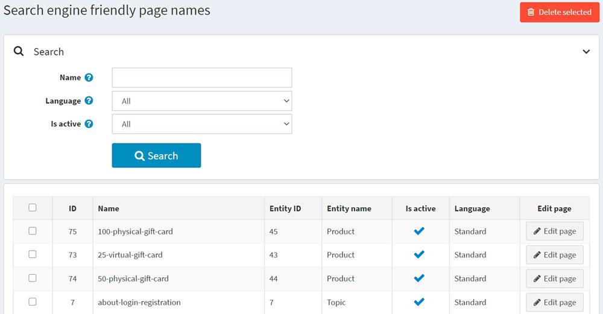

# Search engine optimization

SEO stands for search engine optimization; it is a process of getting traffic from "free," "organic," "editorial" or "natural" search results on search engines. All major search engines have primary search results where webpages and other content, such as videos or local listings, are shown and ranked based on what the search engine considers most relevant for users.

nopCommerce supports SEO techniques for various types of pages in your store. Find them listed in the [See also](#see-also) section.

## SEO settings

There are some general SEO settings in nopCommerce that can be applied to the entire store.

To edit SEO settings, go to **Configuration → Settings → General settings**. Then proceed to the *SEO* panel:

- In the **Default page title** field, enter the default title for the pages in your store.
- In the **Page title SEO adjustment** field, select the required page title's SEO adjustment as follows:

  - The page name comes after the store name in the title:
  `YOURSTORE.COM` | PAGENAME

  - The store name comes after the page name in the title:
  PAGENAME | `YOURSTORE.COM`

- Specify the **Page title separator**.
- Enter the **Default meta keywords** for the pages in your store. This can be overridden for individual categories, manufacturers, products, and some other pages.
- Enter the **Default meta description** for the pages in your store. This can be overridden for individual categories, manufacturers, products, and some other pages.
- Enter the **Home page title** for the home page of your store.
- Enter the **Home page meta description** for the home page of your store.
- Select **Generate product meta description** to automatically generate the product META descriptions (if not specified on the product details page) based on the product's short description.
- Choose the **WWW prefix requirement**. For example, `http://yourStore.com/` can be automatically redirected to `http://www.yourStore.com/`. Select one of the following options:
  - *Doesn't matter*
  - *Pages should have WWW prefix*
  - *Pages should not have WWW prefix*
- Select the **Convert non-western chars** checkbox to remove the accents in SEO names. For example, convert é to e.
- Select the **Enable canonical URLs** checkbox to transform a URL into a canonical URL to enable determining whether two syntactically different URLs may lead to a page with the equivalent content.
- Select the **Twitter META tags** checkbox to generate Twitter META tags on the product details page.
- Select the **Open Graph META tags** checkbox to generate Open Graph META tags on the product details page.
- Select the **Microdata tags** checkbox to generate Microdata tags on the product details page.
- Enter the **Custom &#60;head&#62; tag**. For example, some custom &#60;meta&#62; tag. Or leave empty to ignore this setting.

## SEO panels

There are several types of pages in nopCommerce for which you can set up individual SEO settings, including meta keywords, meta description, meta title, and search engine friendly page names. This is done on SEO panels of the corresponding admin area sections.

- In the **Search engine friendly page name** field, enter the name of the page used by search engines. If you enter nothing, then the webpage URL will be formed using the page name. If you enter *custom-seo-page-name*, then the following custom URL will be used: `http://www.yourStore.com/custom-seo-page-name`.

- In the **Meta title** field, enter the required title. The title tag specifies the title of your webpage. It is retrieved by web browsers and also used by search engines, such as Google, to display a webpage in search results:
  

- Enter the required **Meta keywords**. They describe the content of a webpage concisely and are therefore important indicators of a website's content to search engines. Meta keywords help tell search engines what the topic of the page is. The keywords are generally lowercase.

- In the **Meta description** field, enter a description of the page. The meta description provides a summary of the webpage. Search engines, such as Google, often display the meta description in search results, which can influence click-through rates:
  
  A meta description can be any length, but Google generally truncates snippets to ~155–160 characters. It's best to keep meta descriptions long enough to be sufficiently descriptive, so it's recommended to write descriptions between 50–160 characters. Note that the "optimal" length will vary depending on the situation, and your primary goal should be to provide value and drive clicks.
  
## Search engine friendly page names

To see all search engine friendly page names used in the store, go to **System → Search engine friendly page names**.

Here, you can filter search engine friendly page names by **Name**, **Language** or **Is active** property. You can also delete one or multiple selected search engine friendly page names using the **Delete selected** button. In the **Edit page** column, you can see the button used to navigate to the appropriate page.

## See also

- [Adding products](xref:en/running-your-store/catalog/products/add-products)
- [Product categories](xref:en/running-your-store/catalog/categories)
- [Manufacturers](xref:en/running-your-store/catalog/manufacturers)
- [Vendors](xref:en/running-your-store/vendor-management)
- [Topics (pages)](xref:en/running-your-store/content-management/topics-pages)
- [News](xref:en/running-your-store/content-management/news)
- [Blog](xref:en/running-your-store/content-management/blog)

## Tutorials

- [Understanding SEO settings in nopCommerce](https://youtu.be/UxqM_nJyv1Q)
