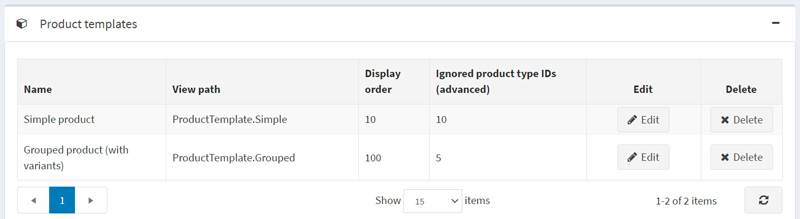
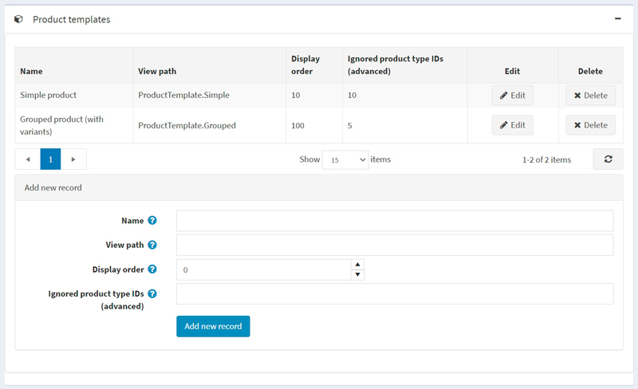
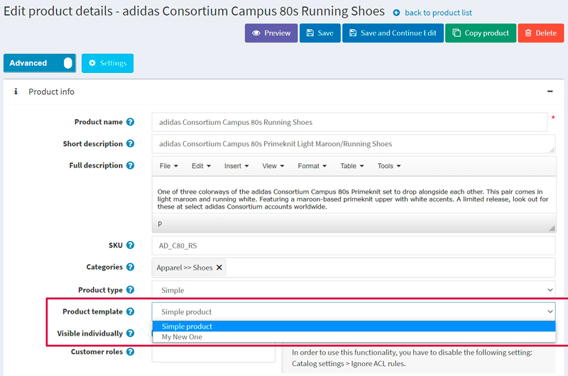

---
title: Templates
uid: en/running-your-store/system-administration/templates
author: git.mariannk
contributors: git.DmitriyKulagin
---

# Templates

In nopCommerce, you can specify an alternate layout template for a category, manufacturer, product, and topic. You can see a list of the existing templates on the **System → Templates** page:

By default, there is one category template, one manufacturer template, one topic template, and two product templates in the system.

Each category, manufacturer, product, and topic details page in the admin area allow you to choose the template when editing an entity. For example:

> [!NOTE]
>
> You will only see the template dropdown list if you have more than one template created for categories, manufacturers, and topics.
>
> [!NOTE]
>
> Since we have two product types, *Simple* and *Grouped (product with variants)*, we have two appropriate product templates created by default:
> 
>
> Therefore, to see the template dropdown list on the product details page, you need to create two product templates that fit the chosen product type. Read about how to do this below.

## Add a new template

Let's see how to create a template on the product template example. Let's say you want to create it for the *Simple* product type.

1. First of all, you need to create an appropriate template file. Skip this step if you already have one placed in the right folder.

   - Go to the `Views\Product` folder.
   - Copy the `ProductTemplate.Simple.cshtml` file and rename it. Let's say it will be    `ProductTemplate.MyNewOne.cshtml`.
   - Modify the code of the `ProductTemplate.MyNewOne.cshtml` file to fit your needs.

1. Go to the **System → Templates** page and proceed to the *Product templates* panel:
  

1. In the *Add new record* block, fill in the following form:

   - Enter the **Name** of the template. In our case, it's `My New One`.
   - Enter the **View path**. In our case, it's `ProductTemplate.MyNewOne`.
   - Enter the **Display order** of this template. 1 represents the top of the list.
   - *For the product template only. Not applicable for other templates:* Enter the **Ignored product type IDs (advanced)**. By default, we have two product types and appropriate product type IDs: *Simple* (ID 5) and *Grouped (ID 10)*. Since we are creating a template for the *Simple* product type, we should ignore the *Grouped* product type with ID 10.

   So the form will look as follows:
  

1. Click the **Add new record** button to save the new template.

   After you save the new template, you will see it on the product details page, and now you can choose from two product templates:
   

> [!NOTE]
>
> It's not required to restrict a product template using the **Ignored product type IDs (advanced)** field. If you leave this field empty, you will be able to use the product template for all types of products.
