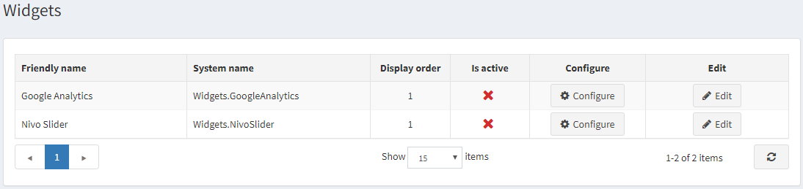

# Widgets

A widget (or control) is an element of a graphical user interface (GUI) that displays information that can be changed by a user. nopCommerce has several built-in widget plugins, for example, Google Analytics or Nivo Slider. A list of available widget plugins is displayed in the grid (on the pictured below). When adding a widget you should select a widget zone. The widget zone is a part of UI (user-interface) in the public store where this widget will be displayed or rendered.

> [!NOTE]
> 
> For example, you can place Live Person chat widget on the left column or on the right column.

## See also

* [Google Analytics Plugin](xref:en/user-guide/configuring/system/widgets/google-analytics)
* [Nivo Slider Widget Plugin](xref:en/user-guide/configuring/system/widgets/nivo-slider)
