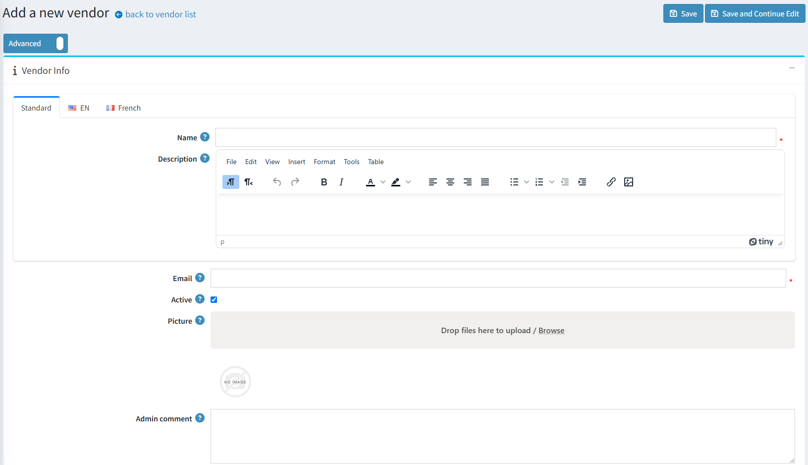

# Vendor management

**Vendors** is a special category of customers that should be considered separately.

nopCommerce has tools for **multi-vendor** and drop shipping that enable you to sell online without having to keep stocks or ship orders. In this case, each product is assigned to a particular vendor whose details (including email address) are stored.

When an order is placed an email is then sent to a vendor of each product in the order. The email includes the products, quantities, etc. The vendor ships the item to the customer on behalf of the merchant, who typically pays each of their vendors at the end of the month.

Products from multiple independent vendors appear in the common product catalog and your website visitors can shop at one web store even if your products are supplied by hundreds of different vendors from all over the world.

Each vendor could be provided with an administrator panel access to manage their products, review sales reports and order details regarding their products. Vendors can't see each other's activities.

The money goes to the merchant account of the store administrator who then manually distributes funds among the vendors according to the order history, which is tracked and managed separately for each provider. In this manner, the customer only sees one charge from the main company.

The following procedure describes how to setup and provide a vendor record with access to the vendor portal site.

## Set up a vendor account

Go to **Customers → Vendors.** The Vendors window is displayed:


Click **Add New.** The Add a New Vendor window is displayed:



Define the following vendor's details:

* **Name** of the vendor
* **Description** for the vendor
* **Vendor's Email.** "Order placed" notifications will be sent to this email.
* Tick **Active** checkbox to activate the vendor

> [!NOTE]
> 
> The appropriate message template is disabled by default, you can change it in [Message Templates](xref:en/running-your-store/content-management/message-templates) section

* **Admin comment**  an optional comment or information for internal use

## Vendor Attributes

A store owner able to create attributes for a vendor much like they can for a product. The vendor attributes would then be displayed on the Vendor Detail page in the public store. This would allow for Multi-Vendor stores to be able to collect and display to the customers more information about the vendor without having to try and format it in the Description field that is currently available.

On the **Vendor attributes** section, select Vendor attributes. Learn more about vendor attributes and how to create them [here](xref:en/running-your-store/vendor-management).


## Display

On the Display panel, define the following Display parameters:


Define the following vendor's details:

* To **Allow customers to select page size** from a predefined list of options
* **Page Size** options (comma separated)
* **Display order** of the vendor

## SEO

On the **SEO** panel, define the following SEO parameters:


* **Meta keywords** - required vendor meta keywords: a brief and concise list of the most important themes of this vendor's page. The meta keywords tag takes the following      form:

    ```html
    <meta name="keywords" content="keywords, keyword, keyword phrase, etc.">
    ```

* **Meta description** - a description of the vendor: brief and concise summary of your page's content. The meta description tag is in the following format:

    ```html
    <meta name="description" content="Brief description of the contents of your page.">
    ```

* **Meta title** - specifies the title of your Web page. It is a code which is inserted into the header of your web page and is in the following format:

    ```html
    <head>
        <title> Creating Title Tags for Search Engine Optimization & Web Usability</title>
    </head>
    ```

* **Search engine friendly page name** - the name of the page used by search engines. If you enter nothing then the vendor page URL is formed using the vendor name. If you enter custom-seo-page-name, then the following custom the URL will be used: `http://www.yourStore.com/custom-seo-page-name`

## Assigning a Vendor to a Customer Record

This step is optional and is required only if you want your vendor to be able to login to his administration portal and manage products, orders, etc.

If you do not want vendors to have access to your site, ignore this step to enable the store owner manage all vendor mappings.

**To register a vendor:**

Go to **Customers → Customers.** The Customers window is displayed:


Click **Edit** beside the customer record you want to assign a vendor to. The Edit Customer window is displayed:

* On the **Customer Info panel**, select a vendor record previously created from **Manager of Vendor** dropdown list.
* Ensure the **Vendors** customer role is selected in the **Customer Roles** field.

> [!NOTE]
> 
> A Vendor customer account cannot have Administrators customer role (which is defined as the default).


After the vendor's customer account is set up, the vendor can use this customer account to manage his products, orders, shipments, and view reports. The Administration link at the top of the public store will be displayed after logging in.

> [!TIP]
> 
> [YouTube tutorial: Managing Vendors](https://www.youtube.com/watch?v=MH6r6tqfLF8&list=PLnL_aDfmRHwsbhj621A-RFb1KnzeFxYz4&index=9)


# Vendor settings

This section describes how to define the **vendor settings** of your store. This includes the number of vendors to display, whether or not to show the vendor on the product details pages of the store and more.

## Manage Vendor Settings

Go to **Configuration → Settings → Vendor Settings.** The Vendor Settings window is displayed:


Define the vendor settings, as follows:

* **Allow customers to apply for vendor account.** Firstly, a vendor request is filled by a user, thus creating a vendor account. Then the request is presented to a store-owner (via email notification) to be accepted.

    > [!WARNING]
    > 
    > A store owner has to add an appropriate customer record to "Vendors" role manually if he wants to grant access to the admin area.

* To require vendors to accept the **Terms of service** during registration.
* **Allow vendors to edit info** allows vendors to provide personal information in public store.
* Choose whether to **Notify about vendor information changes** to notify an admin about vendor information changes.
* **Maximum number of products** per vendor.
* **Allow vendors to import products** allows vendors to import products.
* **Allow customers to contact vendors** (send emails using contact forms). This functionality is available on a vendor details page in the public store. Localizable properties are not supported in a multiple languages setup.
* **Allow search by vendor** to customers, on an advanced search page.
* Choose whether to **Show vendor on product details page** (if associated).
* Choose whether to  **Show vendor name on order details page** (if associated).
* **Number of vendors to display** in the vendor navigation block in the admin area.

This page enables **multi-store configuration**, it means that the same settings can be defined for all stores, or differ from store to store. If you want to manage settings for a certain store, choose its name from Multi-store configuration drop-down list and tick all needed checkbox at the left side to set custom value for them.

## Vendor attributes

You can create any number of vendor attributes. Some different attributes that could be created would be business name, website and etc.


### Adding vendor attributes

Click **Add new** to add the attribute.

In the **Attribute Info** panel, define the following information:


* **Name** - the name of the vendor attribute.
* **Required** - when an attribute is required, vendors must choose an appropriate attribute value before they can continue.
* From the **Control Type** drop-down list, select the required method for displaying the attribute value: **Drop-down list, Radio button list, Checkbox, Textbox, Multiline textbox, Read-only checkbox.**
* **Display order** - the vendor attribute display order.

> [!NOTE]
> 
> Dropdown lists, radio lists, checkbox and read-only checkbox  require the store owner to define values. Textbox and Multiline textbox control types do not require the store owner to define values since customers will be required to fill these textbox fields.

Click **Save and Continue Edit** to proceed to the **values** editing tab.

### Adding new attribute values

On the **Attribute values** panel, click **Add a new attribute value** to create a new attribute value.


In the Add a new attribute value window, define the following information:

* **Name** - the attribute value name.
* Tick the **Pre-selected** checkbox, to indicate the attribute value is pre-selected for a customer.
* **Display order** - display order number of the attribute value.

You can **edit** and **remove** attribute values by clicking the corresponding buttons beside the attributes on the Attribute values panel.

Click **Save.** The new attribute will be displayed in the public store.

## See also

* [Setting up Customers](xref:en/running-your-store/customer-management/index)

