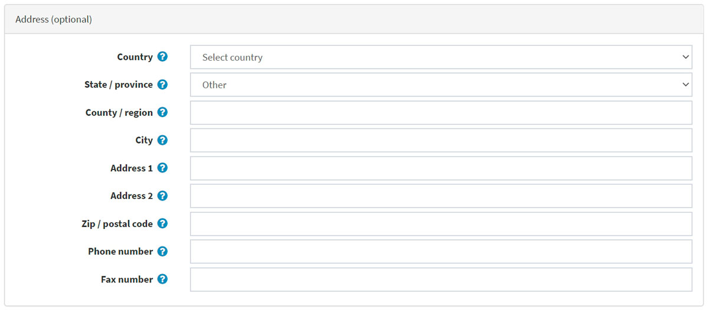
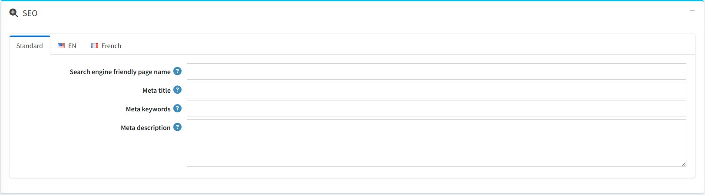
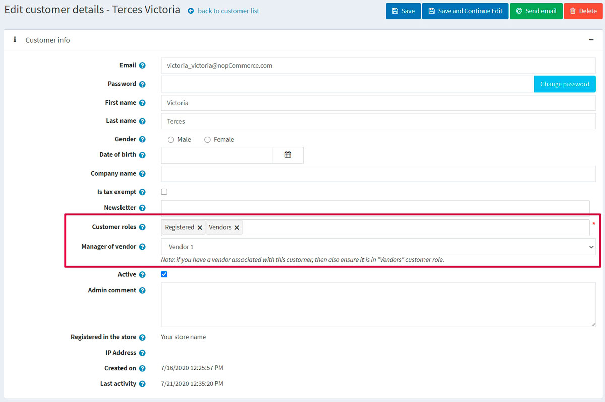

# Vendor management

*Vendors* is a special category of customers that should be considered separately.

nopCommerce has tools for *multi-vendor* and drop shipping that enable you to sell online without having to keep stocks or ship orders. In this case, each product is assigned to a particular vendor whose details (including email address) are stored.

When an order is placed an email is then sent to a vendor of each product in the order. The email includes the products, quantities, etc. The vendor ships the item to the customer on behalf of the merchant, who typically pays each of their vendors at the end of the month.

Products from multiple independent vendors appear in the common product catalog and your website visitors can shop at one web store even if your products are supplied by hundreds of different vendors from all over the world.

Each vendor could be provided with an administrator panel access to manage their products, review sales reports, and order details regarding their products. Vendors can't see each other's activities.

The money goes to the merchant account of the store administrator who then manually distributes funds among the vendors according to the order history, which is tracked and managed separately for each provider. In this manner, the customer only sees one charge from the main company.

The following procedure describes how to set up and provide a vendor record with access to the vendor portal site.

## Set up a vendor account

Go to **Customers → Vendors**. The *Vendors* window is displayed:

Click **Add new**.

### Vendor info

In the *Vendor info* panel, define the following vendor's details:

* **Name** of the vendor.
* **Description** for the vendor.
* Vendor's **Email**. "Order placed" notifications will be sent to this email.
* Tick the **Active** checkbox to activate the vendor.
* Upload a vendor **Picture**.
* **Admin comment** an optional comment or information for internal use.

> [!NOTE]
> 
> Some of vendor message templates, such as *OrderPaid.VendorNotification* and *OrderPlaced.VendorNotification*, are disabled by default. See how to change this in [Message templates](xref:en/running-your-store/content-management/message-templates) section. 

### Vendor attributes

When you create some additional vendor attributes the *Vendor attributes* panel will be displayed as well. 

A store owners able to create attributes for a vendor much like they can for a product. This would allow for multi-vendor stores to collect and display more information about the vendor to customers.

 Learn more about vendor attributes and how to create them in the [Vendor attributes](#vendor-attributes) section below.

### Address (optional)
In the *Address (optional)* panel enter the vendor address.

### Display

In the *Display* panel, define the following display parameters:

* To **Allow customers to select page size** from a predefined list of options.
  * If the previous checkbox is ticked define **Page size options** (comma separated).
* If the previous checkbox is unticked enter the **Page size**.
* **Display order** of the vendor.

### SEO

Refer to [SEO panels](xref:en/running-your-store/search-engine-optimization#seo-panels) section in order to set up SEO.

## Assigning a vendor to a customer record

This step is optional and is required only if you want your vendors to be able to login to their administration portal and manage their products, orders, etc.

If you do not want vendors to have access to the admin area ignore this step to allow the store owner to manage all vendor mappings.

Go to **Customers → Customers**. The *Customers* window is displayed:

Create a new customer or click **Edit** beside a customer record you want to assign a vendor to. For more information about creating a customer refer to [Add a new customer](xref:en/running-your-store/customer-management/managing-customers#add-a-new-customer).

* In the *Customer info* panel, ensure the *Vendors* customer role is selected in the **Customer roles** field.
  > [!NOTE]
  > 
  > A vendor customer account cannot belong to the default *Administrators* customer role.

* In the *Customer info* panel, find the **Manager of vendor** field. Select a vendor record created previously.

After the vendor's customer account is set up, the vendor can use this customer account to manage products, orders, shipments, and view reports. The *Administration* link at the top of the public store will be displayed after logging in.

> [!TIP]
> 
> [YouTube tutorial: Managing vendors](https://www.youtube.com/watch?v=MH6r6tqfLF8&list=PLnL_aDfmRHwsbhj621A-RFb1KnzeFxYz4&index=9)

## Vendor settings

This section describes how to define the vendor settings of your store. This includes the number of vendors to display, whether or not to show the vendor on the product details pages of the store and more.

Go to **Configuration → Settings → Vendor settings**.

This page enables multi-store configuration, it means that the same settings can be defined for all stores, or differ from store to store. If you want to manage settings for a certain store, choose its name from multi-store configuration drop-down list and tick all needed checkboxes at the left side to set custom value for them. For further details refer to [Multi-store](xref:en/getting-started/advanced-configuration/multi-store).
	
### Common

In the *Common* panel define the following vendor settings:

* **Allow customers to apply for vendor account**. Firstly, a vendor request is filled by a user, thus creating a vendor account. Then the request is presented to a store-owner (via email notification) to be accepted.
  > [!NOTE]
  > 
  > A store owner has to add an appropriate customer record to "Vendors" role manually if he wants to grant access to the admin area. Read about it in the [Assigning a vendor to a customer record](#assigning-a-vendor-to-a-customer-record) section above.

  * If the previous checkbox is checked you can tick the **Terms of service** to require vendors to accept terms of service during registration.
    > [!NOTE]
    >
    > To edit these terms of service go to **Content management → Topics (pages)**. Find the **VendorTermsOfService** item and click **Edit**. Read more about it in the [Topics (pages)](xref:en/running-your-store/content-management/topics-pages) section.

* **Allow vendors to edit info** allows vendors to provide personal information in public store.
  * Choose whether to **Notify about vendor information changes** to notify an admin about vendor information changes.

* **Maximum number of products** per vendor.
* **Allow vendors to import products** allows vendors to import products.

### Catalog

In the *Catalog* panel define the following vendor settings:

* **Allow customers to contact vendors** (send emails using contact forms). This functionality is available on a vendor details page in the public store.
* **Allow search by vendor** to customers, on an advanced search page.
* Choose whether to **Show vendor on product details page** (if associated).
* Choose whether to **Show vendor name on order details page** (if associated).
* **Number of vendors to display** in the vendor navigation block in the admin area.

### Vendor attributes

You can create any number of vendor attributes. Some different attributes that could be created would be business name, website and etc.

#### Add a new attribute
Click **Add new** to create a new vendor attribute as well as its values. The *Add new vendor attribute* window will be displayed, as follows:

In the *Attribute info* panel, define the following information:
* **Name** - the name of the vendor attribute.
* **Required** - when an attribute is required, vendors must choose an appropriate attribute value before they can continue.
* From the **Control type** drop-down list, select the required method for displaying the attribute value: *Drop-down list, Radio button list, Checkbox, Textbox, Multiline textbox, Read-only checkbox*.
* **Display order** - the vendor attribute display order.

> [!NOTE]
> 
> Dropdown lists, radio lists, checkbox and read-only checkbox require the store owner to define values. Textbox and multiline textbox control types do not require the store owner to define values since vendors will be required to fill these textbox fields.

Click **Save and continue edit** to proceed to the *Values* panel.

#### Add a new attribute value

In the *Values* panel, click **Add a new attribute value** to create a new attribute value.

In the *Add a new attribute value* window, define the following information:

* **Name** - the attribute value name.
* Tick the **Pre-selected** checkbox, to indicate the attribute value is pre-selected for a customer.
* **Display order** - display order number of the attribute value.

You can edit and remove attribute values by clicking the corresponding buttons beside the attribute values in the *Values* panel.

Click **Save**. The new attribute will be displayed in the public store.