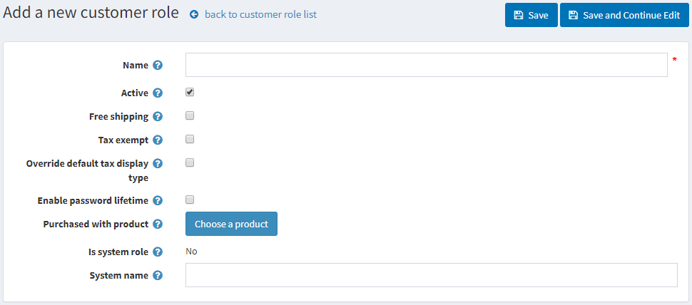

# Customer roles

The customer roles in nopCommerce enable you to form groups of your web-store users. You can create various groups such as store admins, shoppers, [vendors](xref:en/user-guide/configuring/setting-up/customers/vendors/index), and other. You can also grant these groups certain rights such as discounted pricing, and other special statuses (such as tax exemption, free shipping, and more) using Access Control List.

**To add customer roles:**

Go to **Customers → Customer Roles.** The Customer Roles window is displayed:

Click **Add new.** The Add A New Customer Role window is displayed:

Define the following information:

* **Name** of the customer role
* Tick the **Active** to make this role active
* Tick the **Free shipping** checkbox, to enable customers with this role to get free shipping on their orders
* Tick the **Tax exempt** checkbox, to enable customers with this role to make tax-free purchases
* Tick the **Override default tax display type** and select from Default tax display type drop-down list one of the tax types:
  * **Including tax**
  * **Excluding tax**
* Tick the **Enable password lifetime**, to force customers to change their passwords after a specified time.
* **Purchased with product**. Click the **Choose a product** button beside the Purchased with product field in order to choose a special product. A customer is added to this customer role once this product is purchased (paid). Note: In case of refund or order cancellation you must manually remove a customer from this role.
* **Is system role**. This setting shows whether this role is used in the code. It is predefined and cannot be modified.
* Click the **Choose product button** beside the **Purchased with product** field in order to choose a special product. A customer is added to this customer role once this product is purchased (paid).

> [!NOTE]
> 
> In case of refund or order cancellation you must manually remove a customer from this role.

* **System Name** of the customer role

Click **Save.**

 To **edit** the **Customer Roles**, click Edit in the row beside it. The Edit Customer Role window is displayed, edit the customer roles as described above.

## Tutorials

* [Overview of customer roles](https://www.youtube.com/watch?v=3vdIDNIYFIQ)
* [Recovering back a deleted admin user](https://www.youtube.com/watch?v=D45WkrbaA38)
