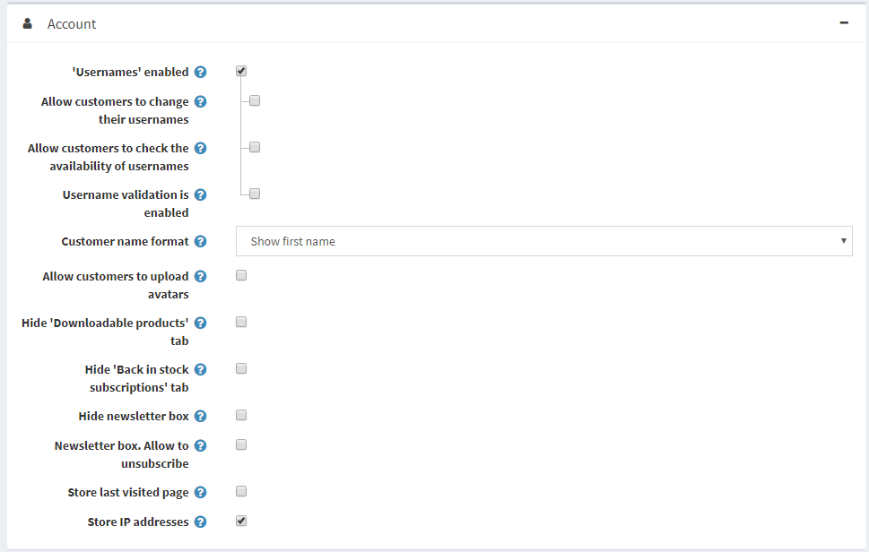
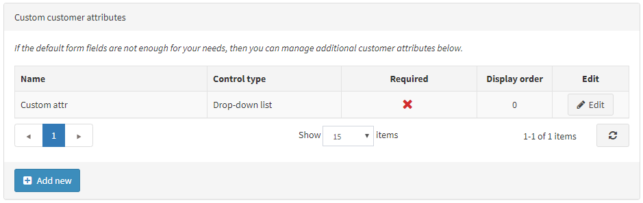

# Customer settings

Customer settings include enabling customers to upload avatars, showing customers locations, name formats, joining dates and more.

To define customer settings, go to **Configuration → Settings → Customer Settings.** The Customer Settings window is displayed. The window has six panels: Common, Password and security, Account, Profile, Customer Form Fields and Address form fields

**Common** panel contains general customer settings.

**Password and security** panel contains fields that can be used to configure security settings and password complexity.

**Account** panel contains fields for setting up a customer account.

**Profile** panel contains fields for configuring customer profile.

**Customer Form Fields** panel contains fields that can be used on the customer registration form.

**Address Form Fields** panel contains fields for detailing the customer’s address during checkout.

## Common

Define the **customer settings,** as follows:

* Select the **Registration method,** as follows:
  * **Standard:** users are enabled to register, no approval is required.
  * **Email Validation:** users are enabled to register, however, they must accept the confirmation email sent to them before their account is approved.
  * **Admin Approval:** users are enabled to register, administrator approval is required.
  * **Disabled:** select this option to disable registration.
* Tick **Notify about new customer registration** checkbox, to enable a store owner to get an email notification each time when a new customer is registered.
* Tick the **Require registration for downloadable products** checkbox if customers have to complete registration in order to purchase downloadable products.
* Choose whether to **Allow customers to select time zone** in the public store on the accounts page. Otherwise, the default time zone is used.
* Select the **Default store time zone** from a dropdown list.

 > [!NOTE]
 > 
 > The current time zone is displayed automatically.

## Password and security

* Set the **Password minimum length, Password must have at least one lowercase, Password must have at least one uppercase, Password must have at least one non alphanumeric character, Password must have at least one digit** to change password complexity
* **Unduplicated passwords number** - number of passwords that mustn't be the same as previous one.
* Select the **Default Password format**, as follows:
  * Clear
  * Hashed
  * Encrypted

> [!NOTE]
> 
> This setting is for storing customers’ passwords and will be applied only to newly registered customers.

* In the **Password lifetime** enter the number of days for password expiration.
* In the **Password recovery link.Days valid** field, enter the number of days for password recovery link. Set it to 0 if you don’t want the link to expire.
* Enter **Maximum login failures**
* In the **Lockout time** (login failures) enter number of minutes to lockout users.
* Tick the checkbox **Force entering email twice** if you want your customers entering password twice during the registration.

## Account

* Tick the **'Usernames' enabled** checkbox, to enable using usernames for login and registration instead of emails. Note: it is not recommended to change the option in the Product environment. When this checkbox is selected, the following options are displayed:
  * **Allow customers to change their usernames:** select this option if customers are allowed to change their usernames.
    * **Allow customers to check the availability of usernames:** select this option to enable customers to check the username availability before clicking Save on My Account - Customer Info page. The Check Availability button is displayed in this case, see the example above.
* Select the **Customer name format,** as follows:
  * Show Emails
  * Show Usernames
  * Show Full Names
  * Show First Name

    The customer name will be shown in the store next to news and blog comments, on forums and more.

* **Allow customers to upload avatars.** The customers’ avatars will be shown in the store next to their news and blog comments, on forums and more. If this option is selected, the next checkbox is displayed. Tick the **Default avatar enabled** checkbox, to display the default user avatars.
* Tick the **Hide ‘Downloadable products’ tab** checkbox, to hide this tab on My Account page.
* Tick the **Hide 'Back in stock subscriptions' tab** checkbox, to hide this tab on My Account page
* Tick the **Hide newsletter box** checkbox if you do not want to display the newsletter subscription box.
* Tick the **Newsletter box.Allow to unsubscribe** checkbox to display "unsubscribe" option in the newsletter block. For example, it's required in Germany.
* Tick the **Store last visited page** checkbox, to store the last visited page. You can then view the last visited by different customers pages on the Online customers page (Customers → Online customers). You can untick this checkbox, to improve the site performance.
* Tick the **Store IP address** checkbox, to store the last IP address of customers, when disabled, it can improve performance.

## Profile

* **Allow viewing of customer profiles.** This enables the role to see the details of other customers.
* Tick the **Show customers location** checkbox if required
* Tick the **Show customers join date** checkbox if required

On the **Customer form fields** panel, define the whether the following form fields are enabled in the system:

* **‘Gender’ enabled**
* **‘Date of Birth’ enabled.** When enabled, you can also decide whether this field should be required and enter a minimum allowed age (for example, to ensure that a customer is above 18)
* **‘Company’ enabled.** When enabled, you can also decide whether this field should be required.
* **‘Street address’ enabled.** When enabled, you can also decide whether this field should be required.
* **‘Street address 2’ enabled**, if the second street address is enabled. When enabled, you can also decide whether this field should be required.
* **‘Zip/postal code’ enabled**. When enabled, you can also decide whether this field should be required.
* **‘City’ enabled.** When enabled, you can also decide whether this field should be required.
* **‘Country’ enabled.** When enabled, you can also decide whether this field should be required.
* **‘State/province’ enabled.** When enabled, you can also decide whether this field should be required. Note: This field is visible only when the Country enabled checkbox is ticked.
* **‘Phone number’ enabled.** When enabled, you can also decide whether this field should be required.
* **‘Fax number’ enabled.** When enabled, you can also decide whether this field should be required.
* Tick the **Accept Privacy policy enabled** checkbox, to request customers to accept the privacy policy during the registration.
* Tick the **‘Newsletter’ enabled** checkbox to offer customers a newsletter subscription during the registration. When the ‘Newsletter’ enabled checkbox is selected, the Newsletter ticked by default checkbox is displayed, which automatically sets the 'Newsletter' checkbox on the registration page as ticked.

> [!NOTE]
> 
> If the default form fields are not enough for your requirements, you can manage additional customer attributes using this table. Customer attributes are created in the same manner as checkout attributes. For further details, refer to [Checkout Attributes](xref:en/user-guide/running/product-management/attributes/checkout-attributes).

On the **Address Form Fields** panel, a store owner can manage the address form fields available during the registration. You can select which fields are enabled and required among the following:

* Company
* Street address
* Street address 2
* Zip/postal code
* City
* Country
* State/province. Note: This field is visible only when the Country is enabled.
* Phone number
* Fax number

> [!NOTE]
> 
> If the default address fields are not enough for your requirements, you can manage additional address attributes using this table. Address attributes are created in the same manner as checkout attributes. For further details, refer to [Checkout Attributes](xref:en/user-guide/running/product-management/attributes/checkout-attributes).

Click **Save.**

## Tutorials

* [Configuring password settings](https://www.youtube.com/watch?v=TwWArXNi0CA)
