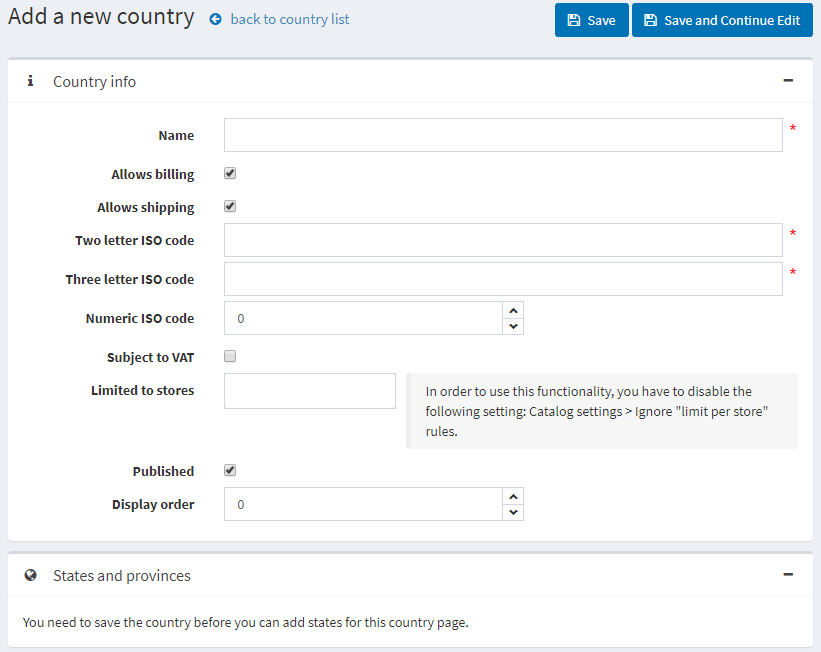
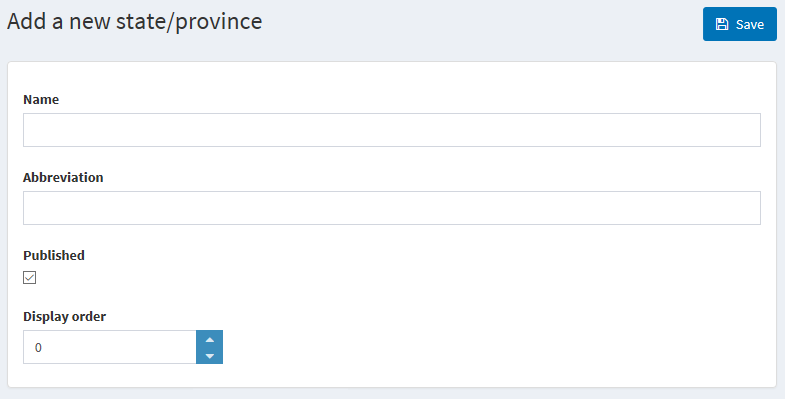

# Countries

This section describes how to manage countries (where your customers are located).

To define the country setting go to **Configuration → Countries.**

> [!TIP]
> 
> By default, all the countries are uploaded. You can Publish and Unpublish countries by selecting them and clicking the corresponding button.

## Adding new countries

You can **Export** a list of states of all the countries, which were added to the system, or Import the additional.

> [!NOTE]
> 
> The format of your file to be imported should be the same as of the exported.

Or you can **add new countries** manually. To add a new country to your list, click **Add new.**

On the **country info** panel define the **following country settings:**

* **Name** of the country.
* Tick the **Allows registration** checkbox, to enable customers located in this country to register for a store account. By default, all the countries are active. If you need to limit the number of countries from which profile registrations are welcome, deactivate all the countries that you do not want to be included.
* **Allows billing** to customers located in this country.
* **Allows shipping** to customers located in this country.
* Enter **Two letter ISO** code of this country.
* Enter **Three letter ISO** code of this country.
* Enter **Numeric letter ISO** code of this country.
* Select the **Subject to VAT** checkbox, to indicate customers in this country are charged EU VAT (the European Union Value Added Tax).

> [!NOTE]
> 
> This field is used only when the EU VAT option is enabled on the Tax Settings page (Configuration → Tax → Tax Settings).

* Set store if vendor is **limited to sore**
* Tick the **Published** checkbox, to enable this country to be visible for new account registrations and for the creation of shipping and billing addresses.
* Enter the **Display order** of this country. A value of 1 represents the top of the list.
* Click **Save.**

## Adding new states and provinces

On the **State and Provinces** panel, you can add states and provinces of the country.

> [!TIP]
> 
> By default, the states of the USA are added.

Click the **Add new record** button to add a new state or province.

Define the **following state/province details:**

* **Name** of a state or a province

* **Abbreviation** for the province or state

* Tick the **Published** checkbox, to publish the state or province on the website.

In the **Display order** field, enter the display order of this province or state. A value of 1 represents the top of the list

To tie a certain store to a country in the **Limited to stores** field of the Country Info panel select pre-created stores from a list, as follows:

> [!NOTE]
> 
> This list is used only when you have several stores configured. For further details refer to [Stores](xref:en/user-guide/configuring/setting-up/main-store/multiple-store).

Click **Save**
