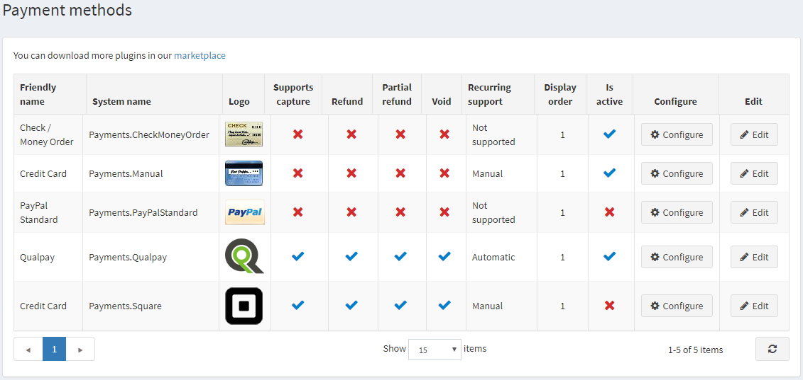

# Payment Methods

A payment method is how a customer pays for the order. nopCommerce supports both **online** and **offline transactions.** For the online methods, nopCommerce integrates with third-party payment gateways, so that customer’s credit card information will be automatically sent through the gateway (as either an authorization or an authorization and charge) upon completion of an order. You can have multiple payment methods active at one time. The user can select how he/she wants to pay at the checkout.

To define payment methods go to **Configuration →  Payment Methods.**

> [!TIP]
> 
> By default, there are several payment methods available in nopCommerce, but you can find needed more payment plugins in nopCommerce [Marketplace](https://www.nopcommerce.com/marketplace).

For further details, refer to the [document](xref:en/developer/plugins/payment-method) (recommended to be used only by developers).

To activate a payment method, Click **Edit** beside the required method, tick the **Is active** checkbox and click Update. The Is active option changes from false to true.

 Different payment methods support different options. There are **4 payment options** you can tick as active or not (supported or not):

* **Supports capture**, whether this method allows processing money transfer after the amount was charged.
* **Refund**, whether this method allows making a money refund after the amount was charged and captured already.
* **Partial refund**, whether this method allows making a partial money refund after the amount was charged and captured already.
* **Void**, whether this method allows making a money refund before the amount was charged (when the payment status is pending).

Click **configure** beside a payment method to set it up.

## See also

* [Square](xref:en/user-guide/configuring/setting-up/payments/methods/square)
* [Qualpay](xref:en/user-guide/configuring/setting-up/payments/methods/qualpay)
* [Manual Processing (Credit Card)](xref:en/user-guide/configuring/setting-up/payments/methods/manual-processing)
* [Purchase order](xref:en/user-guide/configuring/setting-up/payments/methods/purchase-order)
* [PayPal Standard](xref:en/user-guide/configuring/setting-up/payments/methods/paypal-standard)
