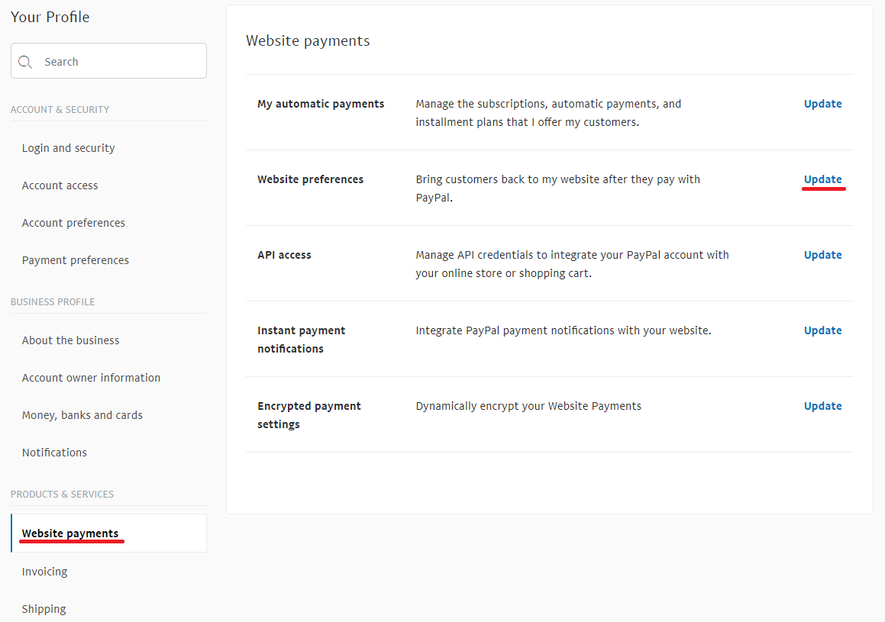
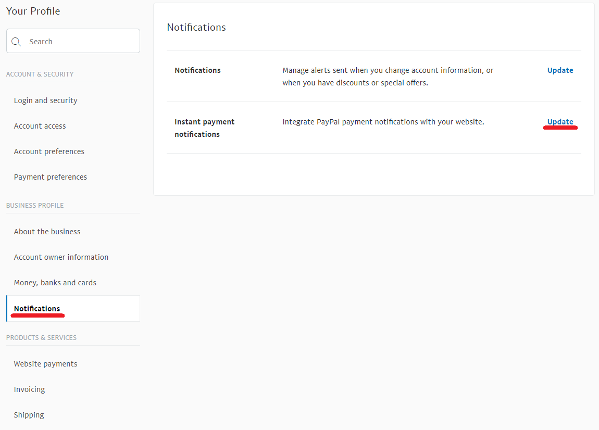

# PayPal Standard

To use **PayPal Standard** plugin as a payment method please follow these steps:

1. Register a Business account on www.paypal.com. Following the link [https://www.paypal.com/bizsignup/](https://www.paypal.com/bizsignup/). Then fill in the information about yourself and your business:

    

    > [!NOTE]
    > 
    > If you already have an account you will be redirected to the authorization

    

    

    

    

1. In the top navigation bar, click on the **Settings** icon 

1. Select **Website payments** in the left panel and click on **Update** in the **Website preferences** line

    
1. In the **Auto return for website payments** section set the switch to **On.** As the **Return URL** enter the URL of your site, which will be receiving ID transactions sending by PayPal after customer payment.

    
1. In the **Payment data transfer** section set the switch to **On** and copy **Identity Token.**

    
1. To configure the plugin in the admin panel of nopCommerce go to **Configuration  → Payment methods,** in the **PayPal Standard** line click on **Configuration**

1. In the **Business Email** field enter an email specified when registering a Business account on paypal.com.

1. In the **PDT Identity Token** field enter the copied **Identity Token** from clause #5.

1. Click **Save**

For the **IPN** (Instant Payment Notification) activation:

1. Select **Notifications** in the left panel and click on **Update in the Instant payment notifications** line

1. Familiarize yourself with the information regarding **IPN** and click **Choose IPN Settings**

1. Select **Receive IPN messages (Enabled)**. As **Notification URL** enter URL of your IPN handler

1. Click **Save.** You should get a message that you have successfully activated IPN.

> [!NOTE]
> 
> Instant Payment Notification (IPN) is PayPal's message service that sends a notification when a transaction is affected. Once IPN is integrated, sellers can automate their back office so they are not required to wait for payments to come in to trigger order fulfillment.

## Known Issues

### Error: Things don't appear to be working at the moment (Paypal)

If you see the above error "Things don't appear to be working at the moment. Please try again later"

The error is caused by a setting within your PayPal Account.

**Step 1**: On the left sidebar under "Products & Services" click "Website Payments"

**Step 2**: Click "Update" next to the "Website Preferences" section

**Step 3**: Scroll down to "Encrypted Website Payments" section, and select "Off" from the right side and then save your changes.

After saving the change you may go back to your site and try the button/forms again and they should work.
