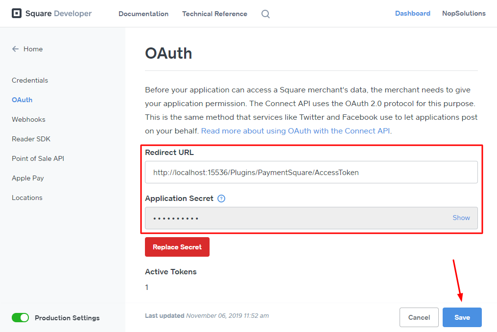
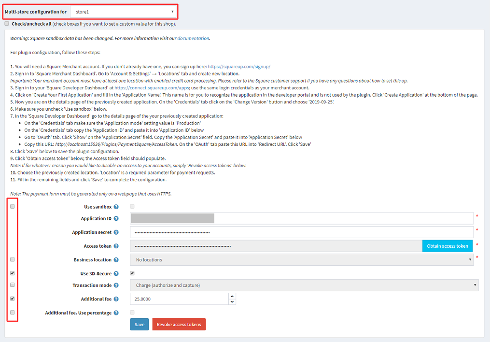

# Square

To configure **Square** plugin as a payment method follow these steps:

## Square Account Setup

1. Sign up for a Square Merchant account.
    - Go to [https://squareup.com/signup/](http://squ.re/nopcommerce)

        
    - Provide information about yourself and your business.

        
1. Create business location.

    - Sign in to **Square Merchant Dashboard**.
    - Go to **Account & Settings → Locations** tab.

        
    - Create new location.

    > [!IMPORTANT]
    > 
    > Your merchant account must have at least one location with enabled credit card processing. Please refer to the Square customer support if you have any questions about how to set this up.

1. Create new Square application.

    - Sign in to **Square Developer Dashboard** at [https://connect.squareup.com/apps](http://squ.re/nopcommerce1) using the same login credentials as your merchant account.

        
    - Click on **Create Your First Application**.

        
    - Name your application. This name is for you to recognize the application in the developer portal and is not used by the plugin. Agree to the **Square Developer Terms of Service** and click **Create Application** at the bottom of the page.

        
    - Now you are on the details page of the previously created application. On the **Credentials** tab click on the **Change Version** button and choose **2019-09-25**.

        

1. To configure plugin in the NopCommerce admin panel go to **Configuration → Payment methods** → click **Configure** for **Payments.Square**.

## Production application mode

Production application mode is used to accept real payments in a live store.

- On the plugin configuration page make sure you uncheck **Use sandbox** and fill in the related fields.

    
- In the **Square Developer Dashboard** go to the details page of the your previously created application:
  - On the **Credentials** tab make sure the *Application mode* setting value is **Production**.

    
  - On the **Credentials** tab copy the **Application ID** and paste it into **Application ID** on the plugin configuration page.

    
  - Go to **OAuth** tab. Click **Show** on the **Application Secret** field. Copy the **Application Secret** and paste it into **Application Secret** on the plugin configuration page.
  - Copy the displayed URL on the plugin configuration page. On the **OAuth** tab paste this URL into **Redirect URL**. Click **Save**.

    
- Click **Save** on the plugin configuration page.

    
- On the plugin configuration page click **Obtain access token**; the **Access token** field should populate.

    

    > [!NOTE]
    > 
    > If for whatever reason you would like to disable an access to your accounts, simply **Revoke access tokens** from the plugin configuration page.

- Choose the previously created location. **Location** is a required parameter for payment requests.

    
- Fill in the remaining fields and click **Save** to complete the configuration.

## Sandbox application mode

Sandbox application mode is used to test the Square payment configuration.

- On the plugin configuration page check **Use sandbox** and fill in the related fields

    
- In the **Square Developer Dashboard** go to the details page of the your previously created application:
  - On the **Credentials** tab make sure the *Application mode* setting value is **Sandbox**.

    
  - On the **Credentials** tab copy the **Sandbox Application ID** and **Sandbox Access Token** and paste it into same fields on the plugin configuration page.

    
- Click **Save** on the plugin configuration page.

    
- Choose the location. **Location** is a required parameter for payment requests.

    

> [!NOTE]
> 
> By default, you can select the **Default Test Account** location. Learn more about using the Square sandbox environment [here](https://developer.squareup.com/docs/testing/sandbox).

- Fill in the remaining fields and click **Save** to complete the configuration.

## Multi-store support

- To configure plugin for multi-store select the required store and fill in the fields below.

    
