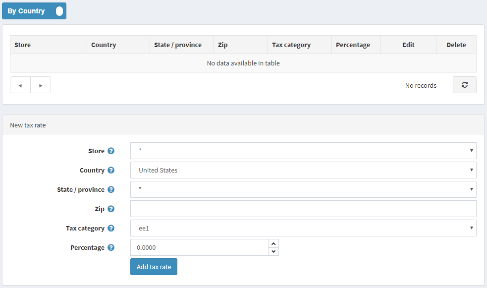

# Manual (Fixed or By Country/State/Zip)

To configure Manual (Fixed or By Country/State/Zip) go to **Configuration → Tax Providers**.

Click **Configure** beside the Manual (Fixed or By Country/State/Zip) option in the list.

You can switch Fixed rate tax calculation to Country/State/Zip tax calculation by clicking button at the top of the page.

## Fixed rate

> [!NOTE]
> 
> this section shows only pre-created tax categories. To create new, go to Configure → Tax Categories.
> 
> * Click **Edit** beside the tax category for which to define a fixed rate.
> * Enter the required rate in the **Rate** column.
> * Click **Update**.

## By country

Define the **new tax rate**, as follows:

* Select the **Store** for which the rate is defined. Select an * to apply this rate to all stores.
* Select the **Country** for which the tax rate is defined.
* Select the **State/province** for which the tax rate is defined. If an asterisk (*) is selected, this tax rate will apply to all customers from the selected country regardless of the state.
* Enter **Zip code** of an area for which the tax rate is defined. If this field is empty, then this tax rate will apply to all customers from the selected country or state regardless of the zip code.
* Select the **Tax category** for which to apply the tax rate.
* In the **Percentage** field, enter the required percentage.

Click **Add tax rate**. The new tax rate is displayed, as follows:

