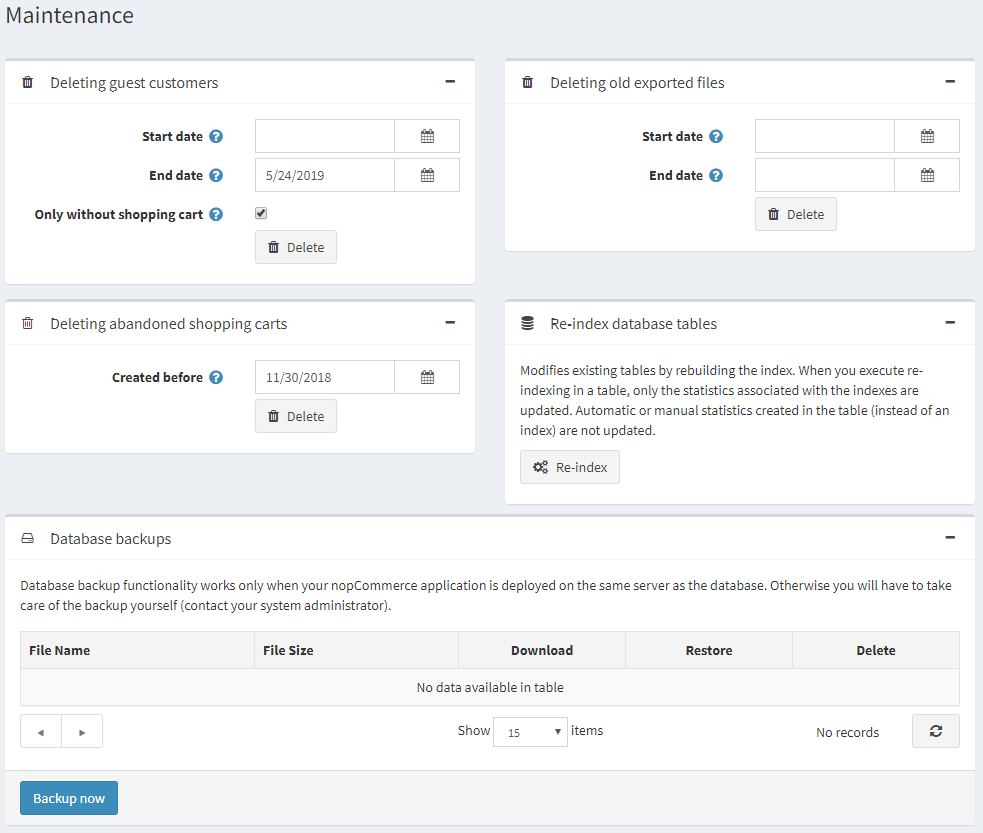

# System Administration

The following procedure describes how to enable store owner to easily delete guest customer records.

## Delete guest customer records

1. From the **System** menu, select **Maintenance**. The **Maintenance** window is displayed, as follows:

    

1. From the Deleting guest customers, click the Delete button. This option enables you to delete customer records created for guest visitors.

> [!NOTE]
> 
> Only guests without orders or written customer content (such as product reviews or news comments) will be deleted

## Tutorials

- [Overview of system maintenance options](https://www.youtube.com/watch?v=CNgTJZoWHTA)
