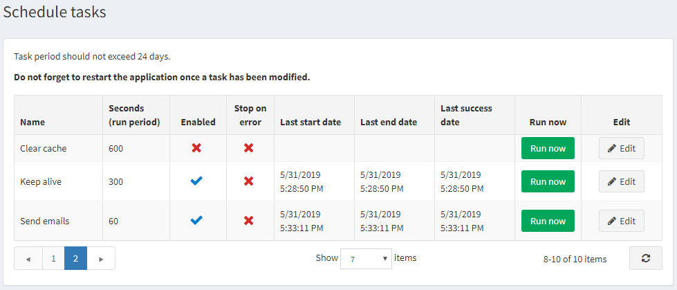

# Schedule Tasks

The scheduled tasks window enables the store owner to schedule a task to run during certain periods in the background and to view useful information regarding the task and whether it was completed successfully. For example, nopCommerce sends queued emails periodically. The tasks run on a separate thread coming from the ASP.NET thread pool.

## Schedule tasks

1. From the **System** menu, select **Schedule Tasks**. The **Schedule Tasks** window is displayed.

    
1. Click the **Edit** button besides the task to edit. The window is expanded, as follows:

    
1. Select the required checkboxes, as follows:
    * **Enabled**: Select to enable the task.
    * **Stop on Error**: Select to stop the task when an error occurs.
1. Click **Update** to save your revisions.
1. If required, you can click **Run Now**, to run a scheduled task on demand.
