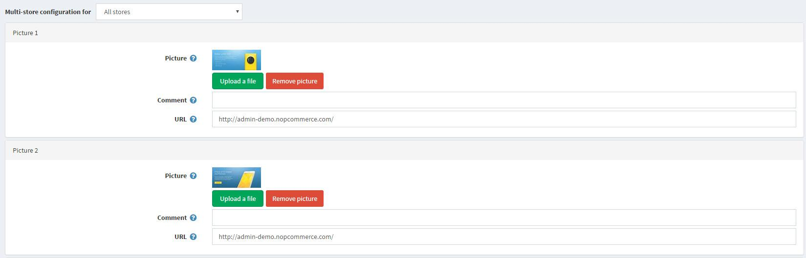

# Nivo Slider widget plugin

Nivo Slider widget plugin allows you to display a slider on the homepage of your store.

## Configure the Nivo Slider widget plugin

Go to **Configuration → Widgets**. The Widgets window is displayed:

Click **Edit** beside the Nivo Slider plugin. The window is expanded, as follows:

Tick the **Is active** checkbox, to enable the Nivo Slider plugin. Click **Configure**. The Configure – Nivo Slider window is displayed, as follows:

Perform the following for each slider you would like to upload:

* In the **Picture** field, click Upload a file to upload the required picture. Click Remove picture to remove the existing one.
* In the **Comment** field, enter a comment for the picture or leave empty to not display any text.
* In the **URL** field, enter the required URL or leave empty if you do not want the picture to be clickable.

Click **Save**. Nivo Slider will be integrated into your store.

> [!NOTE]
> 
> After a widget has been added, you can click Edit in the Widgets window beside the required widget to display the **Edit Widget Details** window and then edit the widget details, as described above.
