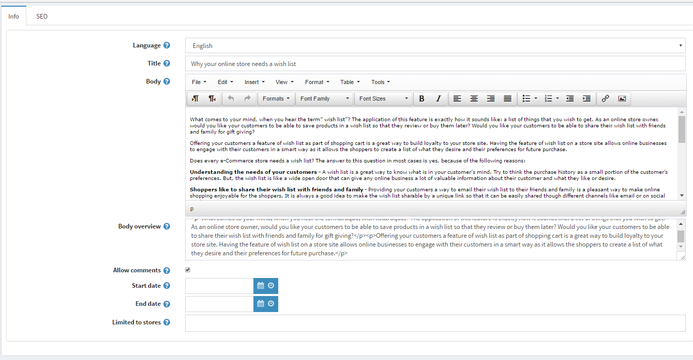
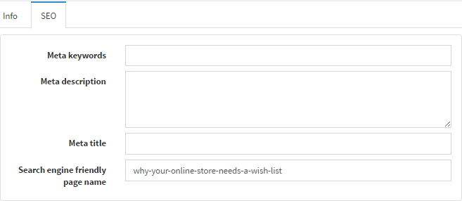

# Blog

A Blog is a great way to connect with your existing customers, keeping them informed about latest product offerings or educating them, as well as to  find new customers.

## Adding new blog posts

To manage blog posts go to **Content management → Blog**

Select tab: **Blog posts**.

Click **Add new** and fill the information about a **new blog post**.

Define **new blog post details**:

- From the **Language** dropdown list, select the language of this blog post. The Customer will only see blog posts for their selected language
- Enter the **Title** of this blog post
- Enter the **Body text** of this blog post
- You can specify the **Body overview** if you want only part of the whole text to be visible on the main blog page
- Enter **Tags** to be displayed on the Blog page in the public store. The more blog posts are associated with a particular tag, the larger size it has in the Popular Tags area, displayed in the sidebar on the Blog page

   

- Select the Allow comments checkbox, to enable customers to add comments to your blog post
- Enter **Start and End date** for displaying this blog post in Coordinated Universal Time (UTC)

 > [!NOTE]
 > 
 > You can leave these fields empty if you do not want to define blog post start and end dates

- Select the **Limited to stores** checkbox, to enable defining the stores where the blog post will be available

While editing existing blog or after clicking **Save and Continue Edit** button for a new one, you can click on **Preview** button to see how the blog will appear on the site.

## Setting up SEO for blog posts

To set up SEO for the blog post go to **SEO tab**

- Enter **Meta keywords** to be added to the blog post header
- Enter **Meta description** to be added to the blog post header
- Override the page title in the **Meta title** field (the default title is the title of the blog post)
- Define the **Search engine friendly page name**. For example, enter "the-best-news" to make your URL`http://yourStore.com/the-best-news`. Leave this field empty to generate it automatically based on the title of the blog post.

## Managing blog comments

To manage blog comments select **Content management → Blog**

Select tab: **Blog comments**.

Here you can **delete** a blog comment, it will then be removed from the system.

## See also

- [Managing blog tutorial](https://www.youtube.com/watch?v=wKMKUF7VfW0&list=PLnL_aDfmRHwsbhj621A-RFb1KnzeFxYz4&index=12)
- [Blog settings](xref:en/user-guide/marketing/content/blog/blog-settings)
