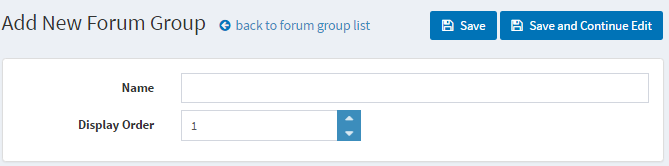
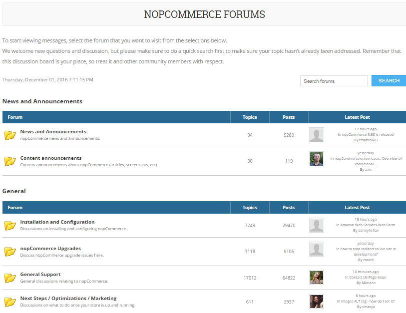

# Forums

A forum is an online discussion site where people can hold conversations in the form of posted messages. Depending on the access level of a user or the forum set-up, a posted message might need to be approved by a moderator before it becomes visible. A forum may contain a number of subforums, with each having several topics.

> [!NOTE]
> 
> in nopCommerce forums are disabled by default. To enable forums, go to Configuration → Settings → Forum Settings. Ensure that Forums enabled is checked. The Forums link should be displayed in the menu in the public store.

To manage forum groups and forums (inside forum groups) go to **Content management → Forums**.

## Adding new forum group

Click the **Add New Forum Group** button.

- Define a new forum group **Name**
- In the **Display order** field, enter the display order of the forum group. A value of 1 represents the top of the list
- Click **Save**

## Adding new forum

- From the **Forum group** dropdown list, select the required forum group
- Enter the **Name** of the new forum
- Enter a **Description** for the new forum
- Select the **Display order** for the forum group. A value of 1 represents the top of the list
- Click **Save**

To view an example of how forums should work go to <http://www.nopcommerce.com/boards/>

## See also

- [Forum settings](xref:en/user-guide/marketing/content/forums/settings)

## Tutorials

- [Managing forums in nopCommerce](https://www.youtube.com/watch?v=wW2QvC4WA_8)
