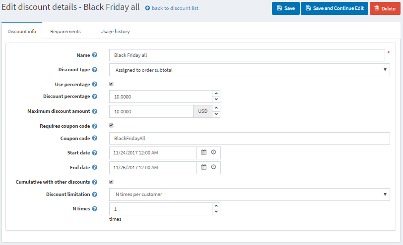

# Common type of discounts

## Black Friday sale

Black Friday is always the day after Thanksgiving. It's quite common discount campaign, almost every online store has a Black Friday sale.

**Name** - you can enter any name, it’s only internal

**Discount type** - here it’s Assigned to subtotal type when a discount is applied to the whole order amount before all the fees are added (like shipping fee and taxes). It’s relevant here because we want all the products in the cart to be discounted.

Besides Assigned to subtotal there several other discount types. There can be Assigned to order total - when a discount is applied to the whole order amount after all the fees are added (like shipping fee and taxes). Also, we can apply discounts to certain categories, manufacturers, or shipping.

We can apply the discount in % or just enter the amount in chosen currency. We have 10% here.

The **maximum amount** can be limited as well, so even if the total amount of products in the cart will be 300$ a customer will only have 10$ discount anyway.

This discount will require a coupon code. You can apply discounts without entering coupon codes, but it’s not recommended considering marketing purposes. Coupon codes allow you to check campaigns results campaigns.

Frequently discounts are time-based. Here we entered Black Friday weekend dates.

**Cumulative with other discounts** option allows customers use several discounts at the same time.

The last setting is for limitation discount usage. For instance, this discount can be applied once per customer.

Often you need to sell more items of the certain product. In this case, to encourage your customers to buy several items of that, you can offer them a discount.  Let’s consider how to use the discount - Buy one item and get 50% on the second in your nopCommerce store.

The type of the discount is Assigned to products. In Applied to products tab you can add them, here will be an oversized T-shirt. We want our customers to get 50% discount on the 2nd t-shirt. This discount can be used once per customer, so the maximum quantity is 1.

You can set up requirements to the product quantity in Requirements tab. Add requirements type Customer has all of these products and add T-shirt with a quantity 2.

You can use this scenario to set up other popular discount buy one and get the second for free if you set up a 100% discount.
