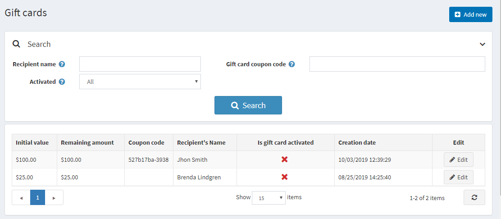
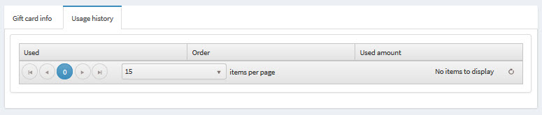

# Gift cards

In nopCommerce, you have an opportunity to sell gift cards among other types of products.

Gift cards is a good marketing tool, enabling you to reach more customers and stimulate additional purchases. Gift cards is a highly targeted instrument as the receivers are certainly motivated to use them, because it is like a personal proposal to them.

## Adding new gift card

You can create gift card products, defining the product as a gift card by checking the **Is Gift Card** check box when creating the product in the **Catalog → Products → Add new → Product info** tab.

## Activating a gift card

After customers complete purchases with the gift card products, you can then search and view the list of all the purchased gift cards in **Sales → Gift cards**.  Gift cards have automatically generated gift card codes, but all of them are disabled by default.

You should tick the checkbox **Is gift card*** activated to activate the card, and generate Coupon code here.

 You can set up when a gift card will be activated and deactivated in **Configuration → Settings → Order Settings** from the drop-down lists Gift card activation order status and Gift card deactivation order status (they can be: **Pending, Processing, Complete, Cancelled**)

Define Gift card information:

- From the **Gift Card Type** select whether it’s **Virtual or Physical**
- Beside **Order** field, click View to view the order in which the gift card was purchased
- In the **Initial value** field, edit the initial value of the card
- If required, edit the **recipients and senders name and email** in the relevant fields.
- Enter an optional message in the **Message** area
- Click **Notify Recipient**. An email containing the gift card details will be sent to the recipient's email

> [!NOTE]
> 
> - **The sender and recipient emails will not be visible for physical gift cards. These mails are visible only for virtual gift cards**
> - **The Notify Recipient button is relevant only for virtual gifts card and not physical gift cards**

## Viewing gift card usage history

Select the **Usage History** tab to display the **Order Details** page for the orders this gift card coupon were used for. After the gift card is activated and the sender received a coupon code, he can use it during checkout.

## Using gift cards

A gift card is performed in the public store by entering the serial number in the box on the shopping cart page.

## See also

- [Adding product](xref:en/user-guide/running/product-management/products/adding-products/index)
- [YouTube tutorial on managing gift cards](https://www.youtube.com/watch?v=4SJ7uBZGas0&index=4&list=PLnL_aDfmRHwsbhj621A-RFb1KnzeFxYz4)
