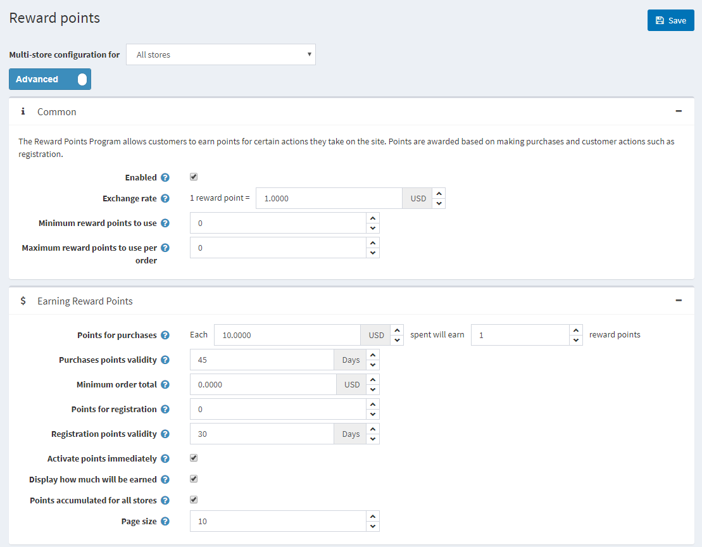

# Reward points

The **Reward Points** functionality enables you to create and implement loyalty program for improving customer experience and increase customer loyalty. The Reward Points Program allows customers to earn points for certain actions they take on the site like registering and making purchases.

Reward points can be used as one of the **payment methods.** This option is displayed in the **Payment Method area of the checkout**. Exchangeable reward points can be used together with other payment methods such as credit cards, gift cards and more.

The points can also be canceled if a customer canceled an order or sent a return request.

## Managing reward points

To manage the Reward Points program go **Configuration → Settings → Reward points.** This page is available in two modes: **basic and advanced.**

To set up your reward point program, define these settings:

- Tick **Enabled** checkbox, to make the reward points program active.
- In the **Exchange rate** field, specify the reward points exchange rate. (1 point - $1 etc).
- In the **Minimum reward point to use** field, enter the minimum amount of rewards points required, before customers can use their reward points. Enter 0, if you do not need to define this setting.
- In the **Points for purchases** field, specify the number of points granted for purchases
- In the **Purchases points validity**, specify the number of  days when the points awarded for purchases will be valid.
- In the **Minimum order total**, specify the minimum order total (exclude shipping cost) to award points for purchases.
- In the **Points for registration** field, specify the number of points granted for customer registration.
- In the **Registration points validity**, specify number of days when the points awarded for registration will be valid.
- Tick the checkbox **Activate points immediately** if you want customers will be able to use reward points right after earn them. If you didn't check this checkbox one more option appears:
- In the **Reward points activation** specify the period (number of days/hours) after which reward points will be activated.
- Tick **Display how much will be earned** checkbox to show your customers how many points will be earned. It will be visible on checkout page.
- Tick **Points accumulated for all stores** checkbox to accumulate all the reward points in one balance for all stores so they can be used in any store.
- In the **Page size** field set the page size for history of reward points on **My account page**
- Click **Save**

> [!NOTE]
> 
> **Reward points are applied only to registered users**

When a customer uses reward points when checkout it looks like that:

## See also

- [Basic and Advanced modes](xref:en/user-guide/configuring/nopcommerce-interface)
- [Managing reward points tutorial](https://www.youtube.com/watch?v=lE4-xDUKkd0&index=14&list=PLnL_aDfmRHwsbhj621A-RFb1KnzeFxYz4)
