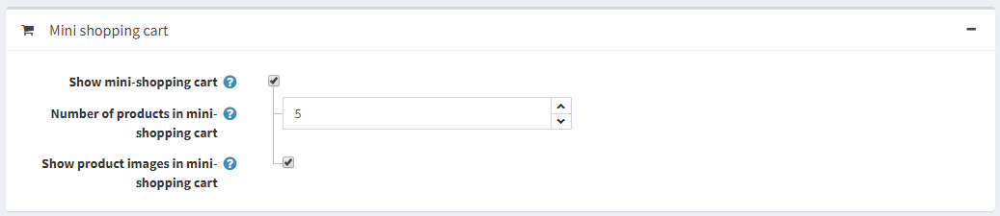
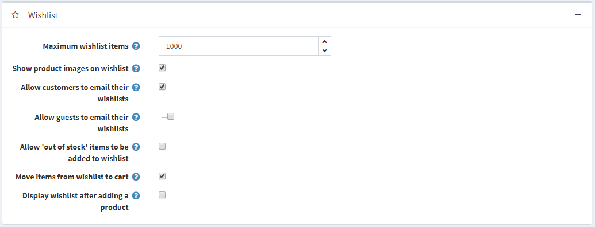

# Shopping cart settings

In the shopping cart settings you can define:

* To **Show discount box** displaying the discount coupon box on the shopping cart page.
* To **Show gift card box** displaying the gift card coupon box on the shopping cart page.
* To **Allow cart item editing**, to enable customers to edit items in the cart. This feature is useful when products have values entered by customers.
* **Maximum shopping cart items** - the maximum number of different products allowed to be added to the shopping cart.
* Select the **Carts shared between stores** checkbox to share shopping carts (and wishlists) between stores.
* To **Show product images on cart**, to display product images in the store shopping carts.
* To **Display cart after adding product**, to the display the Shopping Cart page immediately after a product was added to the cart. When this checkbox is unticked, the customer will remain on the page where the product was added to the cart.
* **Number of Cross-Sells** that you want to display on the checkout page of the shopping cart in the public store. Enter 0, if you do not want to display cross-sells.
* To **Show mini-shopping cart** - a drop down menu, that appears at the top left-hand corner of the main window, when hovering over the Shopping Cart link, as shown below: 
* When this field is ticked the following fields are displayed:
  * **Number of products in mini-shopping cart** - the maximum number of products displayed in the mini shopping cart dropdown menu, in the public store.
  * **Show product images in mini shopping cart** to determine whether images are displayed in the mini shopping cart dropdown menu.
* **Maximum wishlist items** - the maximum number of different products allowed to be added to the wishlist.
* To **Show product images on wishlist**, to display product images on customers’ wishlists.
* To **Allow customers to email their wishlist** to friends. When this field is enabled the following field is displayed:
  * **Allow guests to email their wishlist** to friends.
* To **Allow ‘out of stock’ items to be added to the wishlist**.
* Select the **Move items from wishlist to cart** checkbox to move products from wishlist to the cart when clicking "Add to cart" button. Otherwise, they are copied.
* To **Display wishlist after adding product**, to display the Wishlist page immediately after a product was added to the wishlist. When this checkbox is unticked, the customer will remain on the page where the product was added to the wishlist.

This page enables **multi-store configuration**, it means that the same settings can be defined for all stores, or differ from store to store. If you want to manage settings for a certain store, choose its name from Multi-store configuration drop-down list and tick all needed checkboxes at the left side to set custom value for them.
