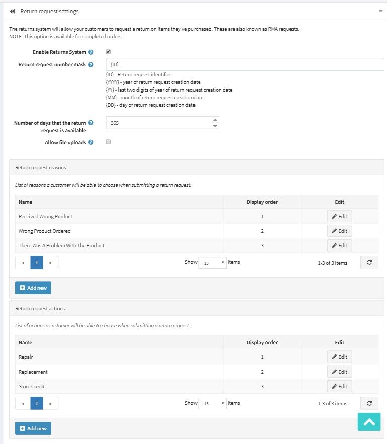

# Return request settings

To define the return request settings, go to **Configuration → Settings → Order Settings**. The Order Settings window will be displayed, in the advanced mode by default. Switch to the **Return request settings panel**.

In return request settings you can define:

* To **Enable Returns System**, to enable your customers to submit return requests for purchased items.
* In the field **Return request number mask** specify custom return request number if needed.
* **Number of days that the return request is available**, to set the number of days that the return request link will be available in the customer area.

  > [!TIP]
  > 
  > For example, if the store owner allows returns within 30 days after the purchase, this field will be set to 30. When the customer logs into the website and looks at My Account, orders completed earlier than 30 days will not have a Return Request button.
* Tick the **Allow file uploads** checkbox if you want to allow uploading files (pictures for example) when submitting a return request. This option is especially useful for customers who faced some problems with their orders, such as receiving damaged items or wrong product, etc.
* **Return request reasons.** Enter a list of reasons that a customer can choose from when submitting a return request.
* **Return request actions.** Enter a list of actions that a customer can choose from when submitting a return request.

This page enables **multi-store configuration**, it means that the same settings can be defined for all stores, or differ from store to store. If you want to manage settings for a certain store, choose its name from Multi-store configuration drop-down list and tick all needed checkboxes at the left side to set custom value for them.

## See also

* [Return Requests](xref:en/user-guide/running/order-management/return-requests/index)
* [Order Settings](xref:en/user-guide/running/order-management/orders/order-settings)
